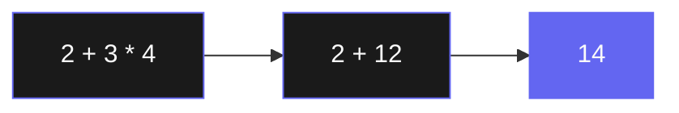
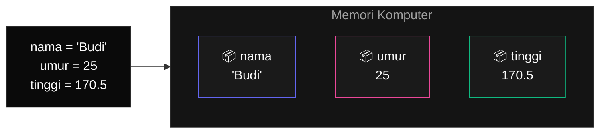
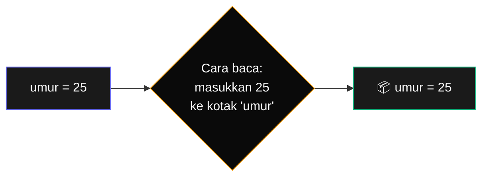
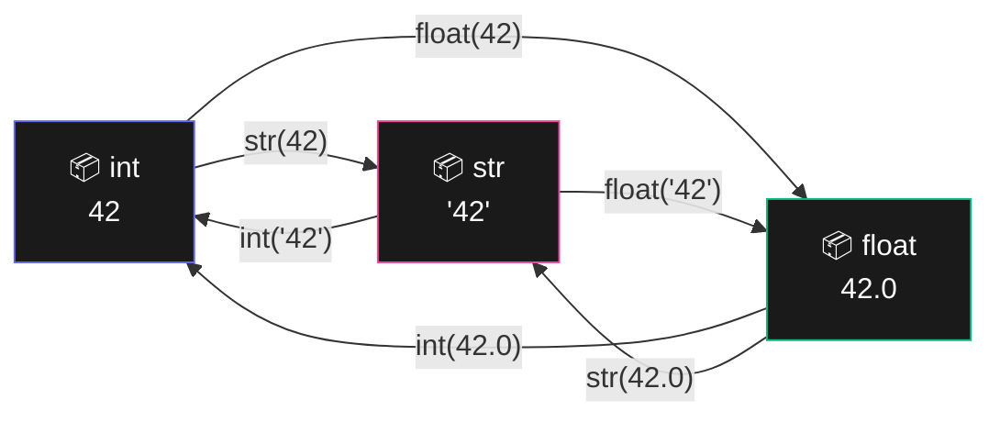

# Bab 1: Dasar-Dasar Python

> *Tidak ada cara belajar bahasa pemrograman yang lebih cepat selain menulis kode. Mari mulai sekarang.*

Bab ini punya satu tujuan sederhana: **kamu menulis kode Python pertamamu, sekarang juga**, tanpa perlu install apapun di komputer.

Kita tidak akan banyak teori. Kita akan banyak praktik. Saat selesai bab ini, kamu sudah:

- Tahu cara menjalankan kode Python di browser tanpa install
- Mengerti apa itu **expression** (rumus) dan **operator**
- Bisa menyimpan dan memakai data lewat **variable**
- Tahu bedanya `string` (teks) dan `integer` (angka)
- Sudah menulis program kecil pertamamu

Mari mulai.

## 1.1. Buka Python di Browser

Cara tercepat menulis Python tanpa ribet adalah memakai **Python online**. Buka salah satu dari:

- [Python.org Shell](https://www.python.org/shell/) — official, paling sederhana
- [Replit](https://replit.com/languages/python3) — fitur lebih banyak, perlu daftar gratis
- [Programiz Online Python](https://www.programiz.com/python-programming/online-compiler/) — tanpa daftar

Untuk bab ini, **pythonshell.org cocok** — paling mirip dengan tampilan yang akan kita pakai nanti saat install di komputer.

Buka link itu, dan kamu akan lihat tampilan dengan tanda `>>>` di awal baris. Itu disebut **Python prompt** — tempat kamu mengetik perintah Python satu baris dan langsung lihat hasilnya.

!!! info "Apa itu prompt?"
    Bayangkan prompt itu seperti seorang petugas teller bank yang menunggu instruksi. Setiap kali kamu mengetik perintah dan tekan Enter, dia langsung kerjakan dan kasih hasil. Kalau perintah kamu ngaco, dia komplain (dengan pesan error).

## 1.2. Mengetik Kode Pertama

Di sebelah `>>>`, ketik:

```python
print("Halo, dunia!")
```

Tekan Enter.

Kamu akan lihat:

```
Halo, dunia!
```

Selamat. Kamu baru saja menulis dan menjalankan program Python pertamamu.

Apa yang baru saja terjadi? Kamu menyuruh Python: **"cetak (`print`) tulisan `Halo, dunia!`"**. Python mengerti dan langsung melakukannya.

Kalimat di dalam tanda kutip — `"Halo, dunia!"` — disebut **string** dalam dunia pemrograman. Artinya: data berupa teks. Kapanpun kamu mau memberi data berupa teks ke Python, bungkus dengan tanda kutip.

!!! tip "Coba ubah"
    Sebelum lanjut, ubah teks di dalam tanda kutip jadi nama kamu sendiri:
    ```python
    print("Halo, saya Yazid!")
    ```
    Lihat hasilnya. Eksperimen dengan teks yang lain. Sentuh tools-nya, jangan cuma lihat.

## 1.3. Python sebagai Kalkulator

Sebelum lanjut ke konsep yang lebih besar, mari pakai Python sebagai kalkulator. Ketik di prompt:

```python
2 + 2
```

Hasil: `4`. Lalu coba:

```python
50 - 8
```

Hasil: `42`. Sekarang yang lebih menarik:

```python
(7 + 3) * 4
```

Hasil: `40`.

Python mengerti aturan matematika seperti yang kamu pelajari di SD: kurung dulu, lalu kali/bagi, lalu tambah/kurang.

### Operator Matematika

Python punya beberapa simbol untuk operasi matematika. Yang utama:

| Operator | Operasi | Contoh | Hasil |
|----------|---------|--------|-------|
| `+` | Penjumlahan | `2 + 3` | `5` |
| `-` | Pengurangan | `10 - 4` | `6` |
| `*` | Perkalian | `5 * 6` | `30` |
| `/` | Pembagian | `15 / 4` | `3.75` |
| `//` | Pembagian bulat | `15 // 4` | `3` |
| `%` | Sisa pembagian (modulo) | `15 % 4` | `3` |
| `**` | Pangkat | `2 ** 10` | `1024` |

Tiga yang terakhir mungkin baru bagimu. Mari lihat satu per satu.

**Pembagian bulat (`//`)** membuang sisa desimal. Berguna kalau kamu cuma butuh tahu "berapa kali utuh".

```python
>>> 100 // 30
3
```

100 dibagi 30 = 3 kali utuh, sisanya kita buang.

**Modulo (`%`)** kebalikannya — yang diambil justru sisanya.

```python
>>> 100 % 30
10
```

100 dibagi 30 = 3 kali utuh, sisa **10**.

!!! example "Contoh pakai modulo"
    Modulo sangat berguna untuk cek apakah suatu angka **genap atau ganjil**. Angka genap selalu sisa 0 saat dibagi 2:

    ```python
    >>> 100 % 2
    0
    >>> 7 % 2
    1
    ```

    Kalau hasilnya 0, berarti genap. Kalau 1, ganjil. Trik ini akan sering kamu pakai nanti.

**Pangkat (`**`)** untuk perhitungan eksponensial.

```python
>>> 2 ** 10
1024
>>> 3 ** 4
81
```

`2 ** 10` artinya "2 pangkat 10".

### Expression — Rumus dalam Pemrograman

Apapun yang kamu ketik tadi (`2 + 2`, `(7 + 3) * 4`, `100 % 30`) disebut **expression**. Definisi sederhananya: **expression adalah kombinasi nilai dan operator yang bisa dievaluasi menjadi satu nilai tunggal**.

Bayangkan expression seperti **rumus matematika di kalkulator**. Kamu kasih masukan, hasilnya satu angka.



<div class="flowchart-caption" markdown>
<span class="label">Cara baca diagram</span>

Python mengevaluasi expression dari kiri ke kanan, **tapi mengikuti prioritas operator**:

1. **`2 + 3 * 4`** — ada `+` dan `*`. Karena `*` prioritas lebih tinggi, dia dieksekusi duluan.
2. **`2 + 12`** — `3 * 4` menghasilkan `12`, jadi expression-nya berubah jadi ini.
3. **`14`** — `2 + 12` menghasilkan `14`. Inilah nilai akhir.

Kotak warna **indigo terang di akhir** menandakan hasil final — Python sudah selesai mengevaluasi.

**Kunci**: Python tidak baca `2 + 3 = 5` lalu `5 * 4 = 20`. Dia ingat aturan kali sebelum tambah, sama seperti yang kamu pelajari di SD.
</div>

Python mengevaluasi expression **dari yang prioritasnya paling tinggi** (perkalian sebelum penjumlahan), sampai akhirnya tinggal satu nilai.

```python
>>> 2 + 2
4
>>> 1 + 1 + 1 + 1
4
>>> 8 / 2
4.0
```

Tiga expression berbeda, tiga cara berbeda menulis "4". Hasil akhirnya tetap satu nilai.

Bahkan satu nilai sendiri pun adalah expression yang valid:

```python
>>> 4
4
>>> "Halo"
'Halo'
```

Itu disebut expression paling sederhana — sebuah nilai yang sudah berdiri sendiri.

## 1.4. String — Data Berupa Teks

Sudah kita sentuh tadi: string adalah data berupa teks, dibungkus tanda kutip.

```python
>>> "Hai"
'Hai'
>>> 'Selamat pagi'
'Selamat pagi'
```

Kamu bisa pakai tanda kutip ganda `"..."` atau tanda kutip tunggal `'...'`. Sama saja, asalkan konsisten — buka dan tutup pakai jenis yang sama.

### Menggabungkan String

Operator `+` yang biasanya untuk menjumlahkan, juga bisa menggabungkan string:

```python
>>> "Halo" + " " + "dunia"
'Halo dunia'
>>> "Saya " + "suka " + "Python"
'Saya suka Python'
```

Operasi ini disebut **concatenation** (penggabungan). Perhatikan: kita harus tambahkan spasi `" "` sendiri kalau mau ada spasi di hasil.

!!! warning "Jangan campur tipe data"
    Apa yang terjadi kalau kita coba `"Halo" + 5`?

    ```python
    >>> "Halo" + 5
    Traceback (most recent call last):
      File "<stdin>", line 1, in <module>
    TypeError: can only concatenate str (not "int") to str
    ```

    Python protes — dia tidak tahu cara menggabung teks dengan angka. Untuk hal seperti ini, angkanya harus diubah dulu jadi string. Caranya nanti.

### Menggandakan String

Operator `*` juga bisa dipakai pada string — untuk mengulang:

```python
>>> "ha" * 5
'hahahahaha'
>>> "-" * 30
'------------------------------'
```

Trik praktis: bikin garis pemisah panjang dengan `"-" * 30` lebih cepat daripada mengetik strip 30 kali.

## 1.5. Variable — Tempat Menyimpan Data

Sekarang masuk ke konsep yang **wajib kamu kuasai**: variable.

Bayangkan variable sebagai **kotak yang diberi nama**. Kamu masukkan sesuatu ke dalam kotak itu, lalu kapan saja kamu butuh, tinggal sebut nama kotaknya — dan isinya keluar.



<div class="flowchart-caption" markdown>
<span class="label">Cara baca diagram</span>

Diagram ini menunjukkan apa yang terjadi di **memori komputer** saat kamu menulis 3 baris kode di sebelah kiri.

- **Kotak besar abu-abu** "Memori Komputer" = ruangan tempat semua variable kamu disimpan.
- **3 kotak kecil di dalamnya** = variable yang kamu buat. Setiap kotak punya **nama** (tertulis di atas) dan **isi** (tertulis di bawah, dengan emoji 📦).
- **Warna border yang berbeda** (indigo, pink, hijau) cuma untuk membedakan visual — di Python sebenarnya semua kotak setara.
- **Panah dari kode ke memori** = setiap baris kode `=` membuat satu kotak baru di memori.

**Kunci**: setelah 3 baris kode itu jalan, kalau kamu nanti ketik `nama` di Python, dia akan masuk ke memori, cari kotak bernama `nama`, dan keluarkan isinya `'Budi'`.
</div>

Cara membuat variable:

```python
>>> nama = "Budi"
>>> umur = 25
```

Tanda `=` di sini **bukan** "sama dengan" seperti di matematika. Dalam pemrograman, `=` artinya **"masukkan nilai di sebelah kanan ke kotak yang ada di sebelah kiri"**.



<div class="flowchart-caption" markdown>
<span class="label">Cara baca diagram</span>

Diagram ini menjelaskan **arah `=`** dari kiri ke kanan dalam pikiran Python:

1. **Kotak indigo (kiri)** = kode yang kamu tulis: `umur = 25`.
2. **Diamond amber (tengah)** = cara Python "menerjemahkan" kode itu di kepalanya. Tanda `=` artinya **"masukkan nilai sebelah kanan ke kotak sebelah kiri"** — bukan "sama dengan" matematika.
3. **Kotak hijau (kanan)** = hasil akhir di memori. Sekarang ada kotak bernama `umur` yang berisi `25`.

**Kunci**: arahnya selalu **kanan → kiri**. Nilai di sebelah kanan `=` "mengalir" ke kotak di sebelah kiri. Kalau kebalik, kamu akan error (`25 = umur` tidak valid).
</div>

Setelah dua baris di atas, kamu punya:

- Sebuah kotak bernama `nama`, isinya teks `"Budi"`
- Sebuah kotak bernama `umur`, isinya angka `25`

Kapanpun kamu sebut `nama` atau `umur`, Python akan ambil isinya:

```python
>>> nama
'Budi'
>>> umur
25
>>> print(nama)
Budi
>>> print(umur)
25
```

### Memakai Variable dalam Expression

Variable jadi powerful saat dipakai dalam expression:

```python
>>> umur + 5
30
>>> "Halo, " + nama
'Halo, Budi'
>>> umur * 2
50
```

### Mengubah Isi Variable

Isi variable bisa diubah kapan saja:

```python
>>> umur = 25
>>> umur
25
>>> umur = 30
>>> umur
30
```

Variable `umur` mulanya berisi 25, lalu kita "ganti" isinya jadi 30. Yang lama hilang.

Kamu bahkan bisa pakai variable sendiri di dalam expression yang menugaskan ke dirinya sendiri:

```python
>>> umur = 25
>>> umur = umur + 1
>>> umur
26
```

Baris kedua artinya: "ambil isi `umur` sekarang (25), tambahkan 1, masukkan kembali ke `umur`". Hasilnya: 26.

Trik ini sangat sering dipakai — misalnya untuk menghitung sesuatu (jumlah klik, jumlah pengunjung, dll).

### Aturan Penamaan Variable

Tidak semua nama bisa dipakai untuk variable. Aturannya:

!!! info "Aturan nama variable"
    1. **Hanya** boleh berisi huruf, angka, dan underscore (`_`).
    2. **Tidak boleh** dimulai dengan angka.
    3. **Tidak boleh** ada spasi.
    4. **Tidak boleh** memakai kata yang sudah dipakai Python (seperti `print`, `if`, `for`, dll — daftar lengkapnya nanti).
    5. **Case-sensitive** — `nama`, `Nama`, dan `NAMA` adalah tiga variable berbeda.

Contoh nama valid dan tidak valid:

| Nama | Valid? | Catatan |
|------|--------|---------|
| `nama` | ✅ | Sederhana dan jelas |
| `nama_lengkap` | ✅ | Pakai underscore untuk pisah kata |
| `nama2` | ✅ | Boleh ada angka, asal bukan di awal |
| `_temp` | ✅ | Boleh dimulai dengan underscore |
| `2nama` | ❌ | Dimulai dengan angka |
| `nama lengkap` | ❌ | Ada spasi |
| `nama-lengkap` | ❌ | Tanda strip dianggap operator minus |
| `print` | ⚠️ | Valid tapi dilarang — bentrok dengan fungsi bawaan |

### Konvensi: snake_case

Programmer Python punya kesepakatan: untuk nama variable yang terdiri dari beberapa kata, **pakai underscore** di antara kata.

```python
nama_lengkap = "Budi Santoso"
total_harga = 50000
jumlah_siswa_kelas = 30
```

Ini disebut **snake_case** (mirip ular). Bukan aturan teknis, tapi konvensi yang sudah dipakai luas — patuhi supaya kode kamu enak dibaca orang lain.

## 1.6. Tipe Data Dasar

Setiap nilai di Python punya **tipe**. Tiga tipe paling dasar yang akan kamu pakai sepanjang waktu:

| Tipe | Singkatan Python | Contoh |
|------|------------------|--------|
| Bilangan bulat | `int` | `7`, `-3`, `0`, `99` |
| Bilangan desimal | `float` | `3.14`, `0.5`, `-2.7` |
| Teks | `str` | `"Halo"`, `'Python'` |

Cek tipe dengan fungsi `type()`:

```python
>>> type(25)
<class 'int'>
>>> type(3.14)
<class 'float'>
>>> type("Hai")
<class 'str'>
>>> type("25")
<class 'str'>
```

Perhatikan baris terakhir — `"25"` adalah **string**, bukan integer, karena ada tanda kutip. Komputer memandang "25" (teks) dan 25 (angka) sebagai dua hal sangat berbeda, walaupun kelihatan mirip di mata kita.

### Konversi Antar Tipe

Kadang kamu perlu mengubah tipe data — misalnya dari string ke angka, atau sebaliknya. Pakai fungsi konversi:



<div class="flowchart-caption" markdown>
<span class="label">Cara baca diagram</span>

Diagram ini menunjukkan **enam jalur konversi** antar tiga tipe dasar Python: `int`, `float`, dan `str`.

- **Tiga kotak** = tiga tipe data. Walaupun semua menyimpan "42" dalam bentuk berbeda, mereka **tidak interchangeable** — `42` (int) dan `'42'` (str) bagi Python adalah dua hal yang sangat berbeda.
- **Panah dengan label fungsi** = cara berpindah dari satu tipe ke tipe lain. Contoh: panah dari `int` ke `str` ber-label `str(42)` — artinya pakai fungsi `str()` untuk mengubah `42` jadi `'42'`.
- **Panah dua arah** = setiap pasang tipe bisa dikonversi ke kedua arahnya.

**Hal yang perlu diingat**:

- `int(3.99)` = `3` — bagian desimal **dipotong**, bukan dibulatkan ke `4`.
- `int('halo')` akan **error** — Python cuma bisa konversi string yang isinya angka.
- `str(angka)` selalu aman — semua angka bisa diubah jadi teks.

**Kapan kamu butuh ini?** Setiap kali ingin gabungkan teks dengan angka, atau saat memproses input pengguna (yang selalu masuk sebagai string).
</div>

Pakai fungsi konversi:

```python
>>> str(25)
'25'
>>> int("25")
25
>>> float("3.14")
3.14
>>> int(3.99)
3
```

Beberapa hal penting:

- `str(x)` ubah `x` jadi string
- `int(x)` ubah `x` jadi integer (bilangan bulat)
- `float(x)` ubah `x` jadi float (desimal)
- `int(3.99)` hasilnya `3` — desimalnya **dipotong**, bukan dibulatkan

!!! example "Kapan ini berguna?"
    Sangat sering. Misalnya kamu mau gabungkan teks dengan angka:

    ```python
    >>> umur = 25
    >>> "Saya berumur " + umur + " tahun"
    TypeError: can only concatenate str (not "int") to str
    ```

    Error. `umur` adalah integer, tidak bisa langsung digabung ke string. Solusinya:

    ```python
    >>> "Saya berumur " + str(umur) + " tahun"
    'Saya berumur 25 tahun'
    ```

    Ubah dulu integer-nya jadi string pakai `str()`, baru digabung.

## 1.7. Fungsi Bawaan untuk Pemula

**Fungsi** adalah perintah yang sudah disiapkan Python untuk kita pakai. Beberapa yang langsung berguna:

### `print()` — menampilkan sesuatu

Sudah kita pakai. Bisa untuk apapun:

```python
>>> print("Halo")
Halo
>>> print(2 + 2)
4
>>> print("Halo", "dunia", "!")
Halo dunia !
```

`print()` bisa menerima banyak argumen sekaligus, dipisah koma. Otomatis akan dipisah spasi.

### `input()` — meminta input dari pengguna

Sangat berguna untuk bikin program interaktif:

```python
>>> nama = input("Siapa nama kamu? ")
Siapa nama kamu? Andi
>>> print("Halo, " + nama)
Halo, Andi
```

Saat baris `input(...)` dijalankan, program akan **berhenti** dan menunggu kamu mengetik sesuatu lalu tekan Enter. Apapun yang kamu ketik, akan disimpan ke variable `nama`.

!!! warning "Hasil input() selalu string"
    Bahkan kalau pengguna mengetik angka:

    ```python
    >>> umur = input("Umur kamu? ")
    Umur kamu? 25
    >>> umur + 5
    TypeError: can only concatenate str (not "int") to str
    ```

    `umur` di sini bertipe string (`"25"`), bukan integer. Kalau kamu mau jadikan angka, konversi dulu:

    ```python
    >>> umur = int(input("Umur kamu? "))
    Umur kamu? 25
    >>> umur + 5
    30
    ```

### `len()` — menghitung panjang

Untuk menghitung jumlah karakter dalam string:

```python
>>> len("Halo")
4
>>> len("Belajar Python")
14
>>> nama = "Budi"
>>> len(nama)
4
```

Spasi dan tanda baca ikut dihitung sebagai karakter.

## 1.8. Komentar

Saat kode jadi panjang, kamu kadang ingin menambahkan **catatan untuk diri sendiri** — misalnya menjelaskan apa fungsi suatu bagian. Itulah komentar.

Di Python, komentar dimulai dengan tanda `#`:

```python
# Ini komentar — Python akan mengabaikan baris ini
nama = "Budi"  # Bisa juga di akhir baris
print(nama)
```

Apapun yang ada setelah `#`, sampai akhir baris, akan diabaikan oleh Python. Itu cuma untuk dibaca manusia.

!!! tip "Kapan menulis komentar?"

    Komentar yang baik menjelaskan **kenapa** kode itu ditulis, bukan **apa** yang dilakukan kode itu. Kode yang ditulis dengan nama variable yang jelas biasanya tidak perlu komentar yang menjelaskan "apa".

    ```python
    # Buruk — sudah jelas dari kode
    umur = 25  # set umur jadi 25

    # Baik — menjelaskan konteks/keputusan
    umur_minimum = 17  # KTP Indonesia diterbitkan mulai umur ini
    ```

    Untuk pemula, jangan terlalu pusing soal ini. Komentar dulu sebanyak yang kamu butuh untuk paham kembali kode kamu sendiri seminggu lagi.

## 1.9. Program Pertama

Sekarang kita gabungkan semua yang sudah dipelajari. Tulis program kecil yang:

1. Tanya nama pengguna
2. Tanya umur pengguna
3. Cetak pesan personalisasi termasuk kalkulasi umur 10 tahun lagi

```python
# Program perkenalan sederhana

print("=" * 40)
print("Selamat datang di program perkenalan!")
print("=" * 40)

nama = input("Siapa nama kamu? ")
umur = int(input("Umur kamu sekarang? "))

umur_nanti = umur + 10
tahun_kelahiran = 2026 - umur

print()
print("Halo, " + nama + "!")
print("Tahun ini kamu berumur " + str(umur) + " tahun.")
print("Sepuluh tahun lagi, kamu akan berumur " + str(umur_nanti) + " tahun.")
print("Berarti kamu lahir sekitar tahun " + str(tahun_kelahiran) + ".")
print()
print("Selamat belajar Python, " + nama + "!")
```

**Coba jalankan.** Ketik baris demi baris di prompt, atau (lebih nyaman) salin ke editor online seperti Replit dan jalankan sekaligus.

Contoh output:

```
========================================
Selamat datang di program perkenalan!
========================================
Siapa nama kamu? Sari
Umur kamu sekarang? 28

Halo, Sari!
Tahun ini kamu berumur 28 tahun.
Sepuluh tahun lagi, kamu akan berumur 38 tahun.
Berarti kamu lahir sekitar tahun 1998.

Selamat belajar Python, Sari!
```

Kamu baru saja menulis program Python yang **interaktif, melakukan kalkulasi, dan menampilkan hasil dalam format yang rapi**. Sebagai pemula yang baru 30 menit kenal Python — itu pencapaian.

## 1.10. Ringkasan

Yang kamu dapat dari Bab 1:

- **Expression** = kombinasi nilai dan operator yang menghasilkan satu nilai
- **Operator matematika**: `+`, `-`, `*`, `/`, `//`, `%`, `**`
- **String** = data teks, dibungkus `"..."` atau `'...'`
- **Variable** = kotak penyimpan data, dibuat dengan `nama = nilai`
- **Tipe dasar**: `int` (bulat), `float` (desimal), `str` (teks)
- **Konversi**: `int()`, `float()`, `str()`
- **Fungsi awal**: `print()`, `input()`, `len()`, `type()`
- **Komentar** dengan `#` untuk catatan yang diabaikan Python

Konsep paling penting yang harus benar-benar nempel: **variable**. Hampir semua program yang akan kamu tulis melibatkan menyimpan dan memanipulasi data lewat variable.

## 1.11. Latihan

Kerjakan minimal 5 dari latihan ini sebelum lanjut ke Bab 2. Bukan untuk dinilai — untuk benar-benar mengukur kamu sudah paham atau belum.

### Latihan 1.1 — Eksperimen dengan Operator

Coba expression-expression ini di prompt. Tebak hasilnya **dulu** sebelum tekan Enter.

```python
2 + 2 * 3
(2 + 2) * 3
10 / 3
10 // 3
10 % 3
2 ** 8
"abc" * 3
"abc" + "def"
```

### Latihan 1.2 — Kalkulator Tip

Tulis program yang:

1. Minta input total tagihan restoran
2. Hitung tip 10% dan 15%
3. Cetak total tagihan + tip untuk masing-masing

Output yang diinginkan:

```
Total tagihan: 250000
Tip 10%: 25000.0 -> Total: 275000.0
Tip 15%: 37500.0 -> Total: 287500.0
```

### Latihan 1.3 — Konversi Suhu

Tulis program yang minta suhu dalam Celcius, lalu konversi ke Fahrenheit. Rumus: `F = C * 9/5 + 32`.

### Latihan 1.4 — Detik ke Jam

Tulis program yang minta input jumlah detik, lalu pecah menjadi jam, menit, dan detik tersisa.

Hint: gunakan `//` (pembagian bulat) dan `%` (modulo).

Contoh: `3700` detik → 1 jam 1 menit 40 detik.

### Latihan 1.5 — Mean (Rata-Rata)

Minta pengguna memasukkan 3 angka. Hitung rata-ratanya. Cetak hasilnya.

### Latihan 1.6 — Genap atau Ganjil?

Minta pengguna memasukkan satu angka. Pakai modulo `%` untuk menentukan genap atau ganjil. Tapi karena kita belum belajar `if/else`, untuk sekarang **cukup cetak hasil `angka % 2`** — jelaskan dalam komentar artinya apa.

### Latihan 1.7 — Tantangan

Buat program "biodata" yang menanyakan ke pengguna:

- Nama
- Tanggal lahir (tahun saja, jadi integer)
- Tinggi badan dalam cm

Lalu cetak biodata mereka termasuk:

- Umur (asumsikan tahun sekarang 2026)
- Tinggi dalam meter (bagi 100, jadi float)
- Tinggi dalam feet (1 meter = 3.281 feet, dibulatkan 2 angka di belakang koma — boleh search cara round, atau cukup pakai `int()`)

---

## Selanjutnya

Di Bab 2, kita akan belajar bagaimana program **mengambil keputusan** — kapan melakukan A vs B, kapan mengulangi sesuatu, dan kapan berhenti. Konsep ini namanya **flow control** (kontrol alur).

Sebelum lanjut, pastikan minimum 5 latihan di atas sudah dikerjakan. Tidak perlu sempurna — yang penting kamu coba.

<div class="cheatsheet" markdown>

### Operator Matematika
| Operator | Fungsi | Contoh |
|----------|--------|--------|
| `+` `-` `*` `/` | Tambah, kurang, kali, bagi | `5 + 3` |
| `//` | Bagi bulat | `15 // 4 = 3` |
| `%` | Modulo (sisa) | `15 % 4 = 3` |
| `**` | Pangkat | `2 ** 10` |

### Tipe Dasar
```python
int     # 5, -3, 0
float   # 3.14, 0.5
str     # "halo"
bool    # True, False
```

### Konversi
```python
int("42")       # str → int
str(42)         # int → str
float("3.14")   # str → float
```

### Variable
```python
nama = "Budi"           # buat variable
umur = umur + 1         # update
total = harga * jumlah  # expression
```

### Fungsi Wajib
```python
print(x)                # tampilkan ke layar
input("prompt: ")       # ambil input (return string!)
len("halo")             # panjang
type(x)                 # cek tipe
```

</div>

[← Kembali ke Pendahuluan](../pengantar/pendahuluan.md){ .md-button }
[Lanjut ke Bab 2 →](bab-02-kontrol-alur.md){ .md-button .md-button--primary }

<div class="atribusi-bab">
Diadaptasi dari Chapter 1: Python Basics, "Automate the Boring Stuff with Python" karya <a href="https://inventwithpython.com/" target="_blank">Al Sweigart</a>. Versi asli: <a href="https://automatetheboringstuff.com/2e/chapter1/" target="_blank">automatetheboringstuff.com/2e/chapter1/</a>. Adaptasi: penjelasan diperluas, contoh dilokalkan ke konteks Indonesia, latihan tambahan ditambahkan. Dilisensikan CC BY-NC-SA 4.0.
</div>
