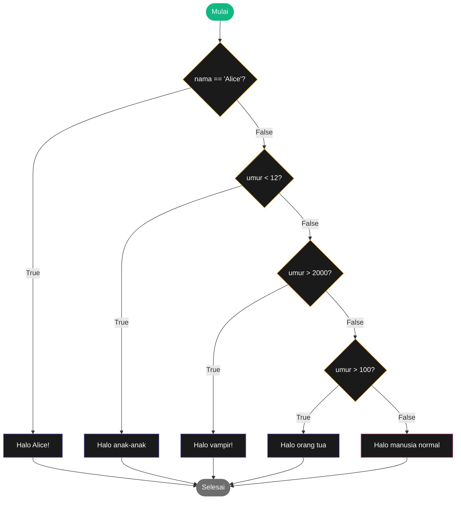
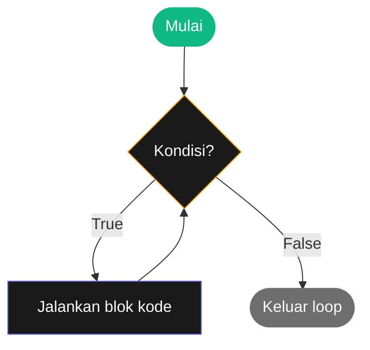
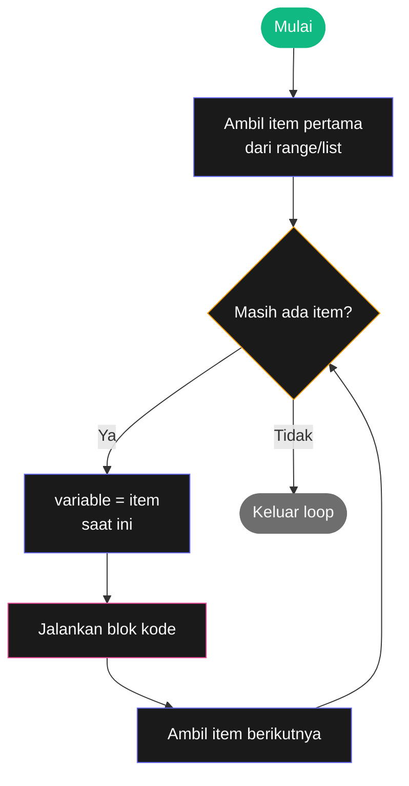

# Bab 2: Kontrol Alur Program

> *Programmer pemula menulis kode yang berjalan dari atas ke bawah. Programmer yang lebih jago bisa menyuruh kode untuk **memilih** dan **mengulang**.*

Di Bab 1, semua program kita berjalan **lurus** — baris demi baris dari atas ke bawah. Itu cuma 5% dari kekuatan pemrograman. Kekuatan sebenarnya muncul saat program bisa:

- **Memilih**: kalau kondisi A, lakukan X. Kalau B, lakukan Y.
- **Mengulang**: kerjakan ini 100 kali. Atau, kerjakan terus sampai kondisi tertentu terpenuhi.

Itulah **kontrol alur program** (flow control) — topik bab ini.

Setelah Bab 2, kamu akan bisa:

- Membuat program mengambil keputusan dengan `if`, `elif`, `else`
- Mengulang sesuatu dengan `for` dan `while`
- Memahami nilai Boolean dan operator perbandingan
- Mengerti kapan pakai `for` vs `while`
- Menulis program yang interaktif dan responsif

## 2.1. Boolean — Tipe Data Ketiga

Di Bab 1, kita kenal tiga tipe: `int`, `float`, dan `str`. Sekarang tipe keempat — yang paling penting untuk kontrol alur:

**Boolean** (`bool`) — tipe data yang hanya punya **dua nilai**: `True` (benar) atau `False` (salah).

```python
>>> sudah_dewasa = True
>>> sedang_hujan = False
>>> type(sudah_dewasa)
<class 'bool'>
```

!!! warning "Perhatikan huruf besar"
    `True` dan `False` ditulis dengan **huruf besar di awal**. `true` dan `false` (huruf kecil) bukan Boolean — Python akan protes.

    ```python
    >>> sudah = true
    NameError: name 'true' is not defined
    ```

Boolean kelihatan sederhana, tapi dia adalah **bahasa keputusan** komputer. Setiap kali program bertanya "lakukan A atau B?", jawabannya selalu di-reduksi menjadi `True` atau `False`.

## 2.2. Operator Perbandingan

Operator perbandingan menghasilkan Boolean. Kamu sudah kenal mereka dari matematika.

| Operator | Arti | Contoh |
|----------|------|--------|
| `==` | Sama dengan | `5 == 5` → `True` |
| `!=` | Tidak sama dengan | `5 != 3` → `True` |
| `<` | Lebih kecil | `3 < 5` → `True` |
| `>` | Lebih besar | `5 > 3` → `True` |
| `<=` | Lebih kecil atau sama | `5 <= 5` → `True` |
| `>=` | Lebih besar atau sama | `5 >= 6` → `False` |

Coba di prompt:

```python
>>> 42 == 42
True
>>> 42 == 99
False
>>> 2 != 3
True
>>> "halo" == "halo"
True
>>> "Halo" == "halo"
False
```

Perhatikan baris terakhir — Python **case-sensitive**. `"Halo"` dan `"halo"` dianggap dua string berbeda.

!!! warning "`=` vs `==` — kesalahan paling sering pemula"
    - `=` artinya **assignment** — masukkan nilai ke variable. _"umur = 25"_ artinya isi variable `umur` dengan 25.
    - `==` artinya **perbandingan** — apakah dua nilai sama? Hasilnya `True` atau `False`.

    Salah satu kesalahan paling sering pemula adalah menulis `=` saat maksudnya `==`:

    ```python
    if umur = 17:    # SALAH — Python error
    if umur == 17:   # BENAR
    ```

### Membandingkan Tipe Berbeda

Python ketat soal tipe. Membandingkan integer dengan integer atau string dengan string aman. Tapi:

```python
>>> 42 == "42"
False
>>> 42 == 42.0
True
```

- `42 == "42"` → `False`. Integer dan string adalah dua dunia berbeda.
- `42 == 42.0` → `True`. Integer dan float bisa dibandingkan karena keduanya angka.

Aturannya: **kalau ragu, ubah dulu ke tipe yang sama** sebelum membandingkan.

## 2.3. Operator Boolean

Kadang satu kondisi tidak cukup. Kamu mau cek "apakah umur ≥ 17 **DAN** punya KTP". Untuk gabungkan kondisi, pakai operator Boolean:

| Operator | Arti |
|----------|------|
| `and` | Kedua kondisi harus benar |
| `or` | Salah satu kondisi benar saja sudah cukup |
| `not` | Membalikkan: True jadi False, False jadi True |

### `and` — Semua harus benar

```python
>>> True and True
True
>>> True and False
False
>>> False and False
False
```

Contoh nyata:

```python
>>> umur = 18
>>> punya_ktp = True
>>> umur >= 17 and punya_ktp
True
```

### `or` — Cukup salah satu

```python
>>> True or False
True
>>> False or False
False
```

Contoh:

```python
>>> hari = "Sabtu"
>>> hari == "Sabtu" or hari == "Minggu"
True
```

### `not` — Pembalik

```python
>>> not True
False
>>> not False
True
>>> hujan = False
>>> not hujan
True
```

`not` berguna saat kamu ingin menulis kondisi sebagai negasi. _"Kalau **TIDAK** hujan, ayo keluar"_:

```python
not hujan
```

Lebih natural daripada `hujan == False`.

### Menggabungkan Operator

Kamu bisa kombinasikan operator-operator di atas:

```python
>>> umur = 25
>>> punya_sim = True
>>> punya_helm = False
>>> umur >= 17 and punya_sim and punya_helm
False
```

Salah satu kondisi (`punya_helm`) `False`, jadi `and` keseluruhan `False`.

!!! tip "Aturan urutan"
    Persis seperti matematika punya "kali sebelum tambah", Boolean operator punya urutan:

    1. `not` dievaluasi pertama
    2. Lalu `and`
    3. Terakhir `or`

    Kalau ragu, **pakai kurung**. Selalu lebih jelas:

    ```python
    (umur >= 17 and punya_sim) or sudah_lulus_ujian
    ```

## 2.4. Statement `if` — Pengambilan Keputusan

Sekarang kita masuk ke topik utama. Statement `if` membuat program bisa **memilih**.

Bentuk dasar:

```python
if kondisi:
    # blok kode yang dijalankan kalau kondisi True
```

Contoh:

```python
nama = input("Siapa nama kamu? ")
if nama == "Alice":
    print("Halo Alice!")
```

Kalau pengguna mengetik "Alice" (persis, case-sensitive), program akan menyapa. Kalau bukan, baris `print` itu di-skip.

### Indentasi — Aturan Wajib

Perhatikan **spasi sebelum `print`** di kode di atas. Itu disebut **indentasi**.

Di banyak bahasa pemrograman, indentasi cuma untuk kerapian. **Di Python, indentasi WAJIB** dan menentukan struktur program. Aturan:

- Gunakan **4 spasi** sebagai standar
- Editor (VS Code, dll) biasanya otomatis mengubah Tab jadi 4 spasi
- Konsisten — jangan campur 4 spasi dan 2 spasi di satu file

Tanpa indentasi yang benar, Python akan error:

```python
if nama == "Alice":
print("Halo")     # SALAH — tidak ada indentasi
```

```
IndentationError: expected an indented block
```

!!! info "Kenapa harus indentasi?"
    Python melarang banyak kebiasaan buruk dengan memaksa indentasi. Hasilnya: kode Python dari programmer manapun terlihat seragam dan mudah dibaca.

### `else` — Kalau Tidak

Sering kali kamu mau bilang "kalau begini, lakukan X. **Kalau tidak, lakukan Y**". Untuk itu pakai `else`:

```python
nama = input("Siapa nama kamu? ")
if nama == "Alice":
    print("Halo Alice!")
else:
    print("Halo, orang asing.")
```

`else` tidak butuh kondisi — dia akan jalan kalau semua `if` di atasnya `False`.

### `elif` — Banyak Cabang

Bagaimana kalau ada lebih dari dua pilihan? Pakai `elif` (singkatan _else if_):

```python
nama = input("Siapa nama kamu? ")
umur = int(input("Umur kamu? "))

if nama == "Alice":
    print("Halo Alice!")
elif umur < 12:
    print("Halo, kamu masih anak-anak.")
elif umur > 2000:
    print("Halo, vampir!")
elif umur > 100:
    print("Halo, seseorang yang sudah hidup lama!")
else:
    print("Halo, manusia normal.")
```

Cara baca alur ini secara visual:



<div class="flowchart-caption" markdown>
<span class="label">Cara baca flowchart</span>

Flowchart ini namanya **decision tree** (pohon keputusan). Cara membacanya: ikuti panah dari atas ke bawah.

**Bentuk-bentuk yang dipakai:**

- **Lingkaran hijau** "Mulai" = titik awal program.
- **Diamond amber** = pertanyaan/kondisi (`if`, `elif`). Setiap diamond punya dua jalur keluar: **True** (kalau jawabannya ya) dan **False** (kalau jawabannya tidak).
- **Kotak indigo** = aksi yang dijalankan saat kondisi True.
- **Kotak pink** = blok `else` — dijalankan kalau **semua** kondisi sebelumnya False.
- **Lingkaran abu-abu** "Selesai" = titik akhir.

**Cara mengikuti alur:**

1. Mulai dari atas. Cek pertanyaan pertama: "nama == 'Alice'?"
2. Kalau **True**, ambil panah ke kanan → cetak "Halo Alice!" → langsung ke "Selesai". **Pertanyaan lain di-skip.**
3. Kalau **False**, ambil panah ke bawah → cek pertanyaan berikutnya.
4. Lanjut sampai ada satu kondisi yang True, **atau** sampai semua kondisi False (lalu jatuh ke `else`).

**Kunci yang sering bikin pemula salah paham**: hanya **satu jalur** yang benar-benar dieksekusi. Walaupun seseorang bernama "Alice" **dan** umurnya 5 tahun, hanya `if nama == "Alice"` yang jalan. Begitu ada kondisi True, sisanya tidak pernah dicek.
</div>

Cara baca alur ini:

1. Cek kondisi pertama (`nama == "Alice"`). Kalau `True`, jalankan blok-nya, **lalu keluar dari seluruh struktur if**.
2. Kalau `False`, cek kondisi kedua (`umur < 12`). Dan seterusnya.
3. Kalau **semua** kondisi `False`, jalankan blok `else` (kalau ada).

!!! tip "Hanya satu blok yang akan jalan"
    Walaupun seseorang punya nama "Alice" dan umur kurang dari 12, **hanya** blok pertama (`nama == "Alice"`) yang akan jalan. Begitu ada `if`/`elif` yang `True`, sisanya di-skip.

### Latihan Cepat

Tulis program penentuan grade nilai:

```python
nilai = int(input("Masukkan nilai (0-100): "))

if nilai >= 90:
    grade = "A"
elif nilai >= 80:
    grade = "B"
elif nilai >= 70:
    grade = "C"
elif nilai >= 60:
    grade = "D"
else:
    grade = "E"

print("Grade kamu: " + grade)
```

Coba jalankan dengan nilai berbeda-beda. Pikirkan kenapa urutan `elif`-nya dari atas ke bawah penting.

## 2.5. Loop — Mengulang Sesuatu

Pengulangan (loop) adalah salah satu hal komputer **jauh** lebih baik dari manusia. Komputer bisa mengulang sesuatu sejuta kali tanpa lelah, tanpa salah ketik, tanpa mengeluh.

Python punya dua jenis loop: `while` dan `for`.

## 2.6. `while` — Ulang Selama Kondisi True

Bentuk dasar:

```python
while kondisi:
    # blok yang diulang selama kondisi True
```

Cara baca: "selama kondisi `True`, ulang blok ini terus".

Alur visualnya:



<div class="flowchart-caption" markdown>
<span class="label">Cara baca flowchart</span>

Flowchart ini menggambarkan **siklus** loop `while` — itulah kenapa ada panah yang **kembali ke atas**.

**Tahap demi tahap:**

1. **Mulai** (lingkaran hijau) — program tiba di baris `while`.
2. **Cek kondisi** (diamond amber) — Python evaluasi kondisi `while`.
3. Kalau **True** → jalankan blok kode di dalam loop → **kembali ke cek** (panah balik ke atas).
4. Kalau **False** → keluar loop, lanjut ke kode setelah `while`.

**Pola "kembali ke atas"** inilah yang membedakan loop dari `if`. Statement `if` cuma ditest sekali; `while` ditest **berulang-ulang** sampai kondisinya jadi False.

**Kenapa infinite loop berbahaya** — sekarang seharusnya jelas dari diagram: kalau di dalam blok kode kamu **tidak** mengubah kondisi, panah balik akan terus bawa kamu ke kondisi yang sama yang selalu True. Loop tidak akan pernah keluar. Pastikan ada kode yang akan akhirnya membuat kondisi `False`.
</div>

Contoh:

```python
hitungan = 1
while hitungan <= 5:
    print("Hitungan: " + str(hitungan))
    hitungan = hitungan + 1
print("Selesai!")
```

Output:

```
Hitungan: 1
Hitungan: 2
Hitungan: 3
Hitungan: 4
Hitungan: 5
Selesai!
```

Cara baca step by step:

1. `hitungan = 1` — siapkan variable
2. Cek kondisi: `1 <= 5`? Ya, masuk loop.
3. Cetak "Hitungan: 1"
4. `hitungan` jadi 2
5. Kembali ke awal, cek kondisi lagi: `2 <= 5`? Ya, masuk.
6. ... dan seterusnya
7. Saat `hitungan` jadi 6, cek: `6 <= 5`? Tidak. Keluar loop.
8. Cetak "Selesai!"

!!! warning "Awas infinite loop"
    Apa yang terjadi kalau saya lupa baris `hitungan = hitungan + 1`?

    ```python
    hitungan = 1
    while hitungan <= 5:
        print("Hitungan: " + str(hitungan))
    # hitungan tetap 1 selamanya — kondisi selalu True
    ```

    Program akan mencetak "Hitungan: 1" **selamanya** — sampai kamu paksa stop. Ini disebut **infinite loop**, dan ini bug klasik.

    Selalu pastikan: di dalam `while`, ada sesuatu yang **mengubah** kondisi sehingga akhirnya bisa jadi `False`.

    Kalau kamu terjebak di infinite loop, tekan **Ctrl+C** di terminal untuk paksa stop.

### Contoh Praktis: Verifikasi Input

```python
nama = ""
while nama == "":
    nama = input("Siapa nama kamu? ")
print("Halo, " + nama)
```

Loop ini akan terus minta nama selama pengguna mengetik string kosong. Begitu mereka ketik sesuatu, kondisi jadi `False` dan loop berakhir.

### `break` — Keluar Paksa dari Loop

Kadang kamu mau keluar loop sebelum kondisi `False`. Pakai `break`:

```python
while True:
    print("Ketik 'keluar' untuk berhenti")
    teks = input("> ")
    if teks == "keluar":
        break
    print("Kamu mengetik: " + teks)
print("Sampai jumpa!")
```

`while True` adalah loop yang **selalu lanjut**. Tanpa `break`, ini infinite loop. Tapi karena ada `if teks == "keluar": break`, program bisa keluar saat pengguna ngetik "keluar".

Pola `while True` + `break` sangat sering dipakai untuk loop yang berjalan sampai kondisi spesifik terpenuhi.

### `continue` — Skip ke Iterasi Berikutnya

`continue` mirip `break`, tapi alih-alih keluar loop, dia **skip ke iterasi berikutnya**.

```python
while True:
    print("Siapa nama kamu?")
    nama = input("> ")
    if nama != "Joe":
        continue
    print("Halo, Joe! Apa password rahasiamu?")
    password = input("> ")
    if password == "swordfish":
        break
print("Akses diberikan.")
```

Penjelasan:

1. Kalau pengguna ketik nama selain "Joe", `continue` → kembali ke atas loop, tanya nama lagi
2. Kalau nama-nya "Joe", lanjut tanya password
3. Kalau password benar, `break` → keluar loop

## 2.7. `for` — Loop dengan Jumlah Pasti

`while` cocok kalau kamu **tidak tahu** berapa kali harus mengulang. `for` cocok kalau kamu **tahu** — misalnya "ulangi 100 kali" atau "untuk setiap item di daftar ini".

Bentuk dasar:

```python
for variable in sesuatu_yang_bisa_diulang:
    # blok kode
```

Alur visualnya:



<div class="flowchart-caption" markdown>
<span class="label">Cara baca flowchart</span>

Flowchart ini menjelaskan kenapa `for` **lebih aman dari infinite loop** dibanding `while`.

**Tahap demi tahap:**

1. **Mulai** (lingkaran hijau) — program tiba di `for variable in sesuatu`.
2. **Init** — Python siapkan iterator: ambil item pertama dari `range()` atau list.
3. **Cek** (diamond amber) — apakah masih ada item tersisa? Ini bukan kondisi yang kamu tulis — Python yang manage sendiri.
4. Kalau **Ya** → set `variable` = item saat ini → jalankan blok kode → **ambil item berikutnya** → kembali ke cek.
5. Kalau **Tidak** → keluar loop.

**Perbedaan dengan `while`:**

- Pada `while`, **kamu** yang bertanggung jawab mengubah kondisi. Lupa = infinite loop.
- Pada `for`, **Python** yang otomatis maju ke item berikutnya. Tidak ada cara untuk infinite loop secara tidak sengaja.

**Itulah kenapa**: kalau jumlah pengulangan sudah pasti (10 kali, 100 kali, atau "untuk tiap item di list"), pakai `for` — lebih aman dan lebih ringkas.
</div>

### `range()` — Sahabat Loop `for`

Cara paling sering pakai `for` adalah dengan `range()`:

```python
for i in range(5):
    print("Hitungan ke-" + str(i))
```

Output:

```
Hitungan ke-0
Hitungan ke-1
Hitungan ke-2
Hitungan ke-3
Hitungan ke-4
```

`range(5)` menghasilkan urutan angka: 0, 1, 2, 3, 4. Total 5 angka, mulai dari **0**, bukan 1.

!!! info "Kenapa mulai dari 0?"
    Hampir semua bahasa pemrograman modern (Python, Java, C, JavaScript, dll) mulai hitungan dari 0. Awalnya aneh, tapi nanti kamu akan kebiasaan. Sebagian besar konsep di pemrograman lebih natural saat dimulai dari 0 — terutama saat masuk ke list di Bab 4.

`range()` punya tiga bentuk pemakaian:

```python
range(5)        # 0, 1, 2, 3, 4
range(2, 7)     # 2, 3, 4, 5, 6 (mulai 2, sampai 7 — 7 tidak termasuk)
range(0, 10, 2) # 0, 2, 4, 6, 8 (loncat 2)
```

Argumen ketiga adalah **step**. Bisa juga negatif untuk mundur:

```python
for i in range(10, 0, -1):
    print(i)
print("Lepas landas!")
```

Output:

```
10
9
8
7
6
5
4
3
2
1
Lepas landas!
```

### `for` vs `while`: Kapan Pakai yang Mana?

| Situasi | Pakai |
|---------|-------|
| "Ulangi 100 kali" | `for` dengan `range(100)` |
| "Untuk tiap item di daftar belanjaan" | `for ... in daftar` (Bab 4) |
| "Terus minta password sampai benar" | `while` |
| "Selama saldo > 0, terus tarik tunai" | `while` |
| "Cetak hitungan 1-10" | `for` dengan `range(1, 11)` |

Aturan praktis: kalau kamu tahu **berapa kali** akan diulang sebelum loop dimulai, pakai `for`. Kalau tergantung **kondisi yang berubah selama loop**, pakai `while`.

## 2.8. Project: Tebak Angka

Mari gabungkan semua yang sudah dipelajari menjadi project nyata.

Buat program tebak angka: komputer "memikirkan" angka random 1-20, pengguna punya 6 kesempatan tebak. Setiap tebakan, program kasih hint.

```python
import random

print("=" * 40)
print("Selamat datang di Tebak Angka!")
print("=" * 40)

nama = input("Siapa nama kamu? ")
print("Hai " + nama + "! Aku sudah memikirkan angka antara 1 dan 20.")

angka_rahasia = random.randint(1, 20)
jumlah_kesempatan = 6

for percobaan in range(1, jumlah_kesempatan + 1):
    print()
    print("Percobaan ke-" + str(percobaan) + ". Tebak:")
    tebakan = int(input("> "))

    if tebakan < angka_rahasia:
        print("Terlalu kecil.")
    elif tebakan > angka_rahasia:
        print("Terlalu besar.")
    else:
        print()
        print("Selamat! Kamu menebaknya dalam " + str(percobaan) + " percobaan.")
        break

if tebakan != angka_rahasia:
    print()
    print("Kesempatan habis. Angkanya adalah " + str(angka_rahasia) + ".")
```

Yang terjadi step by step:

1. `import random` — kita pakai modul `random` untuk angka acak (akan dijelaskan lebih detail di Bab 3)
2. `random.randint(1, 20)` — komputer pilih angka acak 1-20, simpan di `angka_rahasia`
3. `for percobaan in range(1, 7):` — loop 6 kali (percobaan 1 sampai 6)
4. Setiap iterasi: minta tebakan, bandingkan, kasih hint
5. Kalau tebakan benar, `break` keluar loop
6. Setelah loop selesai (apapun penyebabnya), cek apakah pengguna berhasil

**Coba jalankan.** Lalu modifikasi:

- Ubah jumlah kesempatan jadi 10
- Ubah range angka jadi 1-100
- Tambahkan: tampilkan "Hampir!" kalau selisih tebakan ≤ 3

## 2.9. Sedikit Tips

### Pakai Truthiness — Singkat dan Pythonic

Python menganggap nilai-nilai berikut sebagai `False` saat dipakai sebagai kondisi:

- `False`
- `0` dan `0.0`
- `""` (string kosong)
- `None`
- List, dictionary, tuple kosong (akan dibahas nanti)

Semua nilai lain dianggap `True`.

Artinya, alih-alih menulis:

```python
if nama != "":
    print("Halo, " + nama)
```

Bisa lebih singkat:

```python
if nama:
    print("Halo, " + nama)
```

Kalau `nama` string kosong, kondisi `False` — di-skip. Kalau ada isinya, `True` — jalan. Lebih Pythonic.

### Komentar untuk Kode Kompleks

Loop dan kondisi yang berlapis bisa membingungkan. Tambahkan komentar saat alur-nya tidak obvious:

```python
# Loop sampai pengguna ketik password yang benar atau menyerah
while True:
    password = input("Password: ")
    if password == "swordfish":
        break
    if password == "":
        print("Membatalkan login.")
        break
```

## 2.10. Ringkasan

- **Boolean** punya dua nilai: `True` dan `False`
- **Operator perbandingan**: `==`, `!=`, `<`, `>`, `<=`, `>=` — menghasilkan Boolean
- **Operator Boolean**: `and`, `or`, `not` — menggabungkan kondisi
- **`if`/`elif`/`else`** — pengambilan keputusan, dijalankan hanya kalau kondisi `True`
- **Indentasi WAJIB** di Python — pakai 4 spasi konsisten
- **`while`** — loop selama kondisi `True`. Hati-hati infinite loop.
- **`for ... in range(n)`** — loop sebanyak `n` kali (mulai dari 0)
- **`break`** — keluar loop paksa
- **`continue`** — skip ke iterasi berikutnya
- **`while True` + `break`** — pola untuk loop yang berhenti saat kondisi tertentu

Konsep paling penting: **indentasi menentukan blok kode**. Salah indentasi = program error atau perilaku tidak terduga.

## 2.11. Latihan

### Latihan 2.1 — FizzBuzz

Soal klasik yang sering ditanya saat interview kerja. Tulis program yang mencetak angka 1 sampai 30, **tapi**:

- Kalau angka kelipatan 3, cetak "Fizz" (bukan angkanya)
- Kalau angka kelipatan 5, cetak "Buzz"
- Kalau kelipatan 3 **dan** 5, cetak "FizzBuzz"
- Selain itu, cetak angkanya

Hint: pakai `for` dan `range()`. Pakai modulo `%`.

### Latihan 2.2 — Konversi Suhu Berulang

Program yang minta suhu Celcius dari pengguna, konversi ke Fahrenheit, lalu **tanya lagi** apakah mau konversi lagi. Loop sampai pengguna ketik "tidak".

### Latihan 2.3 — Validasi Umur

Program yang minta umur. Kalau pengguna ketik angka negatif atau nol, kasih warning dan **minta lagi**. Loop sampai pengguna ketik angka positif.

### Latihan 2.4 — Tabel Perkalian

Program yang minta angka, lalu cetak tabel perkalian 1 sampai 10 dari angka itu.

Output untuk input 7:

```
7 x 1 = 7
7 x 2 = 14
7 x 3 = 21
...
7 x 10 = 70
```

### Latihan 2.5 — Total Belanja

Program kasir sederhana:

1. Loop terus minta harga barang
2. Kalau pengguna ketik 0, hentikan loop
3. Tampilkan total harga semua barang

### Latihan 2.6 — Tebak Angka Versi 2

Modifikasi project tebak angka di atas:

- Range diperluas jadi 1-100
- Beri hint "Sangat dekat!" kalau selisih ≤ 5
- Catat dan tampilkan riwayat tebakan pengguna di akhir

### Latihan 2.7 — Tantangan: Pola Bintang

Tulis program yang minta angka N, lalu cetak segitiga bintang dengan N baris:

```
*
**
***
****
*****
```

Kalau N = 5, cetak seperti di atas.

Hint: pakai dua loop — satu untuk baris, satu untuk bintang per baris. Atau pakai trik string `"*" * jumlah`.

---

## Selanjutnya

Bab 3 akan masuk ke **Functions** — cara mengelompokkan kode jadi blok-blok yang bisa dipakai berulang. Tanpa function, program besar akan jadi mimpi buruk untuk dirawat.

Sebelum lanjut: pastikan minimal **5 latihan** sudah dikerjakan. Ini bukan basa-basi — flow control adalah keterampilan paling fundamental dalam pemrograman. Semua bab setelah ini mengandalkan kemampuan kamu menulis loop dan kondisi.

<div class="cheatsheet" markdown>

### Operator Perbandingan
| Op | Arti | Op | Arti |
|---|---|---|---|
| `==` | Sama | `!=` | Tidak sama |
| `<` | Kurang dari | `>` | Lebih dari |
| `<=` | ≤ | `>=` | ≥ |

### Boolean
```python
and   # semua harus True
or    # cukup salah satu
not   # kebalikan
```

### `if` / `elif` / `else`
```python
if kondisi:
    aksi_1
elif kondisi_lain:
    aksi_2
else:
    aksi_default
```

### Loop `while`
```python
while kondisi:
    aksi
    # jangan lupa update kondisi!
```

### Loop `for`
```python
for i in range(10):           # 0..9
for i in range(2, 7):         # 2..6
for i in range(0, 10, 2):     # 0,2,4,6,8
for i in range(10, 0, -1):    # 10..1
```

### Kontrol Loop
```python
break       # keluar paksa
continue    # skip ke iterasi berikutnya
```

</div>

[← Kembali ke Bab 1](bab-01-dasar-dasar-python.md){ .md-button }
[Lanjut ke Bab 3 →](bab-03-fungsi.md){ .md-button .md-button--primary }

<div class="atribusi-bab">
Diadaptasi dari Chapter 2: Flow Control, "Automate the Boring Stuff with Python" karya <a href="https://inventwithpython.com/" target="_blank">Al Sweigart</a>. Versi asli: <a href="https://automatetheboringstuff.com/2e/chapter2/" target="_blank">automatetheboringstuff.com/2e/chapter2/</a>. Adaptasi: penjelasan diperluas, contoh dilokalkan, latihan tambahan ditambahkan. Dilisensikan CC BY-NC-SA 4.0.
</div>
