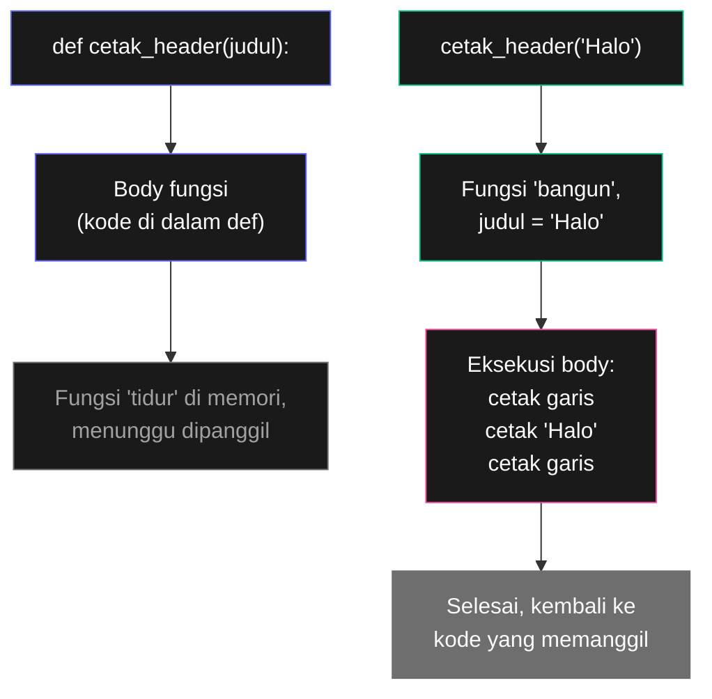
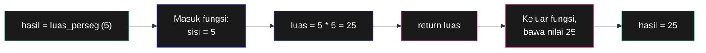
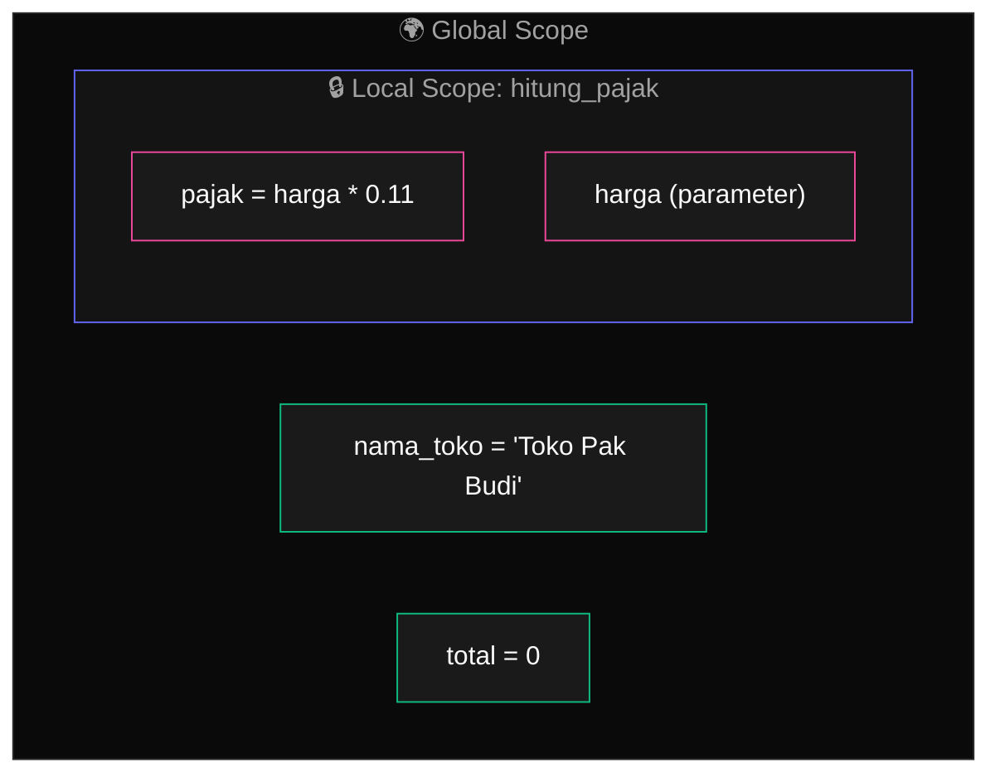
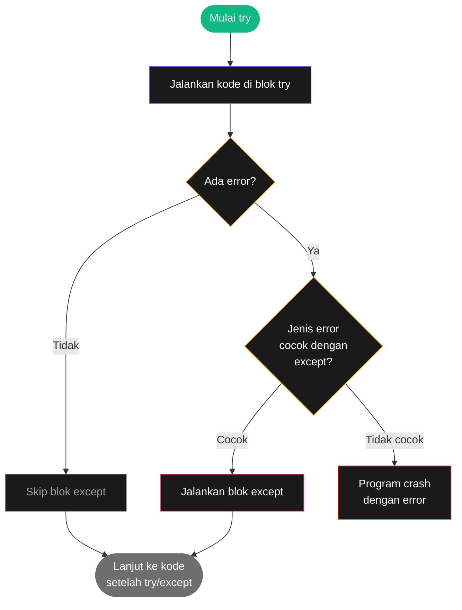

# Bab 3: Fungsi

> *Programmer hebat malas. Mereka tidak suka mengetik kode yang sama dua kali. Itulah kenapa fungsi diciptakan.*

Bayangkan kamu menulis program yang harus mencetak baris pemisah cantik di banyak tempat:

```python
print("=" * 50)
print("Selamat datang!")
print("=" * 50)

# ... 50 baris kode lain ...

print("=" * 50)
print("Menu Utama")
print("=" * 50)

# ... 50 baris kode lagi ...

print("=" * 50)
print("Selamat tinggal!")
print("=" * 50)
```

Tiap kali kamu butuh "header cantik", kamu mengetik 3 baris yang sama. Kalau program-mu butuh 20 header — kamu mengetik 60 baris yang **persis sama**. Ini buruk, karena:

1. **Capek.** Jelas.
2. **Salah ketik bisa terjadi.** Salah satu dari 60 baris itu bisa ke-typo.
3. **Sulit diubah.** Kalau suatu hari kamu mau ganti `=` jadi `*`, kamu harus edit 60 tempat. Lupa satu = bug.

**Fungsi** adalah cara mengatasi ini. Kamu tulis kode satu kali, beri nama, lalu pakai berkali-kali.

Setelah Bab 3, kamu akan bisa:

- Membuat fungsi sendiri dengan `def`
- Memahami parameter, argument, dan return value
- Menggunakan fungsi dari modul (library) Python
- Membedakan local vs global scope
- Menangani error dengan `try`/`except`

## 3.1. Anatomi Fungsi Pertama

Mari ubah contoh di atas pakai fungsi:

```python
def cetak_header(judul):
    print("=" * 50)
    print(judul)
    print("=" * 50)

cetak_header("Selamat datang!")
cetak_header("Menu Utama")
cetak_header("Selamat tinggal!")
```

Bandingkan dua versi. Yang ini cuma 8 baris untuk hasil yang sama dengan 9 baris di atas. Tapi kalau header-nya dipakai 20 kali, versi tanpa fungsi jadi 60 baris, sedangkan versi pakai fungsi tetap **6 baris definisi + 20 baris pemanggilan = 26 baris**. Hemat 34 baris dan tidak ada duplikasi.

Mari urai anatomi fungsi:

```python
def cetak_header(judul):
    print("=" * 50)
    print(judul)
    print("=" * 50)
```

Bagian-bagiannya:

| Bagian | Apa | Catatan |
|--------|-----|---------|
| `def` | Keyword "definisi" | Wajib di awal |
| `cetak_header` | Nama fungsi | Aturan sama dengan nama variable |
| `(judul)` | Parameter | Data yang fungsi terima saat dipanggil |
| `:` | Tanda mulai blok | Wajib |
| 3 baris berindentasi | Body fungsi | Kode yang dieksekusi saat fungsi dipanggil |



<div class="flowchart-caption" markdown>
<span class="label">Cara baca diagram</span>

Diagram ini menjelaskan **dua tahap** kehidupan sebuah fungsi: **definisi** dan **pemanggilan**.

**Tahap 1 — Definisi (jalur indigo)**:

1. Saat Python mengeksekusi `def cetak_header(judul):`, dia tidak menjalankan kode di dalamnya.
2. Dia hanya **mencatat di memori**: "ada fungsi bernama `cetak_header`, body-nya seperti ini".
3. Fungsi "tidur" di memori — siap dipakai, tapi belum aktif.

**Tahap 2 — Pemanggilan (jalur hijau-pink)**:

1. Saat kamu menulis `cetak_header('Halo')`, fungsi "bangun".
2. Parameter `judul` di-set ke nilai yang kamu kasih (`'Halo'`).
3. Body fungsi dieksekusi baris demi baris.
4. Setelah selesai, Python kembali ke baris setelah pemanggilan.

**Kunci**: `def` cuma **mendaftarkan** fungsi. `cetak_header(...)` yang **menjalankannya**. Pemula sering mengira definisi sudah eksekusi kode — bukan.
</div>

## 3.2. Parameter dan Argument

Dua istilah yang sering tertukar bahkan oleh programmer profesional:

- **Parameter** = nama variable yang ada di dalam **definisi** fungsi
- **Argument** = nilai yang kamu kirim saat **memanggil** fungsi

```python
def sapa(nama):              # 'nama' = parameter
    print("Halo, " + nama)

sapa("Budi")                 # 'Budi' = argument
```

Lebih mudah diingat:

> **Parameter** dideklarasikan saat **pem**buatan fungsi.
> **Argument** dikirim saat **a**ksi pemanggilan.

Fungsi bisa punya banyak parameter:

```python
def sapa_lengkap(sapaan, nama, akhiran):
    print(sapaan + ", " + nama + akhiran)

sapa_lengkap("Selamat pagi", "Pak Budi", "!")
sapa_lengkap("Halo", "Sari", " 👋")
```

Saat pemanggilan, urutan argument **wajib sesuai urutan parameter**.

### Argument dengan Nama (Keyword Argument)

Kalau fungsinya punya banyak parameter, mengingat urutan jadi melelahkan. Solusi: pakai **keyword argument** — sebutkan nama parameternya.

```python
sapa_lengkap(nama="Sari", sapaan="Halo", akhiran=" 👋")
```

Urutannya bebas. Kamu juga bisa campur — argument pertama posisional, sisanya keyword:

```python
sapa_lengkap("Halo", akhiran="!", nama="Sari")
```

### Default Value

Kalau parameter sering punya nilai yang sama, kasih dia **default value**:

```python
def sapa_lengkap(nama, sapaan="Halo", akhiran="!"):
    print(sapaan + ", " + nama + akhiran)

sapa_lengkap("Sari")                   # Halo, Sari!
sapa_lengkap("Budi", "Selamat pagi")   # Selamat pagi, Budi!
sapa_lengkap("Andi", akhiran=" 👋")    # Halo, Andi 👋
```

Aturan: parameter dengan default value **harus diletakkan di akhir** dari daftar parameter.

```python
def salah(akhiran="!", nama):    # Error: parameter wajib setelah default
    pass
```

## 3.3. Return Value — Fungsi yang Mengembalikan Sesuatu

Sejauh ini, fungsi kita cuma **melakukan** sesuatu (cetak ke layar). Tapi fungsi yang lebih powerful **menghitung dan mengembalikan** nilai. Pakai keyword `return`:

```python
def luas_persegi(sisi):
    luas = sisi * sisi
    return luas

hasil = luas_persegi(5)
print(hasil)        # 25
print(luas_persegi(7))   # 49
```

Saat Python ketemu `return`, dua hal terjadi:

1. Fungsi **berhenti** di situ — baris setelahnya tidak dieksekusi
2. Nilai setelah `return` **dikirim balik** ke kode yang memanggil



<div class="flowchart-caption" markdown>
<span class="label">Cara baca diagram</span>

Diagram ini menunjukkan **alur nilai** saat fungsi dipanggil dengan `return`.

**Step demi step**:

1. **Panggilan** (hijau) — `luas_persegi(5)` dipanggil. Python tahu hasilnya nanti akan disimpan ke `hasil`.
2. **Masuk fungsi** — parameter `sisi` di-set ke `5`.
3. **Hitung** — body fungsi dieksekusi: `luas = 5 * 5 = 25`.
4. **`return luas`** (pink) — nilai `25` "dikemas" untuk dibawa keluar.
5. **Keluar fungsi** — Python balik ke baris pemanggilan, bawa nilai `25`.
6. **Simpan** — `hasil` sekarang berisi `25`.

**Kunci**: `return` itu seperti **paket**. Fungsi membungkus hasil hitungannya, lalu mengirim balik ke kode pemanggil. Kalau fungsi tidak punya `return`, paket yang dikirim adalah `None` (tidak ada apa-apanya).

**Pemula sering bingung**: `return` ≠ `print`. `print` menampilkan ke layar (manusia lihat). `return` mengirim nilai ke kode (komputer lanjut pakai).
</div>

### Return Banyak Nilai

Python bisa return lebih dari satu nilai sekaligus, dipisah koma:

```python
def info_lingkaran(jari):
    keliling = 2 * 3.14159 * jari
    luas = 3.14159 * jari * jari
    return keliling, luas

k, l = info_lingkaran(5)
print("Keliling:", k)
print("Luas:", l)
```

### Fungsi Tanpa Return

Fungsi yang tidak punya `return` (seperti `cetak_header` di atas) tetap valid. Secara teknis Python akan return `None` — nilai khusus yang artinya "tidak ada nilai".

```python
def cetak_header(judul):
    print(judul)

hasil = cetak_header("Test")
print(hasil)        # None
```

## 3.4. Local vs Global Scope

**Scope** = "wilayah" di mana sebuah variable bisa diakses. Konsep ini penting — sumber bug paling banyak di program pemula.

### Variable di Dalam Fungsi = Local

Variable yang dibuat **di dalam** fungsi hanya hidup di dalam fungsi itu. Begitu fungsi selesai, variable-nya **hilang**:

```python
def hitung_pajak(harga):
    pajak = harga * 0.11    # 'pajak' adalah local variable
    return harga + pajak

total = hitung_pajak(100000)
print(total)        # 111000
print(pajak)        # ERROR! 'pajak' tidak dikenal di luar fungsi
```

Kalau kamu coba akses `pajak` di luar fungsi, Python akan protes:

```
NameError: name 'pajak' is not defined
```

### Variable di Luar Fungsi = Global

Variable yang dibuat di **luar** semua fungsi disebut **global**. Bisa diakses dari mana saja, termasuk dari dalam fungsi:

```python
nama_toko = "Toko Sembako Pak Budi"   # global

def cetak_struk():
    print("=== " + nama_toko + " ===")  # Bisa akses 'nama_toko'

cetak_struk()
```



<div class="flowchart-caption" markdown>
<span class="label">Cara baca diagram</span>

Diagram ini menunjukkan **konsep "ruangan dalam ruangan"** untuk scope.

**Anatomi**:

- **Kotak besar abu-abu** = Global scope. Variable di sini bisa diakses dari **mana saja**.
- **Kotak indigo di dalamnya** = Local scope dari fungsi `hitung_pajak`. Variable di sini **hanya hidup** saat fungsi sedang berjalan.

**Aturan dasar**:

- 🟢 **Dari dalam fungsi**, kamu bisa **lihat** variable global (panah dari local ke global = boleh).
- 🔴 **Dari luar fungsi**, kamu **tidak bisa** lihat variable local (variable local "tersembunyi" di balik dinding fungsi).
- Variable local dengan nama yang **sama** dengan global akan **menutupi** yang global di dalam fungsi tersebut (variable shadowing).

**Kenapa ini didesain begini?** Karena fungsi harus bisa dipakai ulang tanpa khawatir merusak data di luar. Setiap kali fungsi dipanggil, dia dapat "ruang kerja bersih" sendiri.
</div>

### Modifikasi Global dari Dalam Fungsi: `global`

Default-nya, kamu **tidak bisa** memodifikasi global variable dari dalam fungsi. Coba kode ini:

```python
hitungan = 0

def tambah():
    hitungan = hitungan + 1   # ERROR

tambah()
```

Error:

```
UnboundLocalError: local variable 'hitungan' referenced before assignment
```

Untuk memodifikasi global, deklarasikan dulu pakai `global`:

```python
hitungan = 0

def tambah():
    global hitungan
    hitungan = hitungan + 1

tambah()
tambah()
tambah()
print(hitungan)        # 3
```

!!! warning "Gunakan `global` seperlunya"
    Banyak programmer profesional menghindari `global` karena bisa bikin kode susah di-debug — variable bisa berubah dari mana-mana. Lebih baik **return value** dari fungsi, lalu simpan ke variable di luar.

    ```python
    # Lebih baik: return, jangan modifikasi global
    def tambah(angka):
        return angka + 1

    hitungan = 0
    hitungan = tambah(hitungan)
    hitungan = tambah(hitungan)
    ```

## 3.5. Modul — Fungsi Buatan Orang Lain

Python sudah punya **ribuan fungsi siap pakai** yang dikelompokkan dalam **modul** (juga disebut library). Untuk pakai, kamu cukup `import`:

```python
import random

angka_acak = random.randint(1, 100)
print(angka_acak)        # angka random 1-100

import math

print(math.sqrt(16))     # 4.0 (akar kuadrat)
print(math.pi)           # 3.141592653589793
```

Pola pemakaian: `nama_modul.nama_fungsi(...)`.

### Bentuk Lain Import

Ada beberapa cara import. Yang paling sering dipakai:

```python
# Import keseluruhan modul
import random
random.randint(1, 6)

# Import fungsi spesifik
from random import randint
randint(1, 6)        # tidak perlu prefix 'random.'

# Import dengan alias
import random as r
r.randint(1, 6)

# Import semua (TIDAK direkomendasikan)
from random import *
randint(1, 6)
```

`from modul import *` jarang dipakai karena mengisi namespace dengan banyak nama yang tidak terduga — bikin susah baca kode.

### Modul Standar yang Sering Dipakai

Modul-modul ini sudah ada di Python tanpa perlu install:

| Modul | Untuk | Contoh |
|-------|-------|--------|
| `random` | Angka acak, pilihan acak | `random.randint(1, 10)` |
| `math` | Matematika lanjutan | `math.sqrt(25)`, `math.pi` |
| `time` | Waktu, delay | `time.sleep(2)` (tunggu 2 detik) |
| `datetime` | Tanggal & waktu | `datetime.datetime.now()` |
| `os` | Berinteraksi dengan OS | `os.listdir(".")` (daftar file) |
| `sys` | Info sistem Python | `sys.exit()` (keluar program) |
| `json` | Baca/tulis JSON | `json.loads(string_json)` |
| `csv` | Baca/tulis CSV | `csv.reader(...)` |

Kita akan pakai banyak modul ini di Bagian 2.

## 3.6. Exception Handling — Menangani Error

Sejauh ini, kalau program kita ketemu error (misalnya pengguna ketik teks padahal kita mau angka), program **mati**. Itu pengalaman pengguna yang buruk.

**Exception handling** mengizinkan kita **menangkap** error dan menanganinya dengan baik.

```python
def bagi(a, b):
    return a / b

print(bagi(10, 2))       # 5.0
print(bagi(10, 0))       # ERROR! ZeroDivisionError
print("Selamat tinggal") # Tidak pernah dieksekusi
```

Pakai `try`/`except`:

```python
def bagi_aman(a, b):
    try:
        return a / b
    except ZeroDivisionError:
        return "Tidak bisa dibagi nol"

print(bagi_aman(10, 2))   # 5.0
print(bagi_aman(10, 0))   # Tidak bisa dibagi nol
print("Selamat tinggal")  # Tetap dieksekusi
```



<div class="flowchart-caption" markdown>
<span class="label">Cara baca flowchart</span>

Flowchart ini menjelaskan **3 skenario** yang terjadi saat blok `try`/`except`.

**Skenario 1 — Tidak ada error (jalur indigo)**:

1. Blok `try` dijalankan.
2. Tidak ada masalah → blok `except` di-**skip** total.
3. Lanjut ke kode setelah `try/except`.

**Skenario 2 — Error terjadi & jenisnya cocok (jalur pink)**:

1. Blok `try` dijalankan.
2. Error terjadi → Python berhenti di tengah blok `try`.
3. Cek jenis error: cocok dengan `except ZeroDivisionError`? **Ya**.
4. Jalankan blok `except` → lanjut normal.

**Skenario 3 — Error terjadi & jenisnya tidak cocok (jalur merah)**:

1. Blok `try` dijalankan.
2. Error terjadi.
3. Cek jenis error: cocok? **Tidak** (misalnya error-nya `ValueError`, padahal `except`-nya menangkap `ZeroDivisionError`).
4. Program **tetap crash** — `try/except` tidak menangkapnya.

**Kunci**: `except` itu seperti jaring dengan jenis spesifik. Kalau errornya jenis lain, dia lolos jaring. Pemula sering pakai `except:` polos (tanpa jenis) — itu menangkap **semua** error, tapi praktek ini buruk karena bisa menyembunyikan bug yang seharusnya terlihat.
</div>

### Multiple Except

Satu `try` bisa punya banyak `except` untuk jenis error berbeda:

```python
def parse_umur(teks):
    try:
        umur = int(teks)
        return 100 / umur
    except ValueError:
        return "Itu bukan angka"
    except ZeroDivisionError:
        return "Umur tidak boleh nol"

print(parse_umur("25"))        # 4.0
print(parse_umur("abc"))       # Itu bukan angka
print(parse_umur("0"))         # Umur tidak boleh nol
```

### Pola Validasi Input

Pola sangat sering dipakai: minta input pengguna sampai input-nya valid.

```python
while True:
    try:
        umur = int(input("Umur kamu: "))
        if umur < 0:
            print("Umur tidak boleh negatif. Coba lagi.")
            continue
        break        # Input valid, keluar loop
    except ValueError:
        print("Itu bukan angka. Coba lagi.")

print("Umur kamu:", umur)
```

Loop ini akan terus minta input sampai pengguna ketik angka positif yang valid.

## 3.7. Project: Program Kalkulator Sederhana

Mari gabungkan semua yang sudah dipelajari menjadi project nyata.

```python
import math

def cetak_header(judul):
    print()
    print("=" * 40)
    print(judul.center(40))
    print("=" * 40)

def tampilkan_menu():
    print("1. Penjumlahan")
    print("2. Pengurangan")
    print("3. Perkalian")
    print("4. Pembagian")
    print("5. Akar kuadrat")
    print("6. Keluar")

def minta_angka(label):
    while True:
        try:
            return float(input(label))
        except ValueError:
            print("Itu bukan angka. Coba lagi.")

def hitung(pilihan):
    if pilihan in ("1", "2", "3", "4"):
        a = minta_angka("Angka pertama: ")
        b = minta_angka("Angka kedua: ")

        if pilihan == "1":
            return a + b
        elif pilihan == "2":
            return a - b
        elif pilihan == "3":
            return a * b
        elif pilihan == "4":
            try:
                return a / b
            except ZeroDivisionError:
                return "Error: tidak bisa dibagi nol"
    elif pilihan == "5":
        a = minta_angka("Angka: ")
        if a < 0:
            return "Error: akar dari angka negatif tidak ada"
        return math.sqrt(a)
    return None

def main():
    cetak_header("Kalkulator Sederhana")

    while True:
        print()
        tampilkan_menu()
        pilihan = input("Pilih (1-6): ").strip()

        if pilihan == "6":
            print("Terima kasih, sampai jumpa!")
            break

        if pilihan not in ("1", "2", "3", "4", "5"):
            print("Pilihan tidak valid.")
            continue

        hasil = hitung(pilihan)
        print("Hasil:", hasil)

main()
```

Project ini menunjukkan kekuatan fungsi:

1. **`cetak_header`, `tampilkan_menu`, `minta_angka`, `hitung`** — fungsi-fungsi yang reusable dan testable secara terpisah
2. **`main()`** — fungsi utama yang menggabungkan semuanya
3. **Exception handling** di `minta_angka` — pengguna tidak akan crash program walaupun ketik teks ngaco
4. **Modul** `math` dipakai untuk akar kuadrat

Coba jalankan, lalu modifikasi:

- Tambahkan menu pangkat (gunakan `**`)
- Tambahkan menu modulo
- Catat riwayat perhitungan dalam global list, tampilkan saat menu "7. Riwayat"

## 3.8. Tips & Konvensi

### Nama Fungsi yang Baik

- **Pakai kata kerja**: `hitung_pajak`, `kirim_email`, `cetak_struk`. Bukan `pajak` atau `email`.
- **Pakai snake_case**: `hitung_pajak`, bukan `HitungPajak` atau `hitungpajak`.
- **Spesifik**: `hitung_pajak_pertambahan_nilai` lebih baik dari `hitung`.

### Fungsi Pendek

Aturan praktis: kalau fungsi kamu lebih dari **20 baris**, mungkin dia melakukan **terlalu banyak hal**. Pecah jadi fungsi-fungsi kecil yang masing-masing punya satu tugas.

### Docstring

Untuk fungsi yang kompleks, tulis dokumentasi singkat di awal body — pakai triple quotes:

```python
def hitung_pajak(harga, persen=11):
    """Hitung pajak dari harga yang diberikan.

    Args:
        harga: harga sebelum pajak (float)
        persen: persen pajak, default 11

    Returns:
        nilai pajak (float)
    """
    return harga * (persen / 100)
```

Docstring akan muncul saat orang lain (atau kamu sendiri besok) panggil `help(hitung_pajak)`.

## 3.9. Ringkasan

- **Fungsi** memungkinkan kamu menulis kode sekali, pakai berkali-kali — hindari duplikasi
- **`def`** mendefinisikan fungsi; **pemanggilan** menjalankannya
- **Parameter** vs **argument**: parameter di definisi, argument saat pemanggilan
- **Default value** bikin parameter optional
- **Keyword argument** mengizinkan urutan bebas
- **`return`** mengirim nilai keluar dari fungsi
- **Local scope** vs **global scope**: variable local mati saat fungsi selesai
- **`global`** mengizinkan modifikasi global, tapi gunakan seperlunya
- **`import`** memungkinkan pakai fungsi dari modul (random, math, dll)
- **`try`/`except`** menangkap error agar program tidak crash

Konsep paling penting yang harus benar-benar nempel: **`return` mengirim nilai, `print` menampilkan teks**. Pemula sering bingung. Beda banget — `return` untuk komputer (lanjut hitung), `print` untuk manusia (lihat hasil).

## 3.10. Latihan

### Latihan 3.1 — Konversi Suhu Dua Arah

Buat dua fungsi:
- `celcius_ke_fahrenheit(c)` — konversi C ke F
- `fahrenheit_ke_celcius(f)` — konversi F ke C

Tes dengan beberapa nilai. Pastikan `fahrenheit_ke_celcius(celcius_ke_fahrenheit(25))` mengembalikan `25`.

### Latihan 3.2 — Validator Umur

Tulis fungsi `validasi_umur()` yang minta input umur dari pengguna, return integer kalau valid (1-120), atau loop terus minta lagi kalau tidak valid.

### Latihan 3.3 — Pengaman Pembagian

Buat fungsi `bagi_aman(a, b)` yang return hasil `a / b`, atau string `"Error"` kalau `b` adalah nol. Pakai `try`/`except`.

### Latihan 3.4 — Generator Password

Buat fungsi `buat_password(panjang)` yang return string acak dengan panjang tertentu. Pakai `random.choice` dan string `"abcdefghijklmnopqrstuvwxyz0123456789"`.

Hint:
```python
import random

karakter = "abcdefghijklmnopqrstuvwxyz0123456789"
password = ""
for i in range(panjang):
    password = password + random.choice(karakter)
```

### Latihan 3.5 — Kalkulator Body Mass Index (BMI)

Tulis fungsi `hitung_bmi(berat_kg, tinggi_cm)` yang return BMI. Rumus: `BMI = berat / (tinggi_meter ** 2)`.

Tulis juga fungsi `kategori_bmi(bmi)` yang return string:
- "Kekurangan berat" kalau < 18.5
- "Normal" kalau 18.5-24.9
- "Kelebihan berat" kalau 25-29.9
- "Obesitas" kalau ≥ 30

Test gabungannya:
```python
bmi = hitung_bmi(70, 175)
print(kategori_bmi(bmi))
```

### Latihan 3.6 — Refactor Tebak Angka

Ambil project tebak angka dari Bab 2. Refactor pakai fungsi:

- `pilih_angka_rahasia(min, max)` → return angka acak
- `minta_tebakan()` → return integer dari user, dengan validasi
- `evaluasi(tebakan, rahasia)` → return string: "kecil", "besar", atau "tepat"
- `main()` → orchestrator semua fungsi di atas

### Latihan 3.7 — Tantangan: Function Calculator

Buat fungsi `kalkulator(operasi, *angka)` yang menerima operasi string ("tambah", "kali", "rata") dan **berapapun jumlah angka**, lalu return hasil sesuai operasi.

Hint: parameter `*angka` akan menerima semua argument extra sebagai list (akan dijelaskan di Bab 4).

```python
print(kalkulator("tambah", 1, 2, 3))         # 6
print(kalkulator("kali", 2, 3, 4))           # 24
print(kalkulator("rata", 10, 20, 30, 40))    # 25.0
```

---

## Selanjutnya

Bab 4 akan masuk ke **List** — cara menyimpan banyak nilai dalam satu variable. Ini revolusi dari segi kerumitan program yang bisa kamu tulis. Tanpa list, kamu cuma bisa simpan satu nilai per variable. Dengan list, kamu bisa simpan ribuan.

Sebelum lanjut: pastikan minimum **5 latihan** sudah dikerjakan, dan project kalkulator di Bab 3.7 sudah jalan di komputer kamu.

<div class="cheatsheet" markdown>

### Definisi Fungsi
```python
def nama(param1, param2="default"):
    """Docstring."""
    # body
    return value
```

### Pemanggilan
```python
nama("a", "b")              # positional
nama(param1="a", param2="b") # keyword
nama("a", param2="b")        # mix
```

### Return
```python
return x          # satu nilai
return x, y       # multiple → tuple
return            # = return None
```

### Scope
```python
x = 5             # global

def f():
    y = 10        # local
    print(x)      # baca global → OK
    global x      # WAJIB kalau mau MODIFIKASI global
    x = 20
```

### Import
```python
import math                    # math.sqrt(...)
from random import randint     # randint(...)
import numpy as np             # np.array(...)
```

### Exception Handling
```python
try:
    aksi_riskan()
except ValueError:
    handle_value()
except (TypeError, KeyError) as e:
    handle_multiple(e)
finally:
    cleanup()        # always run
```

### Modul Standar Penting
| Modul | Untuk |
|-------|-------|
| `random` | Angka & pilihan acak |
| `math` | Matematika lanjutan |
| `time` | Sleep, timestamp |
| `datetime` | Tanggal & waktu |
| `os`, `sys` | Sistem |
| `json`, `csv` | Parsing data |

</div>

[← Kembali ke Bab 2](bab-02-kontrol-alur.md){ .md-button }
[Lanjut ke Bab 4 →](bab-04-list.md){ .md-button .md-button--primary }

<div class="atribusi-bab">
Diadaptasi dari Chapter 3: Functions, "Automate the Boring Stuff with Python" karya <a href="https://inventwithpython.com/" target="_blank">Al Sweigart</a>. Versi asli: <a href="https://automatetheboringstuff.com/2e/chapter3/" target="_blank">automatetheboringstuff.com/2e/chapter3/</a>. Adaptasi: penjelasan diperluas, contoh dilokalkan, latihan tambahan ditambahkan, flowchart dengan caption ditambahkan. Dilisensikan CC BY-NC-SA 4.0.
</div>
