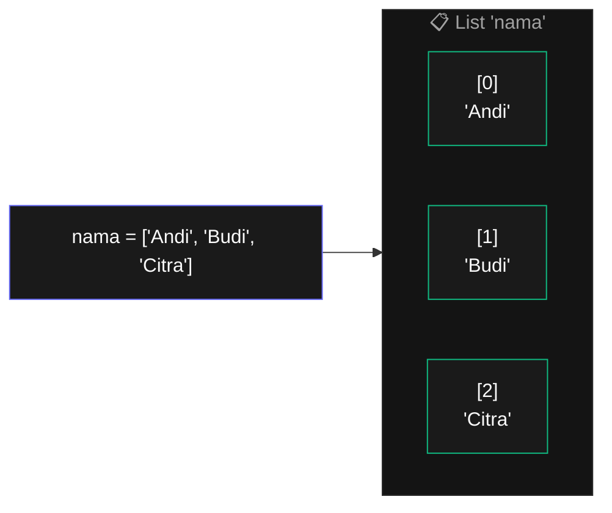
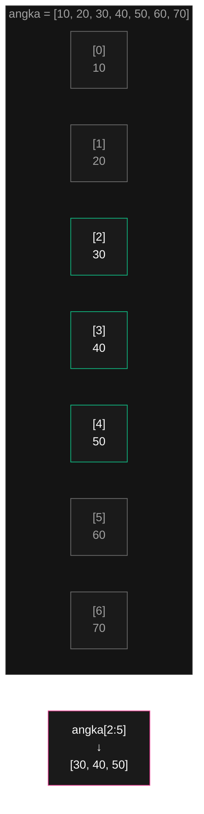
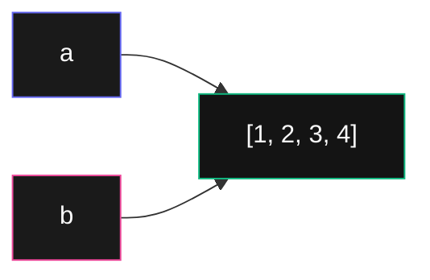

# Bab 4: List

> *Variable bisa simpan satu nilai. List bisa simpan ribuan. Itulah revolusi.*

Sampai Bab 3, kamu cuma bisa simpan **satu nilai per variable**. Mau simpan 100 nama siswa? Bikin 100 variable: `nama1`, `nama2`, ... `nama100`. Mimpi buruk.

**List** mengubah ini total. Satu list bisa menampung ribuan, bahkan jutaan nilai — semua dalam satu variable.

```python
siswa = ["Andi", "Budi", "Citra", "Doni", "Eka"]
```

Itu satu list yang berisi 5 nama. Bisa juga berisi 5 juta. Tidak ada batasan.

Setelah Bab 4, kamu akan bisa:

- Membuat dan memodifikasi list
- Mengakses item dengan indexing dan slicing
- Pakai method list: `append`, `insert`, `remove`, `sort`, dll
- Membedakan list (mutable) vs tuple (immutable)
- Memahami konsep referensi vs salinan — sumber bug yang sering bikin pemula tertipu

## 4.1. Membuat List

Bentuk dasar — daftar nilai dipisah koma, dibungkus tanda kurung siku `[ ]`:

```python
>>> kosong = []
>>> angka = [1, 2, 3, 4, 5]
>>> nama = ["Andi", "Budi", "Citra"]
>>> campur = [1, "halo", 3.14, True]
```

Beberapa hal penting:

- List bisa **kosong** (`[]`)
- List bisa **berisi tipe campuran** — angka, string, boolean, bahkan list lain
- Tidak ada batas jumlah item



<div class="flowchart-caption" markdown>
<span class="label">Cara baca diagram</span>

Diagram ini menunjukkan **anatomi list** di memori.

- **Kotak indigo (kiri)** = kode yang kamu tulis untuk membuat list.
- **Kotak besar abu-abu** = list bernama `nama`. Ini satu objek di memori.
- **Tiga kotak hijau di dalamnya** = tiga item list. Setiap item punya:
  - **Index** (angka di atas, dalam kurung siku) — posisi item dalam list, **mulai dari 0**
  - **Nilai** (di bawah) — isi item

**Kunci**: index `0` = item **pertama**, bukan kedua. Ini berlaku di hampir semua bahasa pemrograman modern. Awalnya aneh, tapi nanti kebiasaan.

Untuk list 3 item, indexnya: `0`, `1`, `2`. Index terakhir selalu **panjang list dikurangi 1**.
</div>

## 4.2. Mengakses Item — Indexing

Untuk ambil satu item dari list, pakai **indexing** dengan kurung siku:

```python
>>> nama = ["Andi", "Budi", "Citra"]
>>> nama[0]
'Andi'
>>> nama[1]
'Budi'
>>> nama[2]
'Citra'
```

Coba akses index yang tidak ada:

```python
>>> nama[3]
IndexError: list index out of range
```

Python protes — list cuma punya 3 item (index 0-2), tidak ada index 3.

### Index Negatif

Python punya trik bagus — index **negatif** menghitung dari belakang:

```python
>>> nama[-1]    # item terakhir
'Citra'
>>> nama[-2]    # item kedua dari belakang
'Budi'
>>> nama[-3]    # item ketiga dari belakang
'Andi'
```

`nama[-1]` lebih natural daripada `nama[len(nama) - 1]`. Pakai sering.

### Mengubah Item

List **mutable** — bisa dimodifikasi setelah dibuat. Ubah item dengan menugaskan ke index-nya:

```python
>>> nama = ["Andi", "Budi", "Citra"]
>>> nama[1] = "BUDI"
>>> nama
['Andi', 'BUDI', 'Citra']
```

## 4.3. Slicing — Ambil Beberapa Item Sekaligus

**Slicing** ambil sub-list dengan format `list[mulai:akhir]`:

```python
>>> angka = [10, 20, 30, 40, 50, 60, 70]
>>> angka[2:5]
[30, 40, 50]
```

Penting: index `akhir` **tidak termasuk**. `angka[2:5]` artinya "ambil index 2, 3, 4 — berhenti sebelum 5".



<div class="flowchart-caption" markdown>
<span class="label">Cara baca diagram</span>

Diagram ini menjelaskan **konsep "termasuk-tidak-termasuk"** dalam slicing — yang sering bikin pemula salah hitung.

- **Hijau** = item yang ikut diambil (`[30, 40, 50]`).
- **Abu-abu** = item yang **tidak** diambil.

**Aturan slicing `[mulai:akhir]`**:

- **`mulai`** → **termasuk** (item ini ikut diambil)
- **`akhir`** → **tidak termasuk** (item ini batas, tapi tidak ikut)

**Trik mengingat**: hitung berapa item yang diambil = `akhir - mulai`. Untuk `[2:5]`, jumlah item = `5 - 2 = 3`. Memang 3 item: 30, 40, 50.

**Kenapa didesain begini?** Supaya `list[:n]` mengambil persis `n` item pertama, dan `list[n:]` mengambil sisanya — tanpa overlap atau gap. Kalau kamu sambung `list[:3] + list[3:]`, hasilnya = list lengkap.
</div>

### Bentuk-Bentuk Slicing

```python
>>> angka = [10, 20, 30, 40, 50]
>>> angka[:3]      # mulai dari awal sampai (sebelum) index 3
[10, 20, 30]
>>> angka[2:]      # mulai index 2 sampai akhir
[30, 40, 50]
>>> angka[:]       # seluruh list (cara salin list — penting nanti)
[10, 20, 30, 40, 50]
>>> angka[-2:]     # 2 item terakhir
[40, 50]
>>> angka[::2]     # setiap item, step 2
[10, 30, 50]
>>> angka[::-1]    # list dibalik
[50, 40, 30, 20, 10]
```

## 4.4. Operasi Dasar

### Panjang List — `len()`

```python
>>> nama = ["Andi", "Budi", "Citra"]
>>> len(nama)
3
```

### Cek Keberadaan — `in` dan `not in`

```python
>>> "Andi" in nama
True
>>> "Doni" in nama
False
>>> "Doni" not in nama
True
```

Sangat berguna untuk validasi:

```python
nama_valid = ["admin", "operator", "viewer"]
input_user = input("Role: ")
if input_user in nama_valid:
    print("Akses diberikan")
else:
    print("Role tidak dikenal")
```

### Gabung — `+`

```python
>>> [1, 2, 3] + [4, 5, 6]
[1, 2, 3, 4, 5, 6]
```

### Ulang — `*`

```python
>>> [0] * 5
[0, 0, 0, 0, 0]
>>> ["-"] * 10
['-', '-', '-', '-', '-', '-', '-', '-', '-', '-']
```

Trik praktis: `[0] * 100` bikin list 100 nol — bagus untuk inisialisasi.

## 4.5. Method List — Modifikasi In-Place

**Method** adalah fungsi yang melekat pada objek. Untuk list, formatnya: `nama_list.method(...)`.

### `append()` — Tambah ke Akhir

```python
>>> daftar = ["Andi", "Budi"]
>>> daftar.append("Citra")
>>> daftar
['Andi', 'Budi', 'Citra']
```

`append` modifikasi list **langsung** (in-place) — list aslinya berubah, tidak bikin list baru.

### `insert()` — Tambah di Posisi Tertentu

```python
>>> daftar = ["Andi", "Citra"]
>>> daftar.insert(1, "Budi")
>>> daftar
['Andi', 'Budi', 'Citra']
```

`insert(index, nilai)` masukkan `nilai` di posisi `index`, item lain bergeser ke kanan.

### `remove()` — Hapus Berdasarkan Nilai

```python
>>> daftar = ["Andi", "Budi", "Citra"]
>>> daftar.remove("Budi")
>>> daftar
['Andi', 'Citra']
```

`remove` hapus **item pertama** yang nilainya cocok. Kalau tidak ada, error.

### `pop()` — Hapus dan Kembalikan

```python
>>> daftar = ["Andi", "Budi", "Citra"]
>>> nama_terakhir = daftar.pop()
>>> nama_terakhir
'Citra'
>>> daftar
['Andi', 'Budi']
```

Tanpa argument, `pop` ambil item terakhir. Pakai index untuk ambil dari posisi tertentu:

```python
>>> daftar.pop(0)        # ambil item pertama
'Andi'
```

### `sort()` — Urutkan

```python
>>> angka = [3, 1, 4, 1, 5, 9, 2, 6]
>>> angka.sort()
>>> angka
[1, 1, 2, 3, 4, 5, 6, 9]
```

Urutkan dari besar ke kecil:

```python
>>> angka.sort(reverse=True)
>>> angka
[9, 6, 5, 4, 3, 2, 1, 1]
```

Urutkan tanpa peduli huruf besar/kecil:

```python
>>> nama = ["budi", "Andi", "citra"]
>>> nama.sort(key=str.lower)
>>> nama
['Andi', 'budi', 'citra']
```

### `reverse()` — Balikkan Urutan

```python
>>> daftar = [1, 2, 3, 4, 5]
>>> daftar.reverse()
>>> daftar
[5, 4, 3, 2, 1]
```

### `count()` dan `index()` — Cari Info

```python
>>> daftar = ["a", "b", "c", "a", "a"]
>>> daftar.count("a")
3
>>> daftar.index("c")
2
```

`count(x)` hitung berapa kali `x` muncul. `index(x)` cari posisi pertama `x`.

## 4.6. Loop dengan List

Pakai `for` untuk iterasi list — pola paling sering dipakai:

```python
nama = ["Andi", "Budi", "Citra"]
for n in nama:
    print("Halo, " + n)
```

Kalau butuh **index sekaligus**, pakai `enumerate`:

```python
for i, n in enumerate(nama):
    print(str(i) + ". " + n)
```

Output:

```
0. Andi
1. Budi
2. Citra
```

### Loop Berdasarkan Index

Cara lain — loop pakai range, akses pakai index:

```python
for i in range(len(nama)):
    print(nama[i])
```

Hasilnya sama dengan `for n in nama:`, tapi versi pertama lebih Pythonic. Pakai versi index hanya kalau kamu **memang butuh** index-nya.

## 4.7. Mutable vs Immutable — Tuple

Python punya tipe yang mirip list tapi **tidak bisa diubah** setelah dibuat: **tuple**.

```python
>>> koordinat = (3, 5)
>>> koordinat[0]
3
>>> koordinat[0] = 10
TypeError: 'tuple' object does not support item assignment
```

Tuple pakai kurung biasa `( )` (atau tanpa kurung), bukan `[ ]`. Akses dan slicing sama dengan list, tapi method modifikasi (`append`, `remove`, `pop`, dll) **tidak ada**.

### Kapan Pakai Tuple vs List?

| Pakai List | Pakai Tuple |
|-----------|-------------|
| Data yang akan berubah | Data yang tidak akan berubah |
| Daftar item sejenis (siswa, harga, dll) | Pasangan/struktur kecil (koordinat, RGB color) |
| Tidak yakin → default ke list | Sebagai key di dictionary (Bab 5) |

Tuple punya keunggulan kecil dari segi performa dan aman dari modifikasi tidak sengaja.

```python
# Pakai list — data dinamis
daftar_belanja = ["telur", "susu", "roti"]
daftar_belanja.append("keju")

# Pakai tuple — koordinat tidak akan berubah
posisi_player = (10, 20)
warna_merah = (255, 0, 0)
```

## 4.8. Reference vs Copy — Kuncinya untuk Pemula

Konsep paling sering bikin pemula tertipu. Pelajari pelan-pelan.

### Variable Biasa

```python
>>> a = 5
>>> b = a       # b punya salinan
>>> a = 10
>>> b
5
```

Saat kamu menulis `b = a`, Python bikin **salinan** nilai. Mengubah `a` tidak mempengaruhi `b`.

### Variable List

```python
>>> a = [1, 2, 3]
>>> b = a       # b SAMA dengan a — bukan salinan
>>> a.append(4)
>>> b
[1, 2, 3, 4]    # b ikut berubah!
```

**Apa yang terjadi?** `b = a` tidak menyalin list — kedua nama menunjuk ke **list yang sama** di memori.



<div class="flowchart-caption" markdown>
<span class="label">Cara baca diagram</span>

Diagram ini menunjukkan **konsep referensi** untuk list (dan objek mutable lainnya).

- **Kotak `a` dan `b`** = nama variable. Mereka **bukan** kotak yang berisi list.
- **Kotak besar di tengah** = list sebenarnya, hidup di memori.
- **Panah** = "menunjuk ke" — `a` dan `b` keduanya menunjuk ke list yang **sama**.

**Kunci**: variable list seperti **alamat rumah**. Kalau dua orang punya alamat yang sama, mereka tinggal di rumah yang sama. Mengubah furniture di rumah itu akan terlihat oleh keduanya.

**Bandingkan dengan integer**: `a = 5; b = a; a = 10; b masih 5` — karena assignment integer **memang** menyalin nilai. Tapi list, dictionary, dan objek custom **tidak** disalin saat assignment.
</div>

### Cara Bikin Salinan Sebenarnya

Pakai slicing kosong `[:]` atau method `.copy()`:

```python
>>> a = [1, 2, 3]
>>> b = a[:]        # bikin salinan baru
>>> a.append(4)
>>> b
[1, 2, 3]           # b tidak terpengaruh
```

```python
>>> a = [1, 2, 3]
>>> b = a.copy()    # cara lain
>>> a.append(4)
>>> b
[1, 2, 3]
```

!!! warning "Function juga kena efek ini"
    Saat kamu lewatkan list ke function, function dapat **referensi**, bukan salinan:

    ```python
    def tambah_item(daftar):
        daftar.append("baru")

    belanja = ["telur", "susu"]
    tambah_item(belanja)
    print(belanja)        # ['telur', 'susu', 'baru']
    ```

    Kadang ini **yang kamu mau**. Kadang **bukan**. Kalau bukan, kirim salinan: `tambah_item(belanja[:])`.

## 4.9. Project: Kalkulator Statistik

Mari gabungkan semua yang sudah dipelajari:

```python
def cetak_header(judul):
    print()
    print("=" * 40)
    print(judul.center(40))
    print("=" * 40)

def minta_angka_angka():
    """Minta input angka-angka dari user, return list."""
    print("Masukkan angka satu per satu.")
    print("Ketik 'selesai' untuk berhenti.")

    angka_angka = []
    while True:
        teks = input("Angka ke-" + str(len(angka_angka) + 1) + ": ").strip()
        if teks.lower() == "selesai":
            break
        try:
            angka = float(teks)
            angka_angka.append(angka)
        except ValueError:
            print("  ⚠ Bukan angka, coba lagi")

    return angka_angka

def hitung_rata(angka):
    if len(angka) == 0:
        return 0
    return sum(angka) / len(angka)

def hitung_median(angka):
    """Median = nilai tengah setelah diurutkan."""
    if len(angka) == 0:
        return 0

    urut = angka[:]      # bikin salinan supaya tidak mengubah list asli
    urut.sort()

    n = len(urut)
    tengah = n // 2

    if n % 2 == 1:
        # Jumlah ganjil — ambil yang persis di tengah
        return urut[tengah]
    else:
        # Jumlah genap — rata-rata dua tengah
        return (urut[tengah - 1] + urut[tengah]) / 2

def main():
    cetak_header("Kalkulator Statistik")

    angka = minta_angka_angka()

    if len(angka) == 0:
        print("Tidak ada angka diinput.")
        return

    cetak_header("Hasil")
    print("Jumlah angka :", len(angka))
    print("Total        :", sum(angka))
    print("Minimum      :", min(angka))
    print("Maximum      :", max(angka))
    print("Rata-rata    :", round(hitung_rata(angka), 2))
    print("Median       :", round(hitung_median(angka), 2))

main()
```

Coba jalankan, lalu modifikasi:

- Tambahkan perhitungan modus (nilai yang paling sering muncul)
- Tampilkan list input yang sudah diurutkan
- Tambahkan validasi: angka harus positif

## 4.10. Ringkasan

- **List** = wadah untuk banyak nilai, dibuat dengan `[ ]`
- **Index dimulai dari 0**. Index negatif menghitung dari belakang
- **Slicing** `list[mulai:akhir]` — `akhir` tidak termasuk
- **Method modifikasi**: `append`, `insert`, `remove`, `pop`, `sort`, `reverse`
- **`in` / `not in`** untuk cek keanggotaan
- **`len`, `sum`, `min`, `max`** untuk operasi global
- **`for item in list`** = pola loop paling Pythonic
- **`enumerate`** kalau butuh index sekaligus
- **Tuple** = list immutable, pakai `( )`
- **Reference**: `b = a` untuk list **tidak** menyalin — pakai `a[:]` atau `a.copy()` untuk salinan sebenarnya

Konsep paling penting: **reference vs copy**. Banyak bug aneh berasal dari ini. Kalau kamu menugaskan list ke variable lain, ingat — kamu cuma bikin alias, bukan kembaran.

## 4.11. Latihan

### Latihan 4.1 — Statistik Sederhana

Tulis fungsi `statistik(angka_list)` yang menerima list angka, return tuple `(min, max, rata)`. Pakai `min()`, `max()`, dan `sum()`.

### Latihan 4.2 — Hapus Duplikat

Tulis fungsi `tanpa_duplikat(daftar)` yang menerima list, return list baru tanpa item duplikat. Urutan harus dipertahankan (jangan langsung pakai `set` — lakukan manual untuk latihan).

Hint:
```python
hasil = []
for item in daftar:
    if item not in hasil:
        hasil.append(item)
return hasil
```

### Latihan 4.3 — Reverse Tanpa `.reverse()`

Tulis fungsi `balik(daftar)` yang return list yang dibalik, **tanpa** pakai `.reverse()` atau slicing `[::-1]`. Pakai loop manual.

### Latihan 4.4 — Top N

Tulis fungsi `n_tertinggi(daftar, n)` yang return `n` nilai tertinggi dari list angka.

```python
n_tertinggi([3, 1, 4, 1, 5, 9, 2, 6], 3)
# [9, 6, 5]
```

### Latihan 4.5 — Pengelola Daftar Belanja

Tulis program interaktif yang menampilkan menu:

1. Tambah item
2. Hapus item
3. Tampilkan daftar
4. Cari item
5. Keluar

Pengguna pilih, program lakukan operasi pada daftar belanja. Pakai loop sampai pengguna pilih "Keluar".

### Latihan 4.6 — Anagram Detector

Tulis fungsi `apakah_anagram(kata1, kata2)` yang return `True` kalau kedua kata adalah anagram (huruf-hurufnya sama walaupun urutan beda).

Hint: ubah ke list huruf, sort, bandingkan.

```python
apakah_anagram("listen", "silent")  # True
apakah_anagram("hello", "world")    # False
```

### Latihan 4.7 — Tantangan: Matrix Transpose

Sebuah **matrix** adalah list of list. Misalnya 3x3:

```python
m = [
    [1, 2, 3],
    [4, 5, 6],
    [7, 8, 9],
]
```

Tulis fungsi `transpose(matrix)` yang menukar baris dengan kolom:

```
Sebelum:        Sesudah:
1 2 3           1 4 7
4 5 6           2 5 8
7 8 9           3 6 9
```

---

## Selanjutnya

Bab 5 akan masuk ke **Dictionary** — tipe data dengan **key-value pair**. Ini akan menggantikan banyak kasus di mana list saja kurang ekspresif.

<div class="cheatsheet" markdown>

### Buat List
```python
[]                      # kosong
[1, 2, 3]              # angka
["a", "b", "c"]        # string
[1, "halo", 3.14]      # campur OK
list(range(5))          # [0,1,2,3,4]
```

### Akses
```python
x[0]        # pertama
x[-1]       # terakhir
x[2:5]      # slice index 2,3,4
x[:3]       # 3 pertama
x[-3:]      # 3 terakhir
x[::-1]     # dibalik
x[::2]      # tiap 2
```

### Modifikasi
```python
x.append(item)        # tambah di akhir
x.insert(i, item)     # tambah di posisi i
x.pop()               # ambil & hapus terakhir
x.pop(i)              # ambil & hapus index i
x.remove(value)       # hapus yang nilai-nya value
del x[i]              # hapus index i
x[0] = "baru"         # ubah
```

### Cari & Info
```python
x.index(value)        # cari index
x.count(value)        # hitung kemunculan
value in x            # cek keberadaan (True/False)
len(x)                # panjang
sum(x), min(x), max(x)
```

### Sort
```python
x.sort()                      # in-place ascending
x.sort(reverse=True)          # descending
x.sort(key=str.lower)         # custom key
sorted(x)                     # return baru, x tidak berubah
```

### Loop
```python
for item in x: ...
for i, item in enumerate(x): ...
for a, b in zip(list_a, list_b): ...
```

### Tuple (Immutable)
```python
t = (1, 2, 3)         # pakai (), bukan []
# semua slice/index OK
# tapi t[0] = 99 → ERROR
```

### Reference vs Copy
```python
b = a              # alias — modify a, b ikut berubah!
b = a[:]           # SALINAN
b = a.copy()       # SALINAN
b = list(a)        # SALINAN
```

</div>

[← Kembali ke Bab 3](bab-03-fungsi.md){ .md-button }
[Lanjut ke Bab 5 →](bab-05-dictionary.md){ .md-button .md-button--primary }

<div class="atribusi-bab">
Diadaptasi dari Chapter 4: Lists, "Automate the Boring Stuff with Python" karya <a href="https://inventwithpython.com/" target="_blank">Al Sweigart</a>. Versi asli: <a href="https://automatetheboringstuff.com/2e/chapter4/" target="_blank">automatetheboringstuff.com/2e/chapter4/</a>. Adaptasi: penjelasan diperluas, contoh dilokalkan, latihan tambahan, flowchart dengan caption ditambahkan. Dilisensikan CC BY-NC-SA 4.0.
</div>
