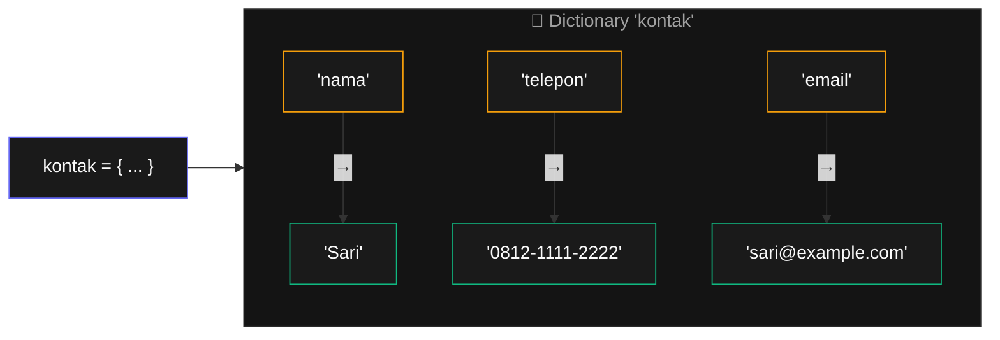
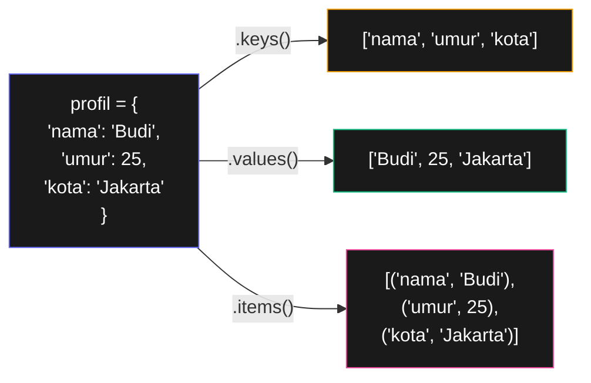

# Bab 5: Dictionary & Struktur Data

> *List bagus untuk daftar berurutan. Tapi gimana kalau yang penting adalah hubungan antar data? Itulah dictionary.*

Di Bab 4, kita pakai list untuk simpan banyak nilai. Tapi list punya keterbatasan: aksesnya **berdasarkan posisi (index)**. Cocok untuk daftar siswa, tapi bagaimana kalau kamu mau simpan profil seseorang?

```python
# Dengan list — pusing
profil = ["Budi", 25, "Jakarta", "0812-3456-7890", "budi@gmail.com"]

# Mau ambil email? Mana index-nya? Index 4? Aku perlu hafal urutan.
print(profil[4])
```

Bandingkan dengan **dictionary** — akses berdasarkan **nama (key)**, bukan posisi:

```python
profil = {
    "nama": "Budi",
    "umur": 25,
    "kota": "Jakarta",
    "telepon": "0812-3456-7890",
    "email": "budi@gmail.com",
}

print(profil["email"])    # langsung tahu artinya apa
```

Setelah Bab 5, kamu akan bisa:

- Membuat, mengakses, dan memodifikasi dictionary
- Pakai method dictionary: `keys`, `values`, `items`, `get`, `setdefault`
- Loop melalui dictionary
- Membuat struktur data berlapis (list dalam dictionary, dictionary dalam list)
- Pakai `pprint` untuk menampilkan data kompleks dengan rapi

## 5.1. Anatomi Dictionary

Dictionary dibuat dengan kurung kurawal `{ }`, isinya **pasangan key-value** dipisah `:`:

```python
>>> kontak = {
...     "nama": "Sari",
...     "telepon": "0812-1111-2222",
...     "email": "sari@example.com",
... }
```



<div class="flowchart-caption" markdown>
<span class="label">Cara baca diagram</span>

Diagram ini menunjukkan **anatomi pasangan key-value** di dictionary.

- **Kotak amber (kiri)** = **key** (kunci). Bisa string, integer, atau tuple — yang penting **immutable**. Tidak boleh duplikat.
- **Kotak hijau (kanan)** = **value** (nilai). Bisa apa saja: string, angka, list, bahkan dictionary lain.
- **Panah `→`** = pemetaan. Setiap key "menunjuk" ke satu value.

**Analogi**: dictionary seperti **buku alamat**. Key = nama orang, value = alamatnya. Kamu cari berdasarkan nama, bukan halaman ke berapa.

**Aturan penting**:

- Key **harus unik** dalam satu dictionary.
- Key **harus immutable** (tidak bisa berubah). String dan integer aman; list **tidak bisa** jadi key.
- Value boleh apa saja, termasuk yang mutable.
- Tidak ada urutan "alami" (Python 3.7+ menjaga urutan input, tapi jangan andalkan urutan).
</div>

## 5.2. Akses dan Modifikasi

Akses value pakai key di dalam kurung siku:

```python
>>> kontak = {"nama": "Sari", "umur": 28}
>>> kontak["nama"]
'Sari'
>>> kontak["umur"]
28
```

Akses key yang tidak ada → error:

```python
>>> kontak["alamat"]
KeyError: 'alamat'
```

### Tambah / Ubah Item

Sama seperti list — assignment ke key:

```python
>>> kontak["umur"] = 29        # ubah
>>> kontak["alamat"] = "Bogor" # tambah baru
>>> kontak
{'nama': 'Sari', 'umur': 29, 'alamat': 'Bogor'}
```

Kalau key sudah ada → ubah. Kalau belum ada → tambah baru. Dictionary tidak protes.

### Hapus Item

```python
>>> del kontak["alamat"]
>>> kontak
{'nama': 'Sari', 'umur': 29}
```

### Cek Keberadaan — `in`

```python
>>> "nama" in kontak
True
>>> "alamat" in kontak
False
```

Ingat: `in` untuk dictionary cek **key**, bukan value.

## 5.3. Method Penting

### `.get(key, default)` — Akses Aman

Lebih aman dari `dict[key]` karena tidak crash kalau key tidak ada:

```python
>>> kontak = {"nama": "Sari"}
>>> kontak.get("umur")           # tidak ada → None
>>> kontak.get("umur", "tidak diketahui")
'tidak diketahui'
>>> kontak.get("nama", "anonim")
'Sari'
```

Pola sangat sering dipakai — lebih ringkas dari `if "umur" in kontak: ... else: ...`.

### `.setdefault()` — Set Kalau Belum Ada

```python
>>> data = {"nama": "Sari"}
>>> data.setdefault("hobi", [])    # buat list kosong kalau belum ada
[]
>>> data["hobi"].append("baca")
>>> data["hobi"].append("musik")
>>> data
{'nama': 'Sari', 'hobi': ['baca', 'musik']}
```

`setdefault(key, default)` artinya: "kalau `key` belum ada, set value-nya ke `default`. Kalau sudah ada, biarkan saja". Berguna untuk **inisialisasi data**.

### `.keys()`, `.values()`, `.items()`

Tiga method untuk loop melalui dictionary:

```python
profil = {"nama": "Budi", "umur": 25, "kota": "Jakarta"}

# Hanya keys
for k in profil.keys():
    print(k)

# Hanya values
for v in profil.values():
    print(v)

# Keys dan values bersamaan
for k, v in profil.items():
    print(k + ": " + str(v))
```



<div class="flowchart-caption" markdown>
<span class="label">Cara baca diagram</span>

Diagram ini menunjukkan **3 cara** mengekstrak data dari dictionary untuk di-loop.

- **`.keys()` (amber)** → list semua key. Pakai kalau cuma butuh nama-nama.
- **`.values()` (hijau)** → list semua value. Pakai kalau cuma butuh isinya.
- **`.items()` (pink)** → list **tuple `(key, value)`**. Pakai kalau butuh keduanya — paling sering dipakai.

**Pola yang paling Pythonic** untuk iterasi dict:

```python
for key, value in dict.items():
    ...
```

Karena tuple `(k, v)` bisa di-unpack langsung ke dua variable. Lebih bersih dari `for k in dict: v = dict[k]`.

**Catatan teknis**: `.keys()`, `.values()`, dan `.items()` sebenarnya tidak return list, tapi "view object" yang efisien. Untuk pemula, anggap saja seperti list — perbedaannya tidak relevan sampai kamu kerja dengan dictionary jutaan item.
</div>

## 5.4. Pretty Print dengan `pprint`

Saat dictionary kompleks, output `print()` jadi tidak terbaca. Pakai modul `pprint`:

```python
import pprint

data = {
    "nama": "Sari",
    "alamat": {
        "jalan": "Jl. Mawar No. 12",
        "kota": "Bandung",
        "kode_pos": "40123",
    },
    "hobi": ["baca", "musik", "fotografi"],
    "akun": {
        "email": "sari@example.com",
        "social": ["twitter", "instagram"],
    },
}

print(data)            # satu baris panjang, susah dibaca
pprint.pprint(data)    # diformat rapi
```

Output `pprint.pprint`:

```
{'akun': {'email': 'sari@example.com', 'social': ['twitter', 'instagram']},
 'alamat': {'jalan': 'Jl. Mawar No. 12', 'kode_pos': '40123', 'kota': 'Bandung'},
 'hobi': ['baca', 'musik', 'fotografi'],
 'nama': 'Sari'}
```

Atau dapat string-nya untuk disimpan ke file:

```python
teks = pprint.pformat(data)
```

## 5.5. Struktur Data Berlapis

Power sebenarnya muncul saat kamu **gabungkan** dictionary dan list.

### List dalam Dictionary

```python
kontak = {
    "nama": "Budi",
    "telepon": ["0812-1111-2222", "021-555-1234"],
    "email": ["budi@gmail.com", "budi@kantor.com"],
}

# Akses telepon kedua
print(kontak["telepon"][1])    # 021-555-1234

# Tambah telepon baru
kontak["telepon"].append("0813-3333-4444")
```

### Dictionary dalam List

```python
siswa = [
    {"nama": "Andi", "nilai": 85},
    {"nama": "Budi", "nilai": 72},
    {"nama": "Citra", "nilai": 91},
]

# Cetak semua nama
for s in siswa:
    print(s["nama"])

# Hitung rata-rata nilai
total = sum(s["nilai"] for s in siswa)
print("Rata-rata:", total / len(siswa))
```

### Dictionary dalam Dictionary

```python
sekolah = {
    "kelas_a": {
        "wali": "Pak Budi",
        "siswa": ["Andi", "Sari", "Doni"],
    },
    "kelas_b": {
        "wali": "Bu Ani",
        "siswa": ["Budi", "Citra", "Eka"],
    },
}

# Akses berlapis
print(sekolah["kelas_a"]["wali"])      # Pak Budi
print(sekolah["kelas_b"]["siswa"][0])  # Budi
```

Pola ini sangat sering muncul saat bekerja dengan **JSON** (Bab 16) — format pertukaran data paling populer di web.

## 5.6. Project: Sistem Inventaris Sederhana

Mari aplikasikan ke kasus nyata: kelola inventaris gudang.

```python
import pprint

def cetak_header(judul):
    print()
    print("=" * 40)
    print(judul.center(40))
    print("=" * 40)

def tampilkan_inventaris(inv):
    if len(inv) == 0:
        print("(Inventaris kosong)")
        return
    print()
    print("Item               Jumlah  Harga (Rp)")
    print("-" * 40)
    total_nilai = 0
    for nama, info in inv.items():
        jumlah = info["jumlah"]
        harga = info["harga"]
        print(f"{nama:18} {jumlah:>5}  {harga:>10,}")
        total_nilai += jumlah * harga
    print("-" * 40)
    print(f"{'TOTAL NILAI':24} Rp {total_nilai:,}")

def tambah_item(inv):
    nama = input("Nama barang: ").strip()
    if nama in inv:
        print(f"⚠ '{nama}' sudah ada di inventaris.")
        return
    try:
        jumlah = int(input("Jumlah: "))
        harga = int(input("Harga satuan: "))
    except ValueError:
        print("Input tidak valid.")
        return
    inv[nama] = {"jumlah": jumlah, "harga": harga}
    print(f"✓ '{nama}' ditambahkan.")

def update_jumlah(inv):
    nama = input("Nama barang: ").strip()
    if nama not in inv:
        print(f"⚠ '{nama}' tidak ditemukan.")
        return
    try:
        baru = int(input("Jumlah baru: "))
        inv[nama]["jumlah"] = baru
        print(f"✓ Jumlah '{nama}' diupdate.")
    except ValueError:
        print("Input tidak valid.")

def hapus_item(inv):
    nama = input("Nama barang: ").strip()
    if nama in inv:
        del inv[nama]
        print(f"✓ '{nama}' dihapus.")
    else:
        print(f"⚠ '{nama}' tidak ditemukan.")

def main():
    cetak_header("Inventaris Gudang")
    inventaris = {}

    while True:
        print()
        print("1. Tampilkan inventaris")
        print("2. Tambah item")
        print("3. Update jumlah")
        print("4. Hapus item")
        print("5. Keluar")

        pilih = input("Pilih (1-5): ").strip()

        if pilih == "1":
            tampilkan_inventaris(inventaris)
        elif pilih == "2":
            tambah_item(inventaris)
        elif pilih == "3":
            update_jumlah(inventaris)
        elif pilih == "4":
            hapus_item(inventaris)
        elif pilih == "5":
            break
        else:
            print("Pilihan tidak valid.")

main()
```

Project ini menggabungkan **dict-of-dict** (`inventaris[nama] = {"jumlah": ..., "harga": ...}`), method dict (`in`, `del`, `.items()`), dan f-string formatting (akan dibahas detail di Bab 6).

Coba jalankan, lalu modifikasi:

- Simpan inventaris ke file (Bab 9 nanti)
- Tambah fitur cari berdasarkan rentang harga
- Tambah field "kategori" — kelompokkan tampilan berdasarkan kategori

## 5.7. Set — Sahabat Dictionary

Walaupun tidak dibahas detail oleh buku asli, **set** adalah struktur data yang berhubungan erat dengan dictionary.

**Set** = kumpulan nilai unik, **tidak terurut**, **tidak ada duplikat**.

```python
>>> angka = {1, 2, 3, 2, 1}    # duplikat otomatis hilang
>>> angka
{1, 2, 3}

>>> kumpulan = set([1, 2, 3, 2, 1])  # dari list
>>> kumpulan
{1, 2, 3}
```

Kapan pakai set?

- **Hapus duplikat dari list** dengan satu baris: `list(set(daftar))`
- **Cek keanggotaan cepat** — `in` di set jauh lebih cepat dari list (untuk data besar)
- **Operasi himpunan**: union, intersection, difference

```python
>>> a = {1, 2, 3, 4}
>>> b = {3, 4, 5, 6}
>>> a | b        # union — semua
{1, 2, 3, 4, 5, 6}
>>> a & b        # intersection — yang ada di keduanya
{3, 4}
>>> a - b        # difference — di a tapi tidak di b
{1, 2}
```

## 5.8. Ringkasan

- **Dictionary** = pasangan key-value, dibuat dengan `{ }`
- **Akses** dengan `dict[key]`, **tambah/ubah** dengan assignment
- **Hapus** dengan `del dict[key]`
- **`in`** cek apakah **key** ada (bukan value)
- **`.get(key, default)`** akses aman tanpa risiko KeyError
- **`.setdefault(key, default)`** untuk inisialisasi
- **Loop**: `.keys()`, `.values()`, `.items()` — yang terakhir paling sering dipakai
- **`pprint`** untuk print dictionary kompleks dengan rapi
- **Struktur berlapis**: list dalam dict, dict dalam list, dict dalam dict
- **Set** = kumpulan unik tanpa urutan, bagus untuk hapus duplikat & operasi himpunan

Konsep paling penting: **dictionary mengubah cara kamu menstrukturkan data**. Begitu kamu nyaman pakai dict, banyak masalah yang sebelumnya butuh kode panjang jadi tinggal beberapa baris.

## 5.9. Latihan

### Latihan 5.1 — Hitung Frekuensi Kata

Tulis fungsi `hitung_frekuensi(teks)` yang menerima string, return dictionary dengan key = kata, value = berapa kali kata muncul.

```python
hitung_frekuensi("apel jeruk apel pisang apel jeruk")
# {'apel': 3, 'jeruk': 2, 'pisang': 1}
```

Hint: pakai `.split()` untuk pecah string jadi list kata, lalu `.get()` atau `.setdefault()`.

### Latihan 5.2 — Inverse Dictionary

Tulis fungsi `inverse(d)` yang tukar key dengan value.

```python
inverse({"a": 1, "b": 2, "c": 3})
# {1: 'a', 2: 'b', 3: 'c'}
```

Catatan: kalau ada value yang sama, key terakhir yang menang.

### Latihan 5.3 — Merge Dictionary

Tulis fungsi `merge(d1, d2)` yang return dictionary baru gabungan keduanya. Kalau ada key sama, value dari `d2` menang.

### Latihan 5.4 — Buku Alamat

Buat program buku alamat:

- Tambah kontak (nama, telepon, email)
- Cari kontak berdasarkan nama
- Edit kontak
- Hapus kontak
- Tampilkan semua

Pakai dictionary di mana key = nama, value = dictionary `{"telepon": ..., "email": ...}`.

### Latihan 5.5 — Group By

Tulis fungsi `group_by_kategori(barang_list)` yang menerima list of dict, kelompokkan berdasarkan field "kategori".

```python
barang = [
    {"nama": "Apel", "kategori": "buah"},
    {"nama": "Bayam", "kategori": "sayur"},
    {"nama": "Jeruk", "kategori": "buah"},
]

group_by_kategori(barang)
# {
#   "buah": [{"nama": "Apel", ...}, {"nama": "Jeruk", ...}],
#   "sayur": [{"nama": "Bayam", ...}],
# }
```

### Latihan 5.6 — Statistik Nilai Siswa

Diberikan list of dict berisi data siswa:

```python
siswa = [
    {"nama": "Andi", "kelas": "A", "nilai": [85, 90, 78]},
    {"nama": "Budi", "kelas": "B", "nilai": [72, 80, 88]},
    {"nama": "Citra", "kelas": "A", "nilai": [91, 95, 87]},
    {"nama": "Doni", "kelas": "B", "nilai": [65, 70, 75]},
]
```

Tulis fungsi `rangking_per_kelas(siswa)` yang return dictionary: key = kelas, value = list nama siswa diurutkan dari nilai rata-rata tertinggi ke terendah.

### Latihan 5.7 — Tantangan: Catur Board Validator

Representasikan papan catur sebagai dictionary, key = posisi (`"a1"`, `"b3"`, dll), value = bidak (`"raja_putih"`, `"benteng_hitam"`, dll).

Tulis fungsi `validasi_papan(papan)` yang return `True` kalau papan valid:

- Tepat 1 raja putih dan 1 raja hitam
- Maksimal 8 pion per warna
- Maksimal 16 bidak total per warna

---

## Selanjutnya

Bab 6 menutup Bagian 1 dengan **Manipulasi String** — operasi-operasi penting untuk teks. Di Bagian 2, kita akan masuk ke project-project nyata: regex, file, web scraping, Excel, PDF, dan banyak lagi.

<div class="cheatsheet" markdown>

### Buat Dictionary
```python
{}                              # kosong
{"k1": "v1", "k2": 2}          # dengan data
dict(a=1, b=2)                  # alternatif
dict([("a", 1), ("b", 2)])      # dari list of tuple
```

### Akses
```python
d["key"]            # error kalau key tidak ada
d.get("key")        # None kalau tidak ada
d.get("key", 0)     # 0 sebagai default
"key" in d          # cek keberadaan
```

### Modifikasi
```python
d["new"] = value           # tambah/update
d.update({"a": 1, "b": 2}) # bulk update
del d["key"]               # hapus
d.pop("key")               # hapus & return value
d.pop("key", default)      # safe pop
d.clear()                  # kosongkan
```

### Loop
```python
for key in d: ...
for key in d.keys(): ...
for value in d.values(): ...
for key, value in d.items(): ...   # paling sering!
```

### `setdefault`
```python
# Buat list kosong kalau belum ada, lalu append
d.setdefault("hobi", []).append("baca")
```

### Pretty Print
```python
import pprint
pprint.pprint(d, indent=2)
```

### Set (Bonus)
```python
s = {1, 2, 3}                 # unique values
list(set(daftar))             # hapus duplikat
a | b   # union
a & b   # intersection
a - b   # difference
```

</div>

[← Kembali ke Bab 4](bab-04-list.md){ .md-button }
[Lanjut ke Bab 6 →](bab-06-string.md){ .md-button .md-button--primary }

<div class="atribusi-bab">
Diadaptasi dari Chapter 5: Dictionaries and Structuring Data, "Automate the Boring Stuff with Python" karya <a href="https://inventwithpython.com/" target="_blank">Al Sweigart</a>. Versi asli: <a href="https://automatetheboringstuff.com/2e/chapter5/" target="_blank">automatetheboringstuff.com/2e/chapter5/</a>. Adaptasi: penjelasan diperluas, contoh dilokalkan, latihan tambahan, flowchart dengan caption ditambahkan. Dilisensikan CC BY-NC-SA 4.0.
</div>
