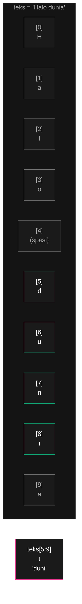
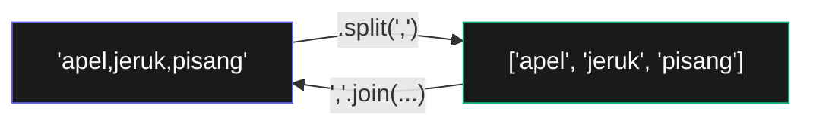

# Bab 6: Manipulasi String

> *Sebagian besar pemrograman dunia nyata adalah memindah-mindah teks. Bab ini bikin kamu jadi master di hal itu.*

Banyak pekerjaan otomasi pada akhirnya tentang **memproses teks**: membaca file CSV, parsing alamat, validasi email, ekstrak data dari halaman web. Sebelum masuk ke project-project itu di Bagian 2, kamu harus jago manipulasi string dulu.

Bab ini menutup Bagian 1. Setelah ini, kamu sudah punya semua fondasi Python yang dibutuhkan untuk masuk ke otomasi nyata.

Setelah Bab 6, kamu akan bisa:

- Pakai escape characters untuk karakter khusus
- Pakai raw string dan multi-line string
- Mengakses karakter dengan indexing dan slicing
- Pakai 20+ method string penting
- Format string dengan f-string (cara paling modern)
- Bekerja dengan clipboard (copy/paste otomatis)

## 6.1. Cara Menulis String — Lebih Dalam

Di Bab 1, kamu sudah pakai string dengan `"..."`. Sekarang kita pelajari nuansanya.

### Tanda Kutip Tunggal vs Ganda

Sama saja. Pilih sesuai kebutuhan:

```python
>>> 'Halo dunia'
'Halo dunia'
>>> "Halo dunia"
'Halo dunia'
```

Yang membedakan: kalau di dalam string ada tanda kutip, pakai jenis yang berbeda di luar:

```python
>>> "Hari ini Andi berkata 'halo'"
"Hari ini Andi berkata 'halo'"

>>> 'I\'m fine'        # bisa juga, tapi perlu escape
"I'm fine"
```

### Escape Characters

Karakter khusus yang dimulai dengan backslash `\`:

| Escape | Arti |
|--------|------|
| `\'` | Tanda kutip tunggal |
| `\"` | Tanda kutip ganda |
| `\\` | Backslash |
| `\n` | Newline (ganti baris) |
| `\t` | Tab |

```python
>>> print("Baris 1\nBaris 2")
Baris 1
Baris 2
>>> print("Kolom1\tKolom2\tKolom3")
Kolom1	Kolom2	Kolom3
```

### Raw String — Hindari Escape

Tambahkan `r` di depan tanda kutip untuk **raw string** — backslash dibaca apa adanya:

```python
>>> print("C:\Users\nama")    # \n dianggap newline → error
>>> print(r"C:\Users\nama")   # raw, backslash dibaca apa adanya
C:\Users\nama
```

Sangat berguna untuk path Windows dan regex (Bab 7).

### Multi-line String

Pakai triple quotes `"""..."""` untuk string yang berisi banyak baris:

```python
laporan = """
Laporan Penjualan Harian
========================
Tanggal: 15 Mei 2026
Total: Rp 1.500.000
"""
print(laporan)
```

Triple quotes juga sering dipakai sebagai **docstring** (yang sudah disinggung di Bab 3).

## 6.2. Indexing dan Slicing String

String secara teknis adalah **list of characters**. Kamu bisa pakai indexing dan slicing seperti list:

```python
>>> teks = "Selamat pagi"
>>> teks[0]
'S'
>>> teks[-1]
'i'
>>> teks[8:12]
'pagi'
>>> teks[::-1]    # dibalik
'igap tameleS'
```



<div class="flowchart-caption" markdown>
<span class="label">Cara baca diagram</span>

Diagram ini menunjukkan **string sebagai sequence karakter**, mirip list di Bab 4.

- **Setiap karakter** punya index sendiri, mulai dari 0.
- **Spasi pun dihitung** sebagai karakter dengan index sendiri (di sini index 4).
- **Slicing** mengikuti aturan yang sama dengan list: `[mulai:akhir]`, `akhir` tidak termasuk.

Untuk string `"Halo dunia"` (10 karakter, index 0-9):

- `teks[0]` = `'H'` (karakter pertama)
- `teks[-1]` = `'a'` (karakter terakhir)
- `teks[5:9]` = `'duni'` (4 karakter: index 5, 6, 7, 8 — index 9 tidak termasuk)

**Kunci**: skill slicing dari Bab 4 langsung kepakai di sini. Konsep `[mulai:akhir]` konsisten di seluruh Python.

**Bedanya dengan list**: string **immutable**. Kamu tidak bisa `teks[0] = "h"` — error. String di Python tidak bisa diubah setelah dibuat. Kalau mau "ubah", bikin string baru.
</div>

### String Immutable — Bikin Versi Baru

```python
>>> teks = "Halo"
>>> teks[0] = "h"
TypeError: 'str' object does not support item assignment
```

Yang benar — bikin string baru:

```python
>>> teks = "Halo"
>>> teks_baru = "h" + teks[1:]
>>> teks_baru
'halo'
```

## 6.3. Method String Penting

String punya banyak method. Mari bahas yang paling sering dipakai.

### Capitalization

```python
>>> "halo dunia".upper()
'HALO DUNIA'
>>> "HALO DUNIA".lower()
'halo dunia'
>>> "halo dunia".title()
'Halo Dunia'
>>> "halo dunia".capitalize()
'Halo dunia'
>>> "Halo".swapcase()
'hALO'
```

Pola sangat sering dipakai — **normalisasi sebelum bandingkan**:

```python
input_user = input("Lanjutkan? (y/n): ")
if input_user.lower() == "y":
    ...
```

Tanpa `.lower()`, "Y", "y", "YES" semua harus dicek satu-satu.

### Strip — Hapus Whitespace

```python
>>> "   halo   ".strip()
'halo'
>>> "   halo   ".lstrip()       # left only
'halo   '
>>> "   halo   ".rstrip()       # right only
'   halo'
>>> "***halo***".strip("*")     # strip karakter spesifik
'halo'
```

`.strip()` wajib hampir di setiap input pengguna — orang sering tidak sengaja ketik spasi di awal/akhir.

### Split dan Join

Dua method paling powerful — pasangan yang bekerja berlawanan.

**`.split()`** — string → list:

```python
>>> "apel,jeruk,pisang".split(",")
['apel', 'jeruk', 'pisang']
>>> "Halo dunia ya".split()        # default: pisah pakai whitespace
['Halo', 'dunia', 'ya']
>>> "satu\ndua\ntiga".split("\n")
['satu', 'dua', 'tiga']
```

**`.join()`** — list → string:

```python
>>> ",".join(["apel", "jeruk", "pisang"])
'apel,jeruk,pisang'
>>> " - ".join(["A", "B", "C"])
'A - B - C'
>>> "".join(["H", "a", "l", "o"])
'Halo'
```



<div class="flowchart-caption" markdown>
<span class="label">Cara baca diagram</span>

Diagram ini menunjukkan **`split` dan `join` sebagai operasi kebalikan**.

- **Panah atas** (`split`) — pecah string jadi list, dengan separator.
- **Panah bawah** (`join`) — gabung list jadi string, dengan separator.

**Kunci yang sering bikin pemula bingung**:

- **`.split(",")`** dipanggil pada **string** (yang akan dipecah).
- **`",".join(list)`** dipanggil pada **separator** (string), parameter-nya list.

Susunannya kebalikan! Kalau kamu nulis `list.join(",")`, error — list tidak punya method `.join()`.

**Trik mengingat**:

- *"Pecah string ini, pakai pemisah ini"* → `string.split(pemisah)`
- *"Pakai pemisah ini, satukan list ini"* → `pemisah.join(list)`

**Pola powerful**: gabungan keduanya bisa modifikasi semua item dalam string sekaligus.

```python
teks = "andi,budi,citra"
hasil = ", ".join(s.upper() for s in teks.split(","))
# 'ANDI, BUDI, CITRA'
```
</div>

### Replace

```python
>>> "Halo dunia".replace("dunia", "Python")
'Halo Python'
>>> "aaa".replace("a", "b")
'bbb'
>>> "satu satu satu".replace("satu", "1", 2)    # max 2 kali
'1 1 satu'
```

### Cek Konten — `startswith`, `endswith`, `in`

```python
>>> "Halo dunia".startswith("Halo")
True
>>> "halo.py".endswith(".py")
True
>>> "py" in "halo.py"
True
```

Sangat sering dipakai untuk validasi — cek format email, ekstensi file, prefix, dll.

### Validasi Karakter

```python
>>> "12345".isdigit()
True
>>> "halo".isalpha()
True
>>> "halo123".isalnum()
True
>>> "    ".isspace()
True
>>> "HALO".isupper()
True
```

Pakai untuk validasi sebelum konversi:

```python
teks = input("Umur: ")
if teks.isdigit():
    umur = int(teks)
else:
    print("Bukan angka")
```

### Padding & Alignment

Untuk format output rapi:

```python
>>> "halo".ljust(10)
'halo      '
>>> "halo".rjust(10)
'      halo'
>>> "halo".center(10)
'   halo   '
>>> "5".zfill(4)
'0005'
```

Pola praktis — formatting tabel teks:

```python
nama = "Andi"
nilai = 85
print(nama.ljust(15) + str(nilai).rjust(5))
# Andi              85
```

### Find Methods

```python
>>> "halo dunia".find("dunia")
5
>>> "halo dunia".find("python")
-1
>>> "abcabc".count("a")
2
```

`.find()` return index pertama, `-1` kalau tidak ada. `.count()` hitung berapa kali muncul.

## 6.4. f-String — Cara Modern Format String

Sejak Python 3.6, ada cara format string yang jauh lebih bersih: **f-string**.

### Cara Lama vs f-String

```python
nama = "Sari"
umur = 28

# Cara lama 1 — concatenation
print("Halo, " + nama + "! Umur kamu " + str(umur))

# Cara lama 2 — % formatting (gaya C)
print("Halo, %s! Umur kamu %d" % (nama, umur))

# Cara lama 3 — .format()
print("Halo, {}! Umur kamu {}".format(nama, umur))

# Cara modern — f-string
print(f"Halo, {nama}! Umur kamu {umur}")
```

f-string adalah pemenang. Lebih bersih, lebih cepat, dan **expression** bisa langsung di dalamnya:

```python
>>> harga = 50000
>>> jumlah = 3
>>> f"Total: Rp {harga * jumlah:,}"
'Total: Rp 150,000'

>>> nama = "Budi"
>>> f"Halo, {nama.upper()}!"
'Halo, BUDI!'
```

### Format Specifier

f-string bisa diformat dengan `:format`:

```python
>>> pi = 3.14159265
>>> f"{pi:.2f}"           # 2 angka di belakang koma
'3.14'
>>> f"{pi:.4f}"
'3.1416'
>>> f"{pi:10.2f}"         # lebar 10, 2 desimal
'      3.14'

>>> harga = 1500000
>>> f"Rp {harga:,}"       # ribuan dipisah koma
'Rp 1,500,000'

>>> nilai = 0.85
>>> f"{nilai:.0%}"        # persen
'85%'
```

| Format | Arti | Hasil dengan `3.14159` |
|--------|------|------------------------|
| `.2f` | 2 desimal float | `3.14` |
| `,` | Pemisah ribuan | `3` (kalau bukan integer, tidak banyak efek) |
| `0.2%` | Persen | `314.16%` |
| `>10` | Right align lebar 10 | `'      3.14159'` |
| `<10` | Left align lebar 10 | `'3.14159   '` |
| `^10` | Center align | `'  3.14159 '` |

## 6.5. Project: Generator Password

Project gabungan semua konsep:

```python
import random

def buat_password(panjang=12, with_huruf=True, with_angka=True, with_simbol=True):
    """Generate password acak dengan opsi karakter."""
    karakter = ""
    if with_huruf:
        karakter += "abcdefghijklmnopqrstuvwxyz"
        karakter += "ABCDEFGHIJKLMNOPQRSTUVWXYZ"
    if with_angka:
        karakter += "0123456789"
    if with_simbol:
        karakter += "!@#$%^&*()-_=+[]{}<>?"

    if karakter == "":
        return ""

    return "".join(random.choice(karakter) for i in range(panjang))

def cek_kekuatan(password):
    """Return label kekuatan password."""
    skor = 0
    if len(password) >= 8:
        skor += 1
    if len(password) >= 12:
        skor += 1
    if any(c.islower() for c in password):
        skor += 1
    if any(c.isupper() for c in password):
        skor += 1
    if any(c.isdigit() for c in password):
        skor += 1
    if any(not c.isalnum() for c in password):
        skor += 1

    if skor <= 2:
        return "Lemah"
    elif skor <= 4:
        return "Sedang"
    else:
        return "Kuat"

def main():
    print("=" * 40)
    print("Generator Password".center(40))
    print("=" * 40)

    try:
        panjang = int(input("Panjang password (default 12): ") or "12")
    except ValueError:
        panjang = 12

    pakai_simbol = input("Pakai simbol? (y/n): ").lower() == "y"

    print()
    print("3 password yang disarankan:")
    for i in range(3):
        pwd = buat_password(panjang=panjang, with_simbol=pakai_simbol)
        kekuatan = cek_kekuatan(pwd)
        print(f"  {i+1}. {pwd:<20} [{kekuatan}]")

main()
```

Project ini menggabungkan:

- **f-string** untuk format output
- **String concatenation** untuk membangun set karakter
- **`.join()`** dengan generator expression
- **`.islower()`, `.isupper()`, `.isdigit()`, `.isalnum()`** untuk cek kekuatan
- **`any()`** dengan generator (Python idiom)
- **`random.choice()`** dari Bab 3

## 6.6. Bonus: Modul `pyperclip` — Clipboard Otomatis

Salah satu trik powerful — kontrol clipboard sistem dari Python:

```python
import pyperclip

pyperclip.copy("Halo dari Python!")    # tulis ke clipboard
teks = pyperclip.paste()                # baca dari clipboard
print(teks)                             # Halo dari Python!
```

Install dulu (kalau belum):

```bash
pip install pyperclip
```

Project keren: **boilerplate text inserter**. Misal kamu sering butuh template email yang sama:

```python
import sys
import pyperclip

TEMPLATE = {
    "agree": "Iya, sepakat. Mari kita lanjutkan.",
    "busy": "Maaf, saya sedang tidak bisa membantu sekarang.",
    "upsell": "Apakah tertarik dengan paket premium kami?",
}

if len(sys.argv) < 2:
    print("Pakai: python boilerplate.py <key>")
    print("Pilihan:", list(TEMPLATE.keys()))
    sys.exit()

kunci = sys.argv[1]
if kunci in TEMPLATE:
    pyperclip.copy(TEMPLATE[kunci])
    print(f"✓ Template '{kunci}' disalin ke clipboard")
else:
    print(f"⚠ Key '{kunci}' tidak ditemukan")
```

Setelah ini, ketik di terminal:

```bash
python boilerplate.py agree
```

Lalu Ctrl+V di mana saja — teks akan ter-paste.

## 6.7. Ringkasan

- **String quotes**: tunggal `'...'`, ganda `"..."`, multi-line `"""..."""`
- **Escape**: `\n`, `\t`, `\\`, `\'`, `\"`. Pakai **raw string** `r"..."` untuk hindari escape
- **Indexing & slicing** sama seperti list
- **String immutable** — semua method "modifikasi" sebenarnya bikin string baru
- **Method capitalization**: `.upper()`, `.lower()`, `.title()`, `.capitalize()`
- **`.strip()`** wajib di setiap input pengguna
- **`.split()` ↔ `.join()`** — pasangan untuk string ↔ list
- **`.replace()`** untuk substitusi
- **`.startswith()`, `.endswith()`, `in`** untuk cek konten
- **`.isdigit()`, `.isalpha()`, `.isalnum()`** untuk validasi karakter
- **`.ljust()`, `.rjust()`, `.center()`, `.zfill()`** untuk padding
- **f-string** = cara modern format string (`f"... {variable} ..."`)
- **`pyperclip`** untuk akses clipboard

Konsep paling penting: **fasih dengan f-string dan method `.split()`/`.join()`**. Tiga ini muncul di hampir setiap program Python yang akan kamu tulis.

## 6.8. Latihan

### Latihan 6.1 — Reverse Words

Tulis fungsi `reverse_words(teks)` yang membalikkan urutan kata, tapi mempertahankan urutan huruf di tiap kata.

```python
reverse_words("Halo dunia indah")
# 'indah dunia Halo'
```

### Latihan 6.2 — Validator Email Sederhana

Tulis fungsi `valid_email(email)` yang return `True` kalau email valid:

- Mengandung `@`
- Ada minimal 1 karakter sebelum `@`
- Bagian setelah `@` mengandung `.`
- Tidak ada spasi

(Validasi email "betulan" rumit — pakai regex di Bab 7. Untuk sekarang, cukup yang sederhana.)

### Latihan 6.3 — Pig Latin Translator

Pig Latin = aturan permainan kata anak-anak Inggris. Tulis fungsi `to_pig_latin(kata)`:

- Kalau kata mulai dengan vokal (a, i, u, e, o), tambahkan "way" di akhir
- Kalau mulai dengan konsonan, pindahkan konsonan pertama ke akhir, tambah "ay"

```python
to_pig_latin("apple")     # "appleway"
to_pig_latin("banana")    # "ananabay"
```

### Latihan 6.4 — Tabel Format

Tulis fungsi `cetak_tabel(data)` yang menerima list of dict, cetak sebagai tabel rapi.

```python
cetak_tabel([
    {"nama": "Andi", "umur": 25, "kota": "Jakarta"},
    {"nama": "Sari", "umur": 28, "kota": "Bandung"},
])
```

Output:

```
NAMA   UMUR  KOTA
----   ----  ----
Andi    25   Jakarta
Sari    28   Bandung
```

Hint: pakai f-string dengan padding (`f"{x:<10}"`).

### Latihan 6.5 — Censor

Tulis fungsi `censor(teks, kata_terlarang)` yang ganti semua kemunculan kata terlarang dengan asterisk dengan jumlah sama:

```python
censor("hari ini cerah sekali", ["cerah"])
# "hari ini ***** sekali"
```

### Latihan 6.6 — Hitung Vokal

Tulis fungsi `hitung_vokal(teks)` yang return dictionary: berapa kali tiap vokal muncul. Case-insensitive.

```python
hitung_vokal("Halo dunia indah")
# {'a': 3, 'i': 2, 'u': 1, 'e': 0, 'o': 1}
```

### Latihan 6.7 — Tantangan: Markdown to HTML Sederhana

Tulis fungsi `markdown_to_html(md)` yang konversi sintaks markdown sederhana ke HTML:

- `**bold**` → `<strong>bold</strong>`
- `*italic*` → `<em>italic</em>`
- `# Heading` → `<h1>Heading</h1>` (kalau di awal baris)
- `## Heading` → `<h2>Heading</h2>`

(Pakai cara manual; nanti kalau pakai regex di Bab 7 jauh lebih elegan.)

---

## Selamat — Bagian 1 Selesai!

Kamu sudah menyelesaikan **6 bab pertama** dari buku ini. Itu pencapaian yang nyata. Sekarang kamu sudah punya **fondasi Python yang lengkap**:

- ✅ Bab 1: Dasar-dasar dan tipe data
- ✅ Bab 2: Kontrol alur (if, while, for)
- ✅ Bab 3: Fungsi dan exception handling
- ✅ Bab 4: List dan tuple
- ✅ Bab 5: Dictionary dan struktur data
- ✅ Bab 6: Manipulasi string

Dengan ini, kamu sudah bisa **menulis program Python yang kompleks dari nol**. Sebagian besar problem yang akan kamu hadapi dalam pekerjaan harian sebenarnya cuma butuh fondasi ini — sisanya tinggal pelajari library yang spesifik.

## Selanjutnya: Bagian 2 — Otomasi

Mulai Bab 7, kita masuk ke **project-project nyata**:

- **Bab 7**: Regular expression untuk pencarian pola di teks
- **Bab 9**: Membaca dan menulis file
- **Bab 12**: Web scraping dari halaman website
- **Bab 13**: Otomasi Excel
- **Bab 15**: Manipulasi PDF dan Word
- **Bab 18**: Kirim email otomatis
- **Bab 19**: Edit gambar massal
- **Bab 20**: GUI automation (auto-klik, auto-ketik)

Ini bagian yang paling **berasa kepakai** dari buku. Kamu akan menulis script yang langsung bisa diaplikasikan ke pekerjaan harian.

<div class="cheatsheet" markdown>

### Quotes
```python
'tunggal'           "ganda"
"""multi
line"""             r"raw \n tidak escape"
```

### Escape Penting
| Code | Arti |
|------|------|
| `\n` | newline |
| `\t` | tab |
| `\\` | backslash |
| `\"` | tanda kutip |

### Indexing & Slicing
```python
s[0]      s[-1]      s[2:5]      s[::-1]
```

### Method Capitalization
```python
s.upper()      s.lower()
s.title()      s.capitalize()
s.swapcase()
```

### Strip
```python
s.strip()           # whitespace dua sisi
s.lstrip()          # kiri saja
s.rstrip()          # kanan saja
s.strip("*")        # karakter spesifik
```

### Split & Join
```python
s.split(",")              # str → list
",".join(list_of_str)     # list → str
s.splitlines()            # split per newline
```

### Cek Konten
```python
s.startswith("ha")
s.endswith(".py")
"x" in s
```

### Validasi
```python
s.isdigit()       # "123"
s.isalpha()       # "abc"
s.isalnum()       # "abc123"
s.isspace()       # "   "
```

### Find & Replace
```python
s.find("x")         # index, atau -1
s.count("x")        # jumlah kemunculan
s.replace("a", "b") # ganti semua
```

### Padding
```python
s.ljust(10)         # kiri-justify
s.rjust(10)         # kanan-justify
s.center(10)        # tengah
"5".zfill(4)        # "0005"
```

### f-String
```python
f"{nama}: {umur}"
f"{harga:,}"        # 1,500,000
f"{pi:.2f}"         # 3.14
f"{x:>10}"          # right-align lebar 10
f"{x:.0%}"          # persen
```

</div>

[← Kembali ke Bab 5](bab-05-dictionary.md){ .md-button }
[Mulai Bagian 2 →](../bagian-2-otomasi/bab-07-regex.md){ .md-button .md-button--primary }

<div class="atribusi-bab">
Diadaptasi dari Chapter 6: Manipulating Strings, "Automate the Boring Stuff with Python" karya <a href="https://inventwithpython.com/" target="_blank">Al Sweigart</a>. Versi asli: <a href="https://automatetheboringstuff.com/2e/chapter6/" target="_blank">automatetheboringstuff.com/2e/chapter6/</a>. Adaptasi: penjelasan diperluas, contoh dilokalkan, latihan tambahan, flowchart dengan caption ditambahkan. Dilisensikan CC BY-NC-SA 4.0.
</div>
