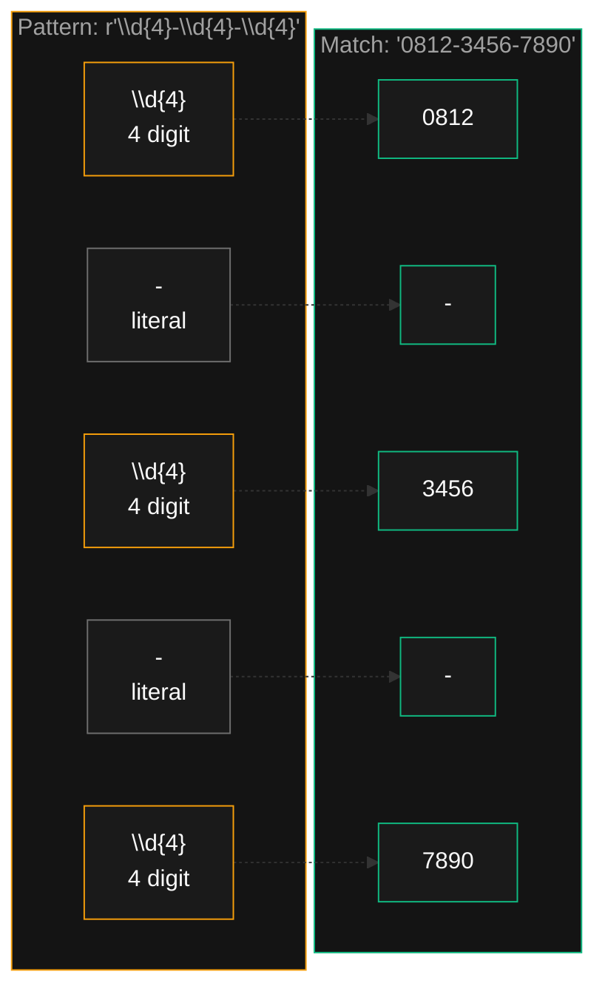
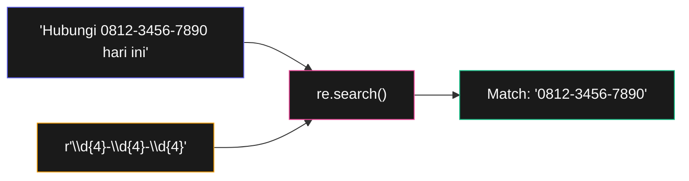

# Bab 7: Regular Expression

> *Pencarian "Ctrl+F" itu untuk teks pasti. Regex untuk pencarian **pola**. Bedanya seperti mencari "Budi" vs mencari "semua nomor HP".*

Bayangkan kamu punya dokumen 500 halaman yang berisi banyak nomor HP, dan kamu ingin ekstrak semuanya. Nomor HP punya pola: 10-13 digit, kadang ada `-`, kadang diawali `+62` atau `0`.

Tanpa regex, kamu harus tulis puluhan baris kode dengan if/else yang rumit. Dengan regex, **satu baris**:

```python
import re
nomor_hp = re.findall(r"(\+62|0)\d{9,12}", dokumen)
```

**Regex** (regular expression) adalah bahasa kecil khusus untuk **mendeskripsikan pola dalam teks**. Bab ini tidak akan jadikan kamu master regex (itu butuh bertahun-tahun), tapi setelah ini kamu akan bisa:

- Cari pola sederhana di teks
- Validasi format (email, nomor HP, kode pos)
- Ekstrak data dari teks tidak terstruktur
- Replace dengan pola

## 7.1. Tanpa Regex — Demonstrasi Masalah

Sebelum belajar regex, mari lihat **kenapa** regex ada. Tulis fungsi yang cari format nomor HP `0812-3456-7890`:

```python
def adalah_nomor_hp(teks):
    if len(teks) != 14:
        return False
    if teks[4] != "-" or teks[9] != "-":
        return False
    for i, c in enumerate(teks):
        if i in (4, 9):
            continue
        if not c.isdigit():
            return False
    return True

print(adalah_nomor_hp("0812-3456-7890"))  # True
print(adalah_nomor_hp("0812-345-6789"))   # False
```

12 baris kode untuk pola sederhana. Sekarang dengan regex:

```python
import re
def adalah_nomor_hp(teks):
    return re.fullmatch(r"\d{4}-\d{4}-\d{4}", teks) is not None
```

3 baris. Itulah daya tarik regex.

## 7.2. Pattern Dasar

### Membuat Pattern

Pattern regex selalu dibuat dengan `re.compile()`:

```python
import re

pola = re.compile(r"\d{4}-\d{4}-\d{4}")
hasil = pola.search("Hubungi saya di 0812-3456-7890.")
print(hasil)        # <re.Match object; span=(15, 29), match='0812-3456-7890'>
print(hasil.group()) # 0812-3456-7890
```

Tiga hal yang perlu kamu paham:

1. **`r"..."`** = raw string. **Selalu** pakai untuk pattern regex — supaya `\d`, `\w`, `\s` tidak diinterpretasi sebagai escape Python.
2. **`re.compile(pola)`** = build pattern reusable.
3. **`pola.search(teks)`** = cari pertama yang cocok. Return `Match` object atau `None`.

### Karakter Khusus Paling Penting

| Pattern | Cocok dengan |
|---------|--------------|
| `\d` | Satu digit (0-9) |
| `\D` | Satu non-digit |
| `\w` | Satu karakter "kata" (huruf, digit, underscore) |
| `\W` | Satu non-kata |
| `\s` | Satu whitespace (spasi, tab, newline) |
| `\S` | Satu non-whitespace |
| `.` | Satu karakter apa saja (kecuali newline) |



<div class="flowchart-caption" markdown>
<span class="label">Cara baca diagram</span>

Diagram ini menunjukkan **bagaimana pattern dibaca dari kiri ke kanan**, bagian per bagian, dan dipasangkan ke bagian teks yang cocok.

**Pattern `\d{4}-\d{4}-\d{4}`** dipecah jadi 5 token:

1. **`\d{4}`** (amber) — placeholder: "tepat 4 digit". Dipasangkan ke `0812`.
2. **`-`** (abu-abu) — literal: harus ada karakter strip tepat di posisi ini. Dipasangkan ke `-`.
3. **`\d{4}`** — 4 digit lagi. Dipasangkan ke `3456`.
4. **`-`** — strip lagi.
5. **`\d{4}`** — 4 digit terakhir. Dipasangkan ke `7890`.

**Cara berpikir regex**:

- **Token amber/dinamis** = "saya menerima apa saja yang cocok jenis ini"
- **Token abu-abu/literal** = "saya cuma terima karakter yang persis ini"

**Karakter literal yang perlu di-escape** (kasih backslash di depan): `. ^ $ * + ? { } [ ] \ | ( )`. Karena karakter-karakter itu punya makna khusus di regex.

```python
# Cari literal "$50" — dollar sign harus di-escape
re.search(r"\$50", "Harga $50")
```

**Pemula sering**: lupa raw string `r"..."`. Tanpa raw string, backslash-nya jadi escape Python, bukan regex. `"\d"` di Python = "huruf d", bukan "digit".
</div>

### Kuantifier — Berapa Kali

| Pattern | Arti |
|---------|------|
| `?` | 0 atau 1 kali |
| `*` | 0 atau lebih |
| `+` | 1 atau lebih |
| `{n}` | Tepat `n` kali |
| `{n,}` | Minimum `n` kali |
| `{n,m}` | Antara `n` sampai `m` kali |

```python
>>> re.search(r"\d{3}", "123")    # tepat 3 digit
<re.Match object; span=(0, 3), match='123'>
>>> re.search(r"\d{3,5}", "12345678")  # 3-5 digit, ambil sebanyak mungkin
<re.Match object; span=(0, 5), match='12345'>
>>> re.search(r"a+b", "aaab")
<re.Match object; span=(0, 4), match='aaab'>
```



<div class="flowchart-caption" markdown>
<span class="label">Cara baca diagram</span>

Diagram ini menunjukkan **3 input + 1 output** dari operasi regex.

- **Kotak indigo (atas)** = teks yang akan dicari.
- **Kotak amber (kiri)** = pattern regex — "deskripsi" pola yang kita cari.
- **Kotak pink (tengah)** = fungsi `re.search()` yang menggabungkan pattern + teks.
- **Kotak hijau (kanan)** = hasil match.

**Cara baca pattern `\d{4}-\d{4}-\d{4}`**:

- `\d{4}` = persis 4 digit
- `-` = literal tanda strip
- `\d{4}` = lagi, 4 digit
- `-` = strip lagi
- `\d{4}` = 4 digit terakhir

Total: **4 digit, strip, 4 digit, strip, 4 digit** — pola nomor HP berformat.

**Kunci**: regex itu seperti "menerangkan apa yang dicari ke komputer". Setelah pattern dibangun, `re.search()` tinggal jalan menelusuri teks dan kembalikan posisi pertama yang cocok.
</div>

## 7.3. Method Penting

### `.search()` — Cari Pertama

```python
>>> re.search(r"\d+", "harga 5000 rupiah").group()
'5000'
```

Return `Match` atau `None`. Selalu cek `is not None` sebelum panggil `.group()`.

### `.findall()` — Cari Semua

```python
>>> re.findall(r"\d+", "ada 5 apel dan 3 jeruk dengan harga 12000")
['5', '3', '12000']
```

Return list semua match.

### `.fullmatch()` — Apakah Seluruh String Cocok

```python
>>> re.fullmatch(r"\d{4}-\d{4}-\d{4}", "0812-3456-7890")
<re.Match object; ...>
>>> re.fullmatch(r"\d{4}-\d{4}-\d{4}", "0812-3456-7890 lain")
None
```

Berbeda dengan `.search()` — `.fullmatch()` butuh **seluruh** string cocok pattern.

### `.sub()` — Replace dengan Pattern

```python
>>> re.sub(r"\d+", "X", "harga 5000 dan 3000")
'harga X dan X'
```

## 7.4. Grouping dengan Tanda Kurung

Tanda kurung `(...)` di regex bikin **group** — bagian yang bisa diambil terpisah:

```python
>>> hasil = re.search(r"(\d{4})-(\d{4})-(\d{4})", "0812-3456-7890")
>>> hasil.group()       # seluruh match
'0812-3456-7890'
>>> hasil.group(1)      # group pertama
'0812'
>>> hasil.group(2)      # group kedua
'3456'
>>> hasil.groups()      # semua group sebagai tuple
('0812', '3456', '7890')
```

### Named Group — Lebih Mudah Dibaca

```python
>>> pola = re.compile(r"(?P<area>\d{4})-(?P<nomor>\d{4})-(?P<lain>\d{4})")
>>> hasil = pola.search("0812-3456-7890")
>>> hasil.group("area")
'0812'
>>> hasil.group("nomor")
'3456'
```

## 7.5. Character Class — `[...]`

Tanda kurung siku `[...]` artinya "salah satu dari karakter ini":

```python
>>> re.findall(r"[aiueo]", "Halo dunia")
['a', 'o', 'u', 'i', 'a']
>>> re.findall(r"[A-Z]", "Halo Dunia Python")
['H', 'D', 'P']
>>> re.findall(r"[A-Za-z]", "Halo123")
['H', 'a', 'l', 'o']
>>> re.findall(r"[^aiueo]", "Halo")  # ^ = NOT
['H', 'l']
```

`-` di dalam `[...]` artinya **range**. `[A-Z]` = huruf besar, `[0-9]` = digit (sama dengan `\d`).

`^` di awal `[...]` artinya **kebalikan** — semua KECUALI yang disebutkan.

## 7.6. Anchor — Awal & Akhir String

| Anchor | Arti |
|--------|------|
| `^` | Awal string (kalau bukan di dalam `[...]`) |
| `$` | Akhir string |
| `\b` | Batas kata (word boundary) |

```python
>>> re.search(r"^Halo", "Halo dunia")    # cocok karena di awal
<Match>
>>> re.search(r"^Halo", "dunia Halo")    # tidak cocok
None
>>> re.search(r"dunia$", "Halo dunia")   # cocok karena di akhir
<Match>
```

`\b` berguna untuk match kata utuh:

```python
>>> re.findall(r"\bcat\b", "cat catastrophe")
['cat']        # 'catastrophe' tidak ikut karena kata berbeda
```

## 7.7. Pattern Praktis yang Sering Dipakai

### Email

```python
pola_email = re.compile(r"[a-zA-Z0-9._%+-]+@[a-zA-Z0-9.-]+\.[a-zA-Z]{2,}")
```

Bukan validator email sempurna (regex untuk email betul-betul valid sangat panjang), tapi cukup untuk 99% kasus.

### Nomor HP Indonesia

```python
pola_hp = re.compile(r"(?:\+62|62|0)8[1-9][0-9]{6,10}")
```

Cocok dengan `+628123456789`, `628123456789`, `08123456789`.

### URL

```python
pola_url = re.compile(r"https?://[^\s]+")
```

`https?` = `http` atau `https` (`s` opsional). `[^\s]+` = bukan whitespace, satu atau lebih.

### Kode Pos Indonesia

```python
pola_kode_pos = re.compile(r"\b\d{5}\b")
```

5 digit dengan batas kata di depan-belakang (supaya tidak match angka 7 digit).

## 7.8. Project: Ekstraksi Kontak dari Teks

```python
import re

def ekstrak_kontak(teks):
    """Ekstrak email dan nomor HP dari teks bebas."""
    pola_email = re.compile(r"[a-zA-Z0-9._%+-]+@[a-zA-Z0-9.-]+\.[a-zA-Z]{2,}")
    pola_hp = re.compile(r"(?:\+62|62|0)8[1-9][0-9]{6,10}")

    return {
        "email": pola_email.findall(teks),
        "telepon": pola_hp.findall(teks),
    }

teks = """
Profil Tim:
- Andi (andi@kantor.com, +6281234567890)
- Sari (sari.lestari@example.com, 081298765432)
- Budi (budi-x@perusahaan.co.id, 6285511112222)
"""

hasil = ekstrak_kontak(teks)
print("Email ditemukan:", hasil["email"])
print("Telepon:", hasil["telepon"])
```

Output:

```
Email ditemukan: ['andi@kantor.com', 'sari.lestari@example.com', 'budi-x@perusahaan.co.id']
Telepon: ['+6281234567890', '081298765432', '6285511112222']
```

5 baris regex, hasil bersih. Bandingkan kalau nulis manual.

## 7.9. Tips Belajar Regex

Regex itu seperti bahasa pemrograman kecil dalam string. Cara cepat menguasainya:

1. **Pakai regex tester online** — [regex101.com](https://regex101.com) atau [pythex.org](https://pythex.org). Mereka kasih penjelasan real-time tiap bagian pattern.
2. **Mulai dari yang sederhana, tambahkan bertahap**. Jangan langsung tulis pattern panjang.
3. **Komentar pattern panjang** dengan flag `re.VERBOSE`:

```python
pola = re.compile(r"""
    \(?\d{3}\)?     # area code, kurung opsional
    [-.\s]?         # pemisah opsional
    \d{3,4}         # 3-4 digit
    [-.\s]?
    \d{4}           # 4 digit terakhir
""", re.VERBOSE)
```

4. **Jangan over-engineer**. Kalau pakai `.startswith()` cukup, jangan pakai regex.

## 7.10. Ringkasan

- **Regex** = bahasa untuk mendeskripsikan pola dalam teks
- **Selalu pakai raw string** `r"..."` untuk pattern
- **`\d`, `\w`, `\s`** = digit, word char, whitespace
- **Kuantifier**: `?`, `*`, `+`, `{n}`, `{n,m}`
- **Group** dengan `(...)` — ambil bagian dengan `.group(n)`
- **Character class** `[...]`, range `[a-z]`, negasi `[^...]`
- **Anchor**: `^` awal, `$` akhir, `\b` batas kata
- **Method utama**: `.search()`, `.findall()`, `.fullmatch()`, `.sub()`

Konsep paling penting: **mulai sederhana, baru tambah kompleksitas**. Pattern regex panjang yang dibikin sekaligus hampir selalu salah.

## 7.11. Latihan

### 7.1 — Validator Email
Tulis fungsi `valid_email(email)` pakai regex.

### 7.2 — Hitung Kata
Tulis fungsi `hitung_kata(teks)` yang return jumlah kata. Pakai `\w+`.

### 7.3 — Sensor Kata Kasar
Tulis fungsi `sensor(teks, daftar_kasar)` yang ganti tiap kata kasar dengan asterisk dengan jumlah sama. Pakai `re.sub` dengan pattern `\b(kata1|kata2)\b`.

### 7.4 — Format Tanggal
Tulis fungsi `format_tanggal(teks)` yang konversi `15-05-2026` jadi `2026-05-15`.

### 7.5 — Ekstrak Hashtag
Tulis fungsi yang return semua hashtag dari teks tweet.

```python
ekstrak_hashtag("Hari ini #cerah dan #produktif #python")
# ['#cerah', '#produktif', '#python']
```

### 7.6 — Tantangan: URL Validator
Validasi URL dengan: protocol (http/https), domain, optional path, optional query string.

<div class="cheatsheet" markdown>

### Wajib: Raw String
```python
re.search(r"\d+", "abc 123")    # PAKAI r"..."
```

### Karakter Khusus
| Pattern | Cocok |
|---------|-------|
| `\d` `\D` | digit, non-digit |
| `\w` `\W` | word char, non-word |
| `\s` `\S` | whitespace, non-ws |
| `.` | apa saja kecuali newline |

### Kuantifier
| Q | Arti |
|---|------|
| `?` | 0 atau 1 |
| `*` | 0+ |
| `+` | 1+ |
| `{n}` | tepat n |
| `{n,m}` | n sampai m |

### Method
```python
re.search(p, s)        # cari pertama → Match atau None
re.findall(p, s)       # list semua match
re.fullmatch(p, s)     # cek seluruh string cocok
re.sub(p, "ganti", s)  # replace dengan pattern
re.compile(p)          # build pattern reusable
```

### Group
```python
m = re.search(r"(\d{4})-(\d{4})", "0812-3456")
m.group()      # '0812-3456'
m.group(1)     # '0812'
m.group(2)     # '3456'
m.groups()     # ('0812', '3456')
```

### Character Class & Anchor
```python
[abc]      # a, b, atau c
[a-z]      # a sampai z
[^abc]     # NOT abc
^          # awal string
$          # akhir string
\b         # batas kata
```

### Pattern Praktis
```python
# Email
r"[a-zA-Z0-9._%+-]+@[a-zA-Z0-9.-]+\.[a-zA-Z]{2,}"

# HP Indonesia
r"(?:\+62|62|0)8[1-9][0-9]{6,10}"

# URL
r"https?://[^\s]+"
```

</div>

[← Bagian 1](../bagian-1-dasar-python/bab-06-string.md){ .md-button }
[Lanjut Bab 8 →](bab-08-validasi-input.md){ .md-button .md-button--primary }

<div class="atribusi-bab">
Diadaptasi dari Chapter 7: Pattern Matching with Regular Expressions, "Automate the Boring Stuff with Python" karya <a href="https://inventwithpython.com/" target="_blank">Al Sweigart</a>. Versi asli: <a href="https://automatetheboringstuff.com/2e/chapter7/" target="_blank">automatetheboringstuff.com/2e/chapter7/</a>. Dilisensikan CC BY-NC-SA 4.0.
</div>
