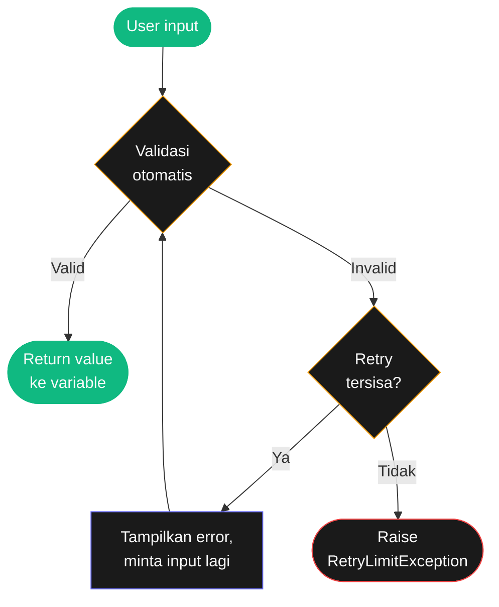

# Bab 8: Validasi Input

> *80% bug program berasal dari user input yang tidak terduga. Validasi yang baik = setengah dari kualitas program.*

Sampai sekarang, validasi input kita lakukan manual:

```python
while True:
    try:
        umur = int(input("Umur: "))
        if 0 < umur <= 120:
            break
        print("Umur harus 1-120")
    except ValueError:
        print("Bukan angka")
```

Berfungsi, tapi 7 baris untuk validasi sederhana. Kalau program kamu butuh banyak input, ini cepat jadi spaghetti.

**`pyinputplus`** = library yang merangkum semua validasi input umum jadi satu baris.

Setelah Bab 8, kamu akan bisa:

- Pakai `pyinputplus` untuk validasi otomatis
- Set min/max, default, timeout, retry limit
- Validasi custom dengan fungsi sendiri

## 8.1. Install

```bash
pip install pyinputplus
```

## 8.2. Fungsi Utama



<div class="flowchart-caption" markdown>
<span class="label">Cara baca flowchart</span>

Flowchart ini menunjukkan **siklus validasi otomatis** PyInputPlus — yang biasanya kamu tulis manual dengan `try/except + while`, sudah jadi bawaan.

**Alur**:

1. **Input** dari user
2. **Validasi otomatis** — sesuai jenis fungsi (`inputInt` cek angka, `inputEmail` cek format email, dll)
3. Kalau **valid** → return value, lanjut ke kode berikutnya
4. Kalau **invalid** → cek apakah masih ada retry tersisa (parameter `limit`)
5. Kalau **masih bisa retry** → tampilkan error, minta input lagi (loop)
6. Kalau **retry habis** → raise `RetryLimitException`

**Yang membedakan dari try/except manual**:

| Manual | PyInputPlus |
|--------|-------------|
| 7-10 baris kode per input | 1 baris |
| Harus tulis loop sendiri | Otomatis |
| Pesan error generic | Pesan spesifik (e.g. "must be ≥ 18") |
| Susah set retry limit | Tinggal `limit=3` |
| Tidak ada timeout | Tinggal `timeout=10` |

**Untuk validasi standar** (angka dengan range, email, date) — pakai PyInputPlus jelas menang. **Untuk validasi unik** (cek di database, regex aneh) — masih bisa pakai dengan `inputCustom` + fungsi sendiri.
</div>

### `inputStr` — Input string dengan validasi

```python
import pyinputplus as pyip

nama = pyip.inputStr(prompt="Nama: ", blank=False)
```

`blank=False` artinya tidak boleh kosong — pengguna harus ketik sesuatu.

### `inputNum`, `inputInt`, `inputFloat` — Angka

```python
umur = pyip.inputInt(prompt="Umur: ", min=1, max=120)
harga = pyip.inputFloat(prompt="Harga: ", greaterThan=0)
```

Otomatis loop sampai user kasih angka valid dalam range.

### `inputChoice` — Pilihan dari daftar

```python
warna = pyip.inputChoice(["merah", "hijau", "biru"])
```

User harus ketik salah satu dari pilihan, atau program loop minta lagi.

### `inputMenu` — Menu bernomor

```python
pilih = pyip.inputMenu(
    ["Tambah", "Edit", "Hapus", "Keluar"],
    numbered=True,
)
```

Output:

```
1. Tambah
2. Edit
3. Hapus
4. Keluar
```

User bisa ketik "1" atau "Tambah" — keduanya valid.

### `inputYesNo`, `inputBool`

```python
lanjut = pyip.inputYesNo(prompt="Lanjut? ")  # 'yes' / 'no'
setuju = pyip.inputBool(prompt="Setuju? ")    # 'true' / 'false'
```

### `inputEmail`, `inputDate`, `inputTime`

```python
email = pyip.inputEmail()
tanggal_lahir = pyip.inputDate()
jam_meeting = pyip.inputTime()
```

## 8.3. Parameter Lanjutan

### `default` — Nilai default kalau kosong

```python
nama = pyip.inputStr(default="Anonim", blank=True)
```

Kalau user tekan Enter tanpa ketik apapun, `nama` jadi `"Anonim"`.

### `limit` — Maksimum percobaan

```python
try:
    umur = pyip.inputInt(min=1, max=120, limit=3)
except pyip.RetryLimitException:
    print("Sudah 3x salah, exit.")
```

### `timeout` — Batas waktu

```python
try:
    jawaban = pyip.inputStr(timeout=10)
except pyip.TimeoutException:
    print("Timeout 10 detik")
```

### `allowRegexes`, `blockRegexes` — Filter custom

```python
# Hanya boleh huruf
nama = pyip.inputStr(allowRegexes=[r"^[a-zA-Z]+$"])

# Tolak yang mengandung angka
nama = pyip.inputStr(blockRegexes=[r"\d"])
```

### Custom Validator

```python
def validasi_genap(value):
    angka = int(value)
    if angka % 2 != 0:
        raise Exception("Harus genap!")

angka = pyip.inputCustom(validasi_genap, prompt="Angka genap: ")
```

## 8.4. Project: Form Pendaftaran

```python
import pyinputplus as pyip

print("=" * 40)
print("FORM PENDAFTARAN".center(40))
print("=" * 40)

nama = pyip.inputStr(prompt="Nama lengkap: ", blank=False)
email = pyip.inputEmail(prompt="Email: ")
umur = pyip.inputInt(prompt="Umur: ", min=17, max=99)

jenis_kelamin = pyip.inputMenu(
    ["Laki-laki", "Perempuan"],
    prompt="Jenis kelamin:\n",
    numbered=True,
)

paket = pyip.inputMenu(
    ["Reguler (Rp 100rb)", "Premium (Rp 250rb)", "VIP (Rp 500rb)"],
    prompt="Pilih paket:\n",
    numbered=True,
)

setuju = pyip.inputYesNo(prompt="Setuju syarat & ketentuan? ")
if setuju == "no":
    print("Pendaftaran dibatalkan.")
else:
    print()
    print("=" * 40)
    print("DATA PENDAFTAR".center(40))
    print("=" * 40)
    print(f"Nama   : {nama}")
    print(f"Email  : {email}")
    print(f"Umur   : {umur}")
    print(f"Gender : {jenis_kelamin}")
    print(f"Paket  : {paket}")
```

5 baris validasi input — bandingkan dengan ~30 baris kalau pakai try/except manual.

## 8.5. Kapan Pakai vs Manual

| Pakai `pyinputplus` | Pakai manual |
|---------------------|--------------|
| Banyak input (form, wizard) | Cuma 1-2 input |
| Validasi standar (angka, email) | Validasi unik |
| Prototype cepat | Library minimal |

## 8.6. Ringkasan

- **`pyinputplus`** menyederhanakan validasi input
- **Fungsi utama**: `inputStr`, `inputInt`, `inputFloat`, `inputChoice`, `inputMenu`, `inputYesNo`, `inputEmail`, `inputDate`
- **Parameter penting**: `min`, `max`, `default`, `limit`, `timeout`, `blank`
- **Custom**: `allowRegexes`, `blockRegexes`, `inputCustom`

## 8.7. Latihan

### 8.1 — Survey App
Buat program survey 5 pertanyaan — campur tipe (string, int, choice, yes/no).

### 8.2 — Quiz Time
Quiz pilihan ganda 10 soal pakai `inputMenu`. Hitung skor di akhir.

### 8.3 — Booking
Booking tiket: nama (string), tanggal (date), jam (time), kelas (choice), jumlah (int min=1).

<div class="cheatsheet" markdown>

### Install
```bash
pip install pyinputplus
```

### Import
```python
import pyinputplus as pyip
```

### Fungsi Utama
```python
pyip.inputStr(prompt="...")
pyip.inputInt(min=1, max=100)
pyip.inputFloat(greaterThan=0)
pyip.inputChoice(["a", "b", "c"])
pyip.inputMenu(["A", "B"], numbered=True)
pyip.inputYesNo()              # 'yes'/'no'
pyip.inputBool()                # 'true'/'false'
pyip.inputEmail()
pyip.inputDate()                # date object
pyip.inputTime()                # time object
```

### Parameter Penting
| Param | Fungsi |
|-------|--------|
| `prompt` | Teks pertanyaan |
| `default` | Nilai kalau kosong |
| `blank=True` | Boleh kosong |
| `min, max` | Range angka |
| `limit=3` | Max retry |
| `timeout=10` | Detik |
| `allowRegexes` | Whitelist pattern |
| `blockRegexes` | Blacklist pattern |

### Custom Validator
```python
def validasi(value):
    if int(value) % 2 != 0:
        raise Exception("Harus genap")

pyip.inputCustom(validasi)
```

### Exception
```python
try:
    x = pyip.inputInt(limit=3)
except pyip.RetryLimitException:
    print("Habis retry")
except pyip.TimeoutException:
    print("Timeout")
```

</div>

[← Bab 7](bab-07-regex.md){ .md-button }
[Lanjut Bab 9 →](bab-09-file-io.md){ .md-button .md-button--primary }

<div class="atribusi-bab">
Diadaptasi dari Chapter 8: Input Validation, "Automate the Boring Stuff with Python" karya <a href="https://inventwithpython.com/" target="_blank">Al Sweigart</a>. Versi asli: <a href="https://automatetheboringstuff.com/2e/chapter8/" target="_blank">automatetheboringstuff.com/2e/chapter8/</a>. Dilisensikan CC BY-NC-SA 4.0.
</div>
