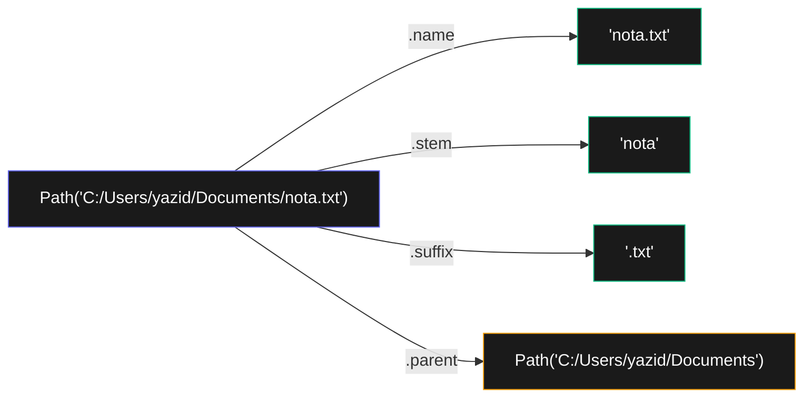

# Bab 9: Membaca & Menulis File

> *Program yang tidak menyentuh file = program yang lupa segala-galanya begitu ditutup. File = memori jangka panjang.*

Sampai sekarang, semua data program kita **hilang** begitu program ditutup. Itu kalau cuma latihan oke, tapi untuk program nyata kamu butuh **persistensi** — data tersimpan di disk dan bisa dibaca lagi besok.

Setelah Bab 9, kamu akan bisa:

- Bekerja dengan path file (Windows, Mac, Linux)
- Buka, baca, tulis, append file teks
- Pakai `pathlib` (cara modern) dan `os.path` (cara klasik)
- Backup, copy, delete file
- Bekerja dengan file zip
- Pakai shelve untuk simpan dictionary Python ke disk

## 9.1. Path File — Lokasi File di Disk

Sebelum bisa baca/tulis file, kamu harus bisa **menunjukkan lokasi**-nya ke Python.

### Path Absolut vs Relatif

- **Absolut**: lokasi lengkap dari root disk. `C:\Users\yazid\Documents\nota.txt` di Windows, `/home/yazid/Documents/nota.txt` di Linux.
- **Relatif**: dari direktori kerja saat ini. `Documents\nota.txt` (artinya: dari folder saat ini, masuk ke Documents, ambil nota.txt).

### Hati-hati dengan Backslash di Windows

Windows pakai `\` sebagai separator. Tapi `\` di Python adalah escape character. Jadi:

```python
# SALAH — Python interpret \U, \n sebagai escape
path = "C:\Users\nama\nota.txt"

# BENAR — pakai raw string
path = r"C:\Users\nama\nota.txt"

# BENAR — atau forward slash, Python paham
path = "C:/Users/nama/nota.txt"

# PALING BENAR — pakai pathlib (cross-platform)
from pathlib import Path
path = Path("C:/Users/nama/nota.txt")
```

## 9.2. `pathlib` — Cara Modern (Direkomendasikan)

```python
from pathlib import Path

# Path saat ini (current working directory)
print(Path.cwd())

# Home directory
print(Path.home())

# Build path dengan / (operator overload yang elegan)
path = Path.home() / "Documents" / "nota.txt"
print(path)

# Cek file/folder
print(path.exists())
print(path.is_file())
print(path.is_dir())

# Properti file
print(path.name)        # 'nota.txt'
print(path.stem)        # 'nota'
print(path.suffix)      # '.txt'
print(path.parent)      # path folder parent
```



<div class="flowchart-caption" markdown>
<span class="label">Cara baca diagram</span>

Diagram ini menunjukkan **anatomi `Path` object** dan property-nya.

Untuk path `C:/Users/yazid/Documents/nota.txt`:

- **`.name`** = nama file lengkap dengan ekstensi (`'nota.txt'`)
- **`.stem`** = nama file tanpa ekstensi (`'nota'`)
- **`.suffix`** = ekstensi termasuk titik (`'.txt'`)
- **`.parent`** = folder yang berisi file (`Path` object lagi)

**Kunci**: `Path` object berbeda dari string biasa. Dia "tahu" bahwa dirinya adalah path file, jadi punya method-method spesifik untuk path manipulation.

**Trik praktis**: ganti ekstensi file dengan `.with_suffix()`:

```python
p = Path("dokumen.txt")
p.with_suffix(".pdf")    # Path('dokumen.pdf')
```

Berguna untuk batch convert file.
</div>

### List File di Folder

```python
folder = Path.home() / "Documents"

# Semua file & folder
for item in folder.iterdir():
    print(item)

# Hanya file .txt
for txt in folder.glob("*.txt"):
    print(txt)

# Recursive — cari di subfolder juga
for txt in folder.rglob("*.txt"):
    print(txt)
```

## 9.3. Baca File Teks

### Cara Sederhana — `read_text()`

```python
from pathlib import Path
isi = Path("nota.txt").read_text(encoding="utf-8")
print(isi)
```

### Cara Klasik — `open()` + `with`

```python
with open("nota.txt", "r", encoding="utf-8") as f:
    isi = f.read()
print(isi)
```

`with` menjamin file ditutup otomatis setelah selesai — bahkan kalau ada error.

### Mode Open

| Mode | Arti |
|------|------|
| `"r"` | Read (baca, default) |
| `"w"` | Write — overwrite isi |
| `"a"` | Append — tambah di akhir |
| `"x"` | Create exclusive — error kalau sudah ada |
| `"b"` | Binary mode (gabungkan: `"rb"`, `"wb"`) |

### Baca Per Baris

```python
with open("nota.txt", "r", encoding="utf-8") as f:
    for baris in f:
        print(baris.rstrip())   # rstrip() hapus \n di akhir
```

Atau dapat list semua baris:

```python
with open("nota.txt") as f:
    baris_list = f.readlines()
```

## 9.4. Tulis File Teks

### Cara Sederhana

```python
Path("output.txt").write_text("Halo dunia!\n", encoding="utf-8")
```

### Cara Klasik

```python
with open("output.txt", "w", encoding="utf-8") as f:
    f.write("Baris 1\n")
    f.write("Baris 2\n")
```

### Append (Tambah di Akhir)

```python
with open("log.txt", "a", encoding="utf-8") as f:
    f.write(f"[{datetime.now()}] Event terjadi\n")
```

!!! warning "Mode `w` MENGHAPUS isi file lama!"
    Selalu cek mode dengan teliti. Mode `w` membuat file baru atau **mengganti seluruh isi** file lama.

    Kalau kamu mau preserve isi, pakai `a` (append) atau baca-modifikasi-tulis.

## 9.5. Operasi File dengan `shutil`

`shutil` (shell utility) untuk operasi file dan folder:

```python
import shutil
from pathlib import Path

# Copy file
shutil.copy("src.txt", "tujuan.txt")

# Copy folder beserta isinya
shutil.copytree("src_folder", "tujuan_folder")

# Pindah / rename
shutil.move("lama.txt", "baru.txt")

# Hapus file
Path("file.txt").unlink()

# Hapus folder beserta isinya
shutil.rmtree("folder_to_delete")
```

!!! danger "Operasi destruktif tidak bisa di-undo"
    `unlink()` dan `rmtree()` **menghapus permanen**, tidak masuk Recycle Bin. Untuk hapus yang aman (masuk recycle bin), pakai library `send2trash`:

    ```python
    import send2trash
    send2trash.send2trash("file.txt")
    ```

## 9.6. Walking Direktori

Untuk proses semua file dalam folder beserta subfolder, pakai `os.walk`:

```python
import os

for folder_skrg, subfolder_list, file_list in os.walk("c:/Users/nama/Documents"):
    print(f"Folder: {folder_skrg}")
    for sub in subfolder_list:
        print(f"  Subfolder: {sub}")
    for file in file_list:
        print(f"  File: {file}")
```

Atau pakai `pathlib`:

```python
for path in Path("c:/Users/nama/Documents").rglob("*"):
    if path.is_file():
        print(path)
```

## 9.7. File Zip

```python
import zipfile

# Buat zip
with zipfile.ZipFile("backup.zip", "w") as z:
    z.write("file1.txt")
    z.write("file2.txt")
    z.write("folder/file3.txt")

# Baca zip
with zipfile.ZipFile("backup.zip") as z:
    print(z.namelist())          # daftar file di dalam
    z.extractall("extracted/")   # ekstrak semua
```

## 9.8. `shelve` — Simpan Dictionary ke File

Untuk simpan/baca dictionary Python ke disk dengan mudah:

```python
import shelve

with shelve.open("data.shelf") as db:
    db["users"] = ["Andi", "Sari", "Budi"]
    db["config"] = {"theme": "dark", "lang": "id"}

# Baca lagi nanti
with shelve.open("data.shelf") as db:
    print(db["users"])
    print(db["config"]["theme"])
```

Cocok untuk simple persistent storage. Untuk yang serius, pakai SQLite atau JSON (Bab 16).

## 9.9. Project: Backup Otomatis

```python
import shutil
from pathlib import Path
from datetime import datetime

def backup_folder(src, dest):
    """Backup folder dengan timestamp."""
    src = Path(src)
    dest = Path(dest)

    if not src.is_dir():
        print(f"⚠ Source bukan folder valid: {src}")
        return

    timestamp = datetime.now().strftime("%Y%m%d_%H%M%S")
    nama_backup = f"{src.name}_backup_{timestamp}"
    target = dest / nama_backup

    print(f"Backup {src} → {target}")
    shutil.copytree(src, target)
    print(f"✓ Selesai. Total file:")

    total = 0
    for item in target.rglob("*"):
        if item.is_file():
            total += 1
    print(f"  {total} file di-backup")

backup_folder(
    src=Path.home() / "Documents" / "Project",
    dest=Path.home() / "Backups",
)
```

## 9.10. Ringkasan

- **`pathlib.Path`** = cara modern, cross-platform untuk path
- **`Path.cwd()`, `Path.home()`** = direktori penting
- **`/` operator** untuk gabung path
- **`.exists()`, `.is_file()`, `.is_dir()`** untuk cek
- **`.read_text()`, `.write_text()`** = baca/tulis cepat
- **`with open(...) as f:`** = cara klasik, lebih kontrol
- **Mode**: `r` (baca), `w` (overwrite), `a` (append)
- **`shutil`** untuk copy/move/delete
- **`os.walk` / `Path.rglob`** untuk iterasi folder
- **`zipfile`** untuk operasi zip
- **`shelve`** untuk persist dictionary

## 9.11. Latihan

### 9.1 — Word Count
Baca file teks, hitung jumlah kata, baris, dan karakter.

### 9.2 — Find & Replace
Buat fungsi `replace_in_file(file, lama, baru)` yang ganti semua occurrence di file.

### 9.3 — Pencarian Teks
Cari semua file `.txt` di folder dan subfolder yang mengandung kata tertentu.

### 9.4 — Konsolidasi
Gabung semua file `.txt` di folder jadi satu file `gabungan.txt`.

### 9.5 — Backup Tantangan
Modifikasi project backup di atas: hanya backup file yang dimodifikasi dalam 7 hari terakhir.

<div class="cheatsheet" markdown>

### Path (Modern)
```python
from pathlib import Path

Path.cwd()                    # current dir
Path.home()                   # home folder
Path("a") / "b" / "c.txt"    # build path

p = Path("file.txt")
p.exists()    p.is_file()    p.is_dir()
p.name        # 'file.txt'
p.stem        # 'file'
p.suffix      # '.txt'
p.parent      # parent folder
p.with_suffix(".pdf")
```

### List Files
```python
folder.iterdir()              # immediate children
folder.glob("*.txt")          # filter ekstensi
folder.rglob("*.txt")         # recursive
```

### Baca/Tulis Cepat
```python
Path("file.txt").read_text(encoding="utf-8")
Path("file.txt").write_text(content, encoding="utf-8")
Path("file.bin").read_bytes()
Path("file.bin").write_bytes(data)
```

### Mode `open()`
| Mode | Arti |
|------|------|
| `r` | baca (default) |
| `w` | tulis (OVERWRITE!) |
| `a` | append (tambah di akhir) |
| `x` | buat baru, error kalau ada |
| `b` | binary (gabung: `rb`, `wb`) |

### Pola Standard
```python
with open(file, "r", encoding="utf-8") as f:
    for baris in f:
        print(baris.rstrip())
```

### `shutil`
```python
shutil.copy(src, dst)
shutil.copytree(src, dst)
shutil.move(src, dst)
shutil.rmtree(folder)         # hapus folder beserta isi
```

### Hapus
```python
Path("file.txt").unlink()
shutil.rmtree("folder")
# Untuk safe (recycle bin):
import send2trash
send2trash.send2trash("file")
```

### Zip
```python
import zipfile
with zipfile.ZipFile("a.zip", "w") as z:
    z.write("file.txt")

with zipfile.ZipFile("a.zip") as z:
    z.namelist()
    z.extractall("dest/")
```

### Persist Dictionary
```python
import shelve
with shelve.open("data.shelf") as db:
    db["key"] = value
```

</div>

[← Bab 8](bab-08-validasi-input.md){ .md-button }
[Lanjut Bab 10 →](bab-10-organisir-file.md){ .md-button .md-button--primary }

<div class="atribusi-bab">
Diadaptasi dari Chapter 9: Reading and Writing Files, "Automate the Boring Stuff with Python" karya <a href="https://inventwithpython.com/" target="_blank">Al Sweigart</a>. Versi asli: <a href="https://automatetheboringstuff.com/2e/chapter9/" target="_blank">automatetheboringstuff.com/2e/chapter9/</a>. Dilisensikan CC BY-NC-SA 4.0.
</div>
