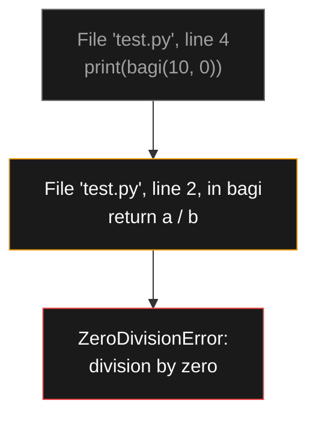
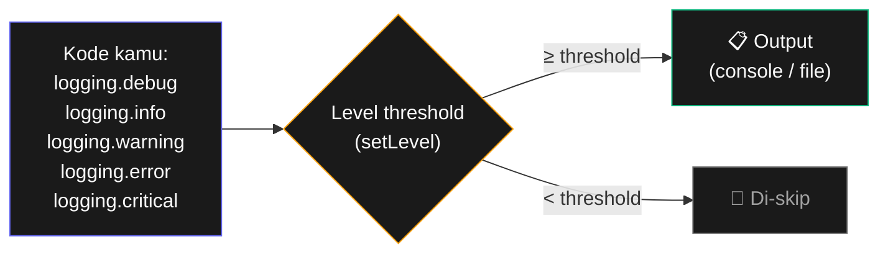

# Bab 11: Debugging

> *Programmer pemula menulis kode. Programmer profesional debug kode. Karena 90% waktu development adalah debug.*

Bug bukan tanda kamu programmer buruk — bug adalah **fakta hidup** programmer. Yang membedakan: profesional punya teknik untuk menemukan bug **cepat**, sementara pemula buang waktu hours menebak-nebak.

Setelah Bab 11, kamu akan bisa:

- Baca pesan error Python dengan benar
- Pakai `assert` untuk validasi internal
- Pakai `logging` daripada `print()` untuk debug
- Pakai debugger Python (`pdb`) untuk step-through

## 11.1. Membaca Error Message

Pemula sering panik saat lihat error. Padahal Python kasih **petunjuk lokasi tepat** bug.

```python
def bagi(a, b):
    return a / b

print(bagi(10, 0))
```

Output:

```
Traceback (most recent call last):
  File "test.py", line 4, in <module>
    print(bagi(10, 0))
  File "test.py", line 2, in bagi
    return a / b
ZeroDivisionError: division by zero
```

**Cara baca**:

1. **Baca dari bawah ke atas**. Baris terakhir adalah jenis & pesan error: `ZeroDivisionError: division by zero`.
2. **Naik ke atas** untuk lihat **rantai pemanggilan** (call stack):
   - Error terjadi di line 2 di fungsi `bagi`
   - Yang manggil dari line 4 (`<module>` = top-level script)



<div class="flowchart-caption" markdown>
<span class="label">Cara baca diagram</span>

Diagram ini menunjukkan **rantai pemanggilan (call stack)** saat error terjadi.

**Urutan kejadian dari atas ke bawah:**

1. **Top** (abu-abu) = baris kode yang memulai semuanya. Line 4 memanggil `bagi(10, 0)`.
2. **Middle** (amber) = fungsi yang sedang dijalankan saat error. Line 2 di dalam `bagi`, di baris `return a / b`.
3. **Error** (merah) = jenis & deskripsi error.

**Cara baca traceback yang benar**:

- **Bottom-up**: mulai dari error message paling bawah (apa yang salah), lalu naik ke baris yang salah (di mana), lalu lebih atas untuk konteks (siapa yang memanggil).
- **Yang penting**: **baris terbawah dari "your code"** — file dan line number kode kamu yang menyebabkan error. Library lain di atasnya biasanya tidak relevan.

**Pemula sering**: lihat error message langsung Google, tanpa baca line number. Akibatnya buang waktu fix di tempat salah.
</div>

### Jenis Error Umum

| Error | Penyebab |
|-------|----------|
| `SyntaxError` | Tata bahasa salah (lupa `:`, kurung tidak balance) |
| `NameError` | Variable belum didefinisikan |
| `TypeError` | Operasi tidak cocok untuk tipe (`"halo" + 5`) |
| `ValueError` | Tipe benar, tapi nilai tidak valid (`int("abc")`) |
| `IndexError` | Index list di luar range |
| `KeyError` | Key tidak ada di dictionary |
| `AttributeError` | Method/property tidak ada |
| `FileNotFoundError` | File tidak ditemukan |
| `IndentationError` | Indentasi salah |

## 11.2. `assert` — Validasi Internal

`assert` cek asumsi kamu tentang kondisi program. Kalau salah, langsung crash dengan pesan jelas.

```python
def hitung_diskon(harga, persen):
    assert 0 <= persen <= 100, "Persen harus 0-100"
    assert harga >= 0, "Harga tidak boleh negatif"
    return harga * (persen / 100)

hitung_diskon(50000, 150)
# AssertionError: Persen harus 0-100
```

**Aturan pakai `assert`**:

- ✅ Untuk **bug yang seharusnya tidak pernah terjadi** kalau program benar
- ❌ **Bukan** untuk validasi user input (pakai `if`/`raise` biasa)
- Bisa di-disable saat production dengan flag `-O`, jadi jangan andalkan untuk security

## 11.3. `logging` — Pengganti `print()` untuk Debug

`print()` untuk debug = pemula. Cara profesional: pakai `logging`.

```python
import logging

logging.basicConfig(
    level=logging.DEBUG,
    format='%(asctime)s - %(levelname)s - %(message)s',
)

logging.debug("Mulai program")

def hitung_total(items):
    logging.debug(f"Hitung total dari {len(items)} item")
    total = sum(items)
    logging.debug(f"Total = {total}")
    return total

hitung_total([10, 20, 30])
logging.debug("Selesai")
```

Output:

```
2026-05-15 10:30:00 - DEBUG - Mulai program
2026-05-15 10:30:00 - DEBUG - Hitung total dari 3 item
2026-05-15 10:30:00 - DEBUG - Total = 60
2026-05-15 10:30:00 - DEBUG - Selesai
```

### Level Logging

| Level | Kapan dipakai |
|-------|---------------|
| `DEBUG` | Info detail untuk debugging |
| `INFO` | Informasi normal program berjalan |
| `WARNING` | Sesuatu tidak normal, tapi program lanjut |
| `ERROR` | Operasi gagal, tapi program lanjut |
| `CRITICAL` | Error fatal, program harus berhenti |



<div class="flowchart-caption" markdown>
<span class="label">Cara baca diagram</span>

Diagram ini menunjukkan **mekanisme filtering** yang membuat logging powerful.

**Konsepnya**: kamu **menulis log untuk semua level** (DEBUG sampai CRITICAL), tapi **hanya yang ≥ threshold** yang muncul di output.

**Hierarki level** (urutan kekritisan):

```
DEBUG (10) < INFO (20) < WARNING (30) < ERROR (40) < CRITICAL (50)
```

**Contoh skenario**:

- `setLevel(DEBUG)` → semua muncul (development mode)
- `setLevel(INFO)` → DEBUG di-skip, sisanya muncul
- `setLevel(WARNING)` → DEBUG dan INFO di-skip
- `setLevel(ERROR)` → cuma ERROR dan CRITICAL muncul (production mode)

**Kenapa ini powerful?**

- Saat **debugging**: pasang `level=DEBUG`, lihat semua detail
- Saat **production**: pasang `level=WARNING`, log file tidak banjir
- **Tanpa edit kode satu baris** — cuma ubah 1 setting di `basicConfig`

**Bandingkan dengan `print()`**:

- Pakai `print()` untuk debug → harus delete satu-satu sebelum production, atau biarkan dan output kotor.
- Pakai logging → tinggal naikkan level, semua DEBUG/INFO otomatis ter-suppress tanpa hapus kode.
</div>

```python
logging.debug("Detail kecil")
logging.info("Aplikasi mulai")
logging.warning("Disk hampir penuh")
logging.error("Gagal kirim email")
logging.critical("Database down!")
```

### Disable Logging Saat Production

```python
logging.disable(logging.CRITICAL)
```

Setelah ini, semua log dari DEBUG sampai ERROR di-skip.

### Log ke File

```python
logging.basicConfig(
    filename="app.log",
    level=logging.INFO,
    format='%(asctime)s - %(levelname)s - %(message)s',
)
```

Bedanya dengan `print()`:

- **`print()`** menggangu output program. Susah remove kalau sudah banyak.
- **Logging** bisa diatur level-nya. Bisa di-disable total. Bisa redirect ke file. Punya timestamp & severity otomatis.

## 11.4. Python Debugger (`pdb`)

Untuk debugging serius — step-by-step execution.

```python
import pdb

def cari_bug(daftar):
    total = 0
    for i, item in enumerate(daftar):
        pdb.set_trace()      # Program berhenti di sini
        total += item
    return total

cari_bug([1, 2, 3])
```

Saat program sampai di `set_trace`, prompt muncul:

```
(Pdb)
```

**Perintah penting**:

| Perintah | Fungsi |
|----------|--------|
| `n` (next) | Eksekusi baris berikutnya |
| `s` (step) | Step ke dalam fungsi |
| `c` (continue) | Lanjut sampai breakpoint berikutnya |
| `l` (list) | Tampilkan kode sekitar |
| `p variable` | Print value variable |
| `pp variable` | Pretty-print |
| `q` (quit) | Keluar debugger |

### Versi Modern: `breakpoint()`

Sejak Python 3.7, ada syntax lebih bersih:

```python
def cari_bug(daftar):
    total = 0
    for item in daftar:
        breakpoint()      # = pdb.set_trace()
        total += item
    return total
```

## 11.5. Tips Debugging Praktis

### 1. Rubber Duck Debugging

Jelaskan kode kamu **baris demi baris** ke benda mati (bebek karet, kucing, tembok). Sering, dalam proses menjelaskan, kamu sendiri sadar bug-nya di mana.

### 2. Bisect Method

Kalau bug sulit dilacak: **comment out setengah kode**. Run.

- Bug masih ada → bug di setengah yang aktif
- Bug hilang → bug di setengah yang di-comment

Ulangi dengan setengah yang teridentifikasi. Dalam 5-7 iterasi, kamu temukan bug-nya.

### 3. Print Sandwich

Sebelum & sesudah baris yang dicurigai:

```python
print(f"Sebelum: x={x}, y={y}")
hasil = fungsi_curiga(x, y)
print(f"Sesudah: hasil={hasil}")
```

Lihat apakah input/output sesuai ekspektasi.

### 4. Reproduce Dulu

Bug yang **tidak bisa direproduksi konsisten** adalah bug yang sulit di-fix. Sebelum debug, pastikan kamu bisa trigger bug-nya secara konsisten.

## 11.6. Ringkasan

- **Baca error**: bottom-up, fokus ke baris kode kamu
- **`assert`** untuk validasi asumsi internal
- **`logging`** menggantikan `print()` untuk debug serius
- **`breakpoint()`** untuk step-through debugger
- **Rubber duck**: jelaskan code untuk temukan bug
- **Bisect**: comment out setengah, persempit lokasi bug

## 11.7. Latihan

### 11.1 — Fix the Bug
Kode di bawah punya 3 bug. Pakai teknik debugging untuk temukan dan fix:

```python
def hitung_rata(angka):
    total = sum(angka)
    return total / len(angka) - 1

print(hitung_rata([10, 20, "30"]))
print(hitung_rata([]))
```

### 11.2 — Logger
Tambahkan logging ke project Bab 9 (backup folder). Log: mulai, jumlah file, error per file, selesai.

### 11.3 — Debug with `breakpoint()`
Tulis fungsi rekursif (misal factorial). Pakai `breakpoint()` untuk lihat tiap level pemanggilan.

<div class="cheatsheet" markdown>

### Baca Error — Bottom Up
1. **Bottom**: jenis error + pesan
2. **Up**: line number kode kamu yang salah
3. **More up**: rantai pemanggilan (call stack)

### Error Umum
| Error | Sebab |
|-------|-------|
| `SyntaxError` | Tata bahasa salah |
| `NameError` | Variable tidak dikenal |
| `TypeError` | `"x" + 5` |
| `ValueError` | `int("abc")` |
| `IndexError` | `lst[100]` (out of range) |
| `KeyError` | `d["x"]` (tidak ada) |
| `AttributeError` | Method tidak ada |

### Assert
```python
assert kondisi, "pesan kalau salah"
```

### Logging
```python
import logging
logging.basicConfig(
    level=logging.DEBUG,
    format='%(asctime)s - %(levelname)s - %(message)s',
)

logging.debug("Detail")
logging.info("Normal")
logging.warning("Tidak normal")
logging.error("Operasi gagal")
logging.critical("Fatal!")

# Disable saat production
logging.disable(logging.CRITICAL)

# Log ke file
logging.basicConfig(filename="app.log", level=logging.INFO)
```

### Debugger
```python
breakpoint()           # modern (Python 3.7+)
import pdb; pdb.set_trace()   # klasik

# Di prompt (Pdb):
n      # next line
s      # step into function
c      # continue
l      # list code
p var  # print variable
q      # quit
```

### Teknik
1. **Rubber duck** — jelaskan ke benda mati
2. **Bisect** — comment setengah kode, persempit
3. **Print sandwich** — sebelum & sesudah baris curiga
4. **Reproduce dulu** — pastikan bug konsisten

</div>

[← Bab 10](bab-10-organisir-file.md){ .md-button }
[Lanjut Bab 12 →](bab-12-web-scraping.md){ .md-button .md-button--primary }

<div class="atribusi-bab">
Diadaptasi dari Chapter 11: Debugging, "Automate the Boring Stuff with Python" karya <a href="https://inventwithpython.com/" target="_blank">Al Sweigart</a>. Versi asli: <a href="https://automatetheboringstuff.com/2e/chapter11/" target="_blank">automatetheboringstuff.com/2e/chapter11/</a>. Dilisensikan CC BY-NC-SA 4.0.
</div>
