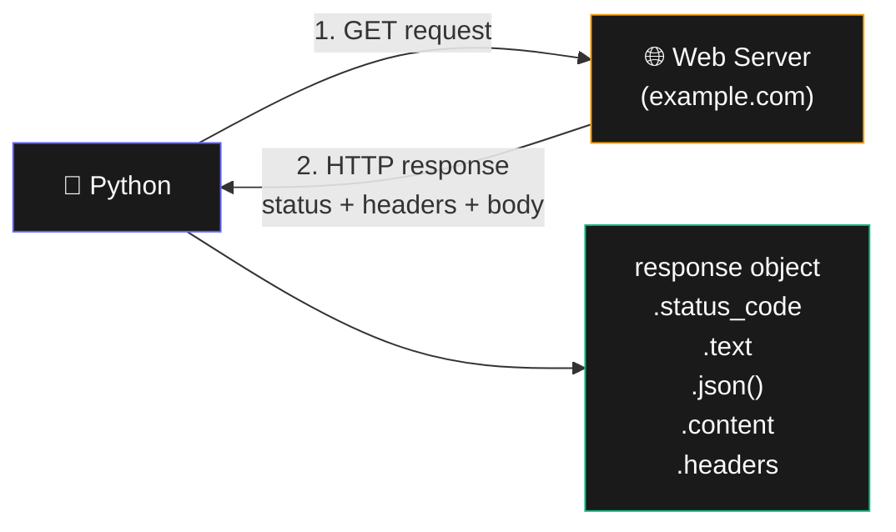
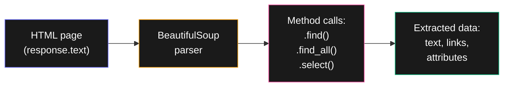

# Bab 12: Web Scraping

> *Internet adalah database terbesar di dunia. Web scraping adalah cara mengambil data darinya.*

Web scraping = mengambil data dari halaman website secara otomatis. Kepakai untuk: monitor harga, kumpul data riset, agregasi berita, ekstrak kontak, dan banyak lagi.

Setelah Bab 12, kamu akan bisa:

- Download halaman web dengan `requests`
- Parse HTML dengan `BeautifulSoup`
- Ekstrak teks, link, gambar dari halaman
- Otomatis browser dengan `selenium` (untuk site dinamis)

!!! warning "Etika Scraping"
    Sebelum scrape: cek `robots.txt` site (`example.com/robots.txt`), respect rate limit, jangan overload server, baca Terms of Service. Untuk komersial, prefer pakai API resmi kalau ada.

## 12.1. Install Tools

```bash
pip install requests beautifulsoup4 lxml selenium
```

## 12.2. `requests` — Download Halaman

```python
import requests

response = requests.get("https://example.com")
print(response.status_code)  # 200 = OK
print(response.text[:500])    # 500 karakter pertama HTML
```



<div class="flowchart-caption" markdown>
<span class="label">Cara baca diagram</span>

Diagram ini menunjukkan **siklus request-response HTTP**.

**Tahap 1: Request keluar**

Saat kamu panggil `requests.get(url)`:

- Python kirim **HTTP GET** ke server target
- Default-nya juga kirim header (User-Agent, Accept, dll)
- Boleh tambahkan header custom: `requests.get(url, headers={...})`

**Tahap 2: Response masuk**

Server balas dengan 3 bagian:

- **Status code** — angka 3 digit (200, 404, 500). Indikator sukses/gagal.
- **Headers** — metadata (Content-Type, Set-Cookie, dll)
- **Body** — isi sebenarnya (HTML, JSON, gambar, dll)

**Tahap 3: Akses via response object**

`response` adalah Python object dengan property:

- **`.status_code`** — integer, **selalu cek dulu** sebelum proses
- **`.text`** — body sebagai string (untuk HTML, JSON, plain text)
- **`.content`** — body sebagai bytes (untuk binary: gambar, PDF)
- **`.json()`** — parse body sebagai JSON, return dict (kalau API return JSON)
- **`.headers`** — dict header response

**Pattern best practice**:

```python
response = requests.get(url, timeout=10)
response.raise_for_status()   # raise exception kalau 4xx/5xx
data = response.json()         # atau .text
```

`raise_for_status()` lebih ringkas dari `if response.status_code != 200:`.
</div>

### Status Code Penting

| Code | Arti |
|------|------|
| 200 | OK |
| 404 | Not Found |
| 403 | Forbidden (server menolak) |
| 500 | Server Error |
| 429 | Too Many Requests (rate limit) |

```python
response = requests.get(url)
if response.status_code == 200:
    process(response.text)
else:
    print(f"Error: {response.status_code}")
```

### Header & Authentication

```python
headers = {
    "User-Agent": "Mozilla/5.0 (compatible; MyBot/1.0)"
}
response = requests.get(url, headers=headers)
```

User-Agent yang **tidak default** sering perlu — banyak site block requests dengan User-Agent default Python.

### Download File Binary

```python
response = requests.get("https://example.com/foto.jpg")
with open("foto.jpg", "wb") as f:
    f.write(response.content)   # binary
```

## 12.3. `BeautifulSoup` — Parse HTML

```python
from bs4 import BeautifulSoup
import requests

response = requests.get("https://news.ycombinator.com")
soup = BeautifulSoup(response.text, "lxml")
```

### Cari Elemen

```python
# Cari satu (yang pertama)
title = soup.find("title")
print(title.text)

# Cari semua
links = soup.find_all("a")
for link in links[:5]:
    print(link.get("href"), "→", link.text)
```

### CSS Selector — Lebih Powerful

```python
# Semua link di class "titleline"
hasil = soup.select(".titleline a")
for link in hasil:
    print(link.get("href"))

# Selector kompleks
soup.select("div.product > h2.title")
soup.select("table#prices tr")
```



<div class="flowchart-caption" markdown>
<span class="label">Cara baca diagram</span>

Diagram ini menunjukkan **alur scraping** dari raw HTML ke data terstruktur.

1. **HTML** (indigo) — string raw HTML dari `response.text`. Biasanya berantakan, banyak tag.
2. **BeautifulSoup parser** (amber) — mengubah string jadi tree object yang bisa di-query. `BeautifulSoup(html, "lxml")`.
3. **Method calls** (pink) — kamu pakai method untuk navigate tree:
   - `.find(tag)` — satu match pertama
   - `.find_all(tag)` — list semua match
   - `.select(css_selector)` — pakai CSS selector seperti jQuery
4. **Data** (hijau) — hasil ekstrak: teks (`.text`), atribut (`.get("href")`), list child elements.

**Kunci**: BeautifulSoup tidak download HTML — itu tugas `requests`. BeautifulSoup hanya parse string yang sudah ada. Pisahkan tanggung jawab: download dengan `requests`, parse dengan `bs4`.

**CSS selector vs find_all**: keduanya bisa, tapi CSS selector lebih ringkas untuk kasus kompleks. Pakai yang lebih nyaman.
</div>

## 12.4. Project: Cek Cuaca

```python
import requests

def cek_cuaca(kota):
    """Pakai wttr.in — service gratis dengan plain text response."""
    response = requests.get(f"https://wttr.in/{kota}?format=3")
    if response.status_code == 200:
        return response.text.strip()
    return f"Error: {response.status_code}"

print(cek_cuaca("Jakarta"))
print(cek_cuaca("Surabaya"))
```

Output:

```
Jakarta: 🌦 +28°C
Surabaya: ⛅ +30°C
```

3 baris untuk weather app. Itu kekuatan `requests`.

## 12.5. Project: Scrape Berita

```python
import requests
from bs4 import BeautifulSoup

def scrape_hn_top(jumlah=10):
    """Ambil top stories dari Hacker News."""
    response = requests.get("https://news.ycombinator.com")
    soup = BeautifulSoup(response.text, "lxml")

    items = soup.select(".titleline > a")[:jumlah]

    hasil = []
    for i, link in enumerate(items, 1):
        hasil.append({
            "rank": i,
            "judul": link.text,
            "url": link.get("href"),
        })
    return hasil

for berita in scrape_hn_top(5):
    print(f"{berita['rank']}. {berita['judul']}")
    print(f"   {berita['url']}")
    print()
```

## 12.6. `selenium` — Untuk Site Dinamis

Banyak site modern pakai JavaScript untuk render konten. `requests` cuma dapat HTML kosong di kasus ini. Solusi: pakai `selenium` — controller browser real.

```bash
pip install selenium
# Plus install ChromeDriver
```

```python
from selenium import webdriver
from selenium.webdriver.common.by import By
import time

driver = webdriver.Chrome()
driver.get("https://example.com")

time.sleep(3)  # tunggu JS render

# Cari elemen
title = driver.find_element(By.TAG_NAME, "h1")
print(title.text)

# Klik tombol
button = driver.find_element(By.CSS_SELECTOR, "button.submit")
button.click()

# Isi form
input_box = driver.find_element(By.ID, "search")
input_box.send_keys("Python")

# Screenshot
driver.save_screenshot("hasil.png")

driver.quit()
```

`selenium` lebih lambat & berat dari `requests` + `bs4`. Pakai hanya kalau target site memang butuh JS.

## 12.7. Tips Scraping

!!! tip "Praktek baik"
    1. **Cek API dulu** — kalau site punya API resmi, pakai itu. Lebih reliable, lebih cepat, lebih legal.
    2. **Rate limit** — jangan request terlalu cepat. `time.sleep(1)` antar request adalah minimum.
    3. **User-Agent** — selalu set custom User-Agent yang descriptive.
    4. **Cache** — simpan hasil scrape ke disk supaya tidak re-request page yang sama.
    5. **Error handling** — site bisa down, struktur HTML bisa berubah. Pakai try/except.

## 12.8. Ringkasan

- **`requests.get(url)`** untuk download halaman
- **Cek `status_code == 200`** sebelum proses
- **`BeautifulSoup(html, "lxml")`** untuk parse
- **`.find()`, `.find_all()`, `.select()`** untuk cari elemen
- **`.text`, `.get(attr)`** untuk ekstrak data
- **`selenium`** untuk JS-heavy site
- **Etika**: respect robots.txt, rate limit, prefer API

## 12.9. Latihan

### 12.1 — Title Checker
Tulis fungsi yang ambil `<title>` dari URL.

### 12.2 — Image Downloader
Download semua gambar dari halaman web (``).

### 12.3 — Quote Scraper
Scrape [quotes.toscrape.com](https://quotes.toscrape.com) — ambil semua quote + author.

### 12.4 — Tantangan: Multi-Page Scraper
Scrape semua halaman dari quotes.toscrape.com (klik "next"), gabung jadi satu list.

<div class="cheatsheet" markdown>

### Install
```bash
pip install requests beautifulsoup4 lxml selenium
```

### `requests`
```python
import requests

r = requests.get(url)
r.status_code         # cek 200 dulu!
r.text                # body sebagai string
r.content             # body sebagai bytes (untuk binary)
r.json()              # parse JSON
r.headers             # dict
r.raise_for_status()  # auto raise kalau 4xx/5xx

# Dengan header & timeout
r = requests.get(url, headers={"User-Agent": "..."}, timeout=10)
```

### Status Code
| Code | Arti |
|------|------|
| 200 | OK |
| 404 | Not Found |
| 403 | Forbidden |
| 429 | Rate Limit |
| 500 | Server Error |

### Download Binary
```python
r = requests.get(url)
with open("file.jpg", "wb") as f:
    f.write(r.content)
```

### `BeautifulSoup`
```python
from bs4 import BeautifulSoup

soup = BeautifulSoup(html, "lxml")

# Cari elemen
soup.find("title")              # satu (yang pertama)
soup.find_all("a")              # list semua
soup.find("div", class_="x")    # dengan filter class
soup.find("div", id="main")

# CSS Selector (lebih powerful)
soup.select(".product .name")
soup.select("#main > h1")
```

### Ekstrak
```python
elem.text             # teks dalam tag
elem.get("href")      # atribut
elem["class"]         # akses langsung
elem.attrs            # semua atribut sebagai dict
```

### Selenium (Site Dinamis)
```python
from selenium import webdriver
from selenium.webdriver.common.by import By

driver = webdriver.Chrome()
driver.get(url)
time.sleep(3)         # tunggu JS

elem = driver.find_element(By.CSS_SELECTOR, ".class")
elem.click()
elem.send_keys("text")

driver.save_screenshot("ss.png")
driver.quit()
```

### Etika
- Cek `robots.txt`
- Rate limit (`time.sleep(1)`)
- Custom User-Agent
- Cache hasil
- Prefer API resmi

</div>

[← Bab 11](bab-11-debugging.md){ .md-button }
[Lanjut Bab 13 →](bab-13-excel.md){ .md-button .md-button--primary }

<div class="atribusi-bab">
Diadaptasi dari Chapter 12: Web Scraping, "Automate the Boring Stuff with Python" karya <a href="https://inventwithpython.com/" target="_blank">Al Sweigart</a>. Versi asli: <a href="https://automatetheboringstuff.com/2e/chapter12/" target="_blank">automatetheboringstuff.com/2e/chapter12/</a>. Dilisensikan CC BY-NC-SA 4.0.
</div>
