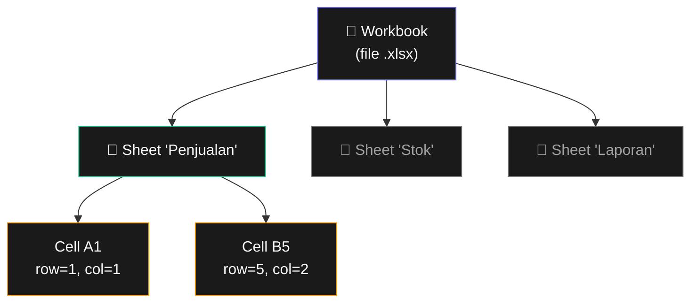

# Bab 13: Otomasi Excel

> *Excel adalah programming language paling populer di dunia. Python + Excel = superpower untuk pekerja kantoran.*

Bab paling kepakai di buku ini bagi pekerja kantoran. Setelah Bab 13, kamu akan bisa:

- Baca data dari file `.xlsx`
- Tulis & format file Excel
- Loop ribuan baris
- Buat chart otomatis
- Project: konsolidasi 100 file Excel jadi 1 rangkuman

## 13.1. Install

```bash
pip install openpyxl
```

`openpyxl` adalah library standar untuk file `.xlsx` (Excel modern). Untuk `.xls` (lama), pakai `xlrd`/`xlwt` — tapi format itu sudah jarang.

## 13.2. Baca File Excel

```python
import openpyxl

wb = openpyxl.load_workbook("data.xlsx")

# Daftar sheet
print(wb.sheetnames)        # ['Sheet1', 'Penjualan', 'Stok']

# Pilih sheet
sheet = wb["Penjualan"]
# atau
sheet = wb.active           # sheet aktif (biasanya pertama)

# Akses cell
print(sheet["A1"].value)
print(sheet.cell(row=1, column=1).value)  # cara alternatif

# Dimensi sheet
print(sheet.max_row)
print(sheet.max_column)
```



<div class="flowchart-caption" markdown>
<span class="label">Cara baca diagram</span>

Diagram ini menunjukkan **3 level hierarki** struktur file Excel.

- **Workbook (indigo)** = file `.xlsx` keseluruhan. Satu workbook bisa berisi banyak sheet.
- **Sheet (hijau/abu)** = satu tab spreadsheet. Yang aktif tercerah, lainnya tetap accessible.
- **Cell (amber)** = satu kotak data. Diidentifikasi dengan **2 cara**:
  - **Alamat A1**: huruf untuk kolom (A, B, C...), angka untuk baris (1, 2, 3...)
  - **Index numerik**: `row=1, column=1` — keduanya **mulai dari 1**, bukan 0!

**Beda dari Python list**: indexing Excel **mulai dari 1**, sedangkan list mulai dari 0. Ini sumber bug klasik:

```python
# SALAH — mulai dari 0
sheet.cell(row=0, column=0).value   # IndexError!

# BENAR — mulai dari 1
sheet.cell(row=1, column=1).value   # = sheet["A1"].value
```

**Konversi alamat A1 ↔ index**:
- A = kolom 1, B = 2, C = 3, ..., Z = 26, AA = 27, AB = 28
- "B5" = `cell(row=5, column=2)`
</div>

### Loop Baris/Kolom

```python
# Iterasi semua baris
for baris in sheet.iter_rows(min_row=2, values_only=True):
    nama, umur, kota = baris
    print(f"{nama} ({umur}) - {kota}")

# Range tertentu
for baris in sheet.iter_rows(min_row=2, max_row=10, max_col=3, values_only=True):
    print(baris)
```

`values_only=True` return tuple nilai. Tanpa flag itu, dapat Cell objects (yang punya formatting info).

## 13.3. Tulis File Excel

```python
import openpyxl

wb = openpyxl.Workbook()
sheet = wb.active
sheet.title = "Laporan"

# Tulis cell
sheet["A1"] = "Nama"
sheet["B1"] = "Nilai"
sheet["C1"] = "Status"

data = [
    ("Andi", 85, "Lulus"),
    ("Budi", 60, "Tidak Lulus"),
    ("Citra", 92, "Lulus"),
]

for i, baris in enumerate(data, start=2):
    sheet.cell(row=i, column=1, value=baris[0])
    sheet.cell(row=i, column=2, value=baris[1])
    sheet.cell(row=i, column=3, value=baris[2])

wb.save("hasil.xlsx")
```

### Append — Lebih Cepat

```python
sheet.append(["Nama", "Nilai", "Status"])
for row in data:
    sheet.append(row)
```

## 13.4. Formatting

### Font, Warna, Style

```python
from openpyxl.styles import Font, PatternFill, Alignment

# Bold + warna teks
header_font = Font(name="Arial", size=12, bold=True, color="FFFFFF")
sheet["A1"].font = header_font

# Background color
fill = PatternFill(start_color="4F46E5", end_color="4F46E5", fill_type="solid")
sheet["A1"].fill = fill

# Alignment
sheet["A1"].alignment = Alignment(horizontal="center", vertical="center")
```

### Width Kolom

```python
sheet.column_dimensions["A"].width = 20
sheet.column_dimensions["B"].width = 10
```

### Format Angka

```python
sheet["B2"] = 1500000
sheet["B2"].number_format = "Rp #,##0"
```

### Freeze Pane

```python
sheet.freeze_panes = "A2"   # baris 1 di-freeze (header)
```

## 13.5. Formula Excel

```python
sheet["E1"] = "Total"
sheet["E2"] = "=SUM(B2:D2)"
sheet["E3"] = "=AVERAGE(B3:D3)"
```

`openpyxl` simpan formula sebagai string. Kalau buka file di Excel, formula otomatis hitung.

## 13.6. Chart

```python
from openpyxl.chart import BarChart, Reference

chart = BarChart()
chart.title = "Penjualan per Bulan"
chart.x_axis.title = "Bulan"
chart.y_axis.title = "Total"

data = Reference(sheet, min_col=2, min_row=1, max_row=13, max_col=2)
labels = Reference(sheet, min_col=1, min_row=2, max_row=13)

chart.add_data(data, titles_from_data=True)
chart.set_categories(labels)

sheet.add_chart(chart, "E2")
wb.save("dengan_chart.xlsx")
```

## 13.7. Project: Konsolidasi 100 File Excel

Skenario: tiap cabang (24 cabang) kirim laporan bulanan dalam file Excel terpisah. Kamu harus rangkum.

```python
from pathlib import Path
import openpyxl

def konsolidasi(folder_input, file_output):
    folder = Path(folder_input)

    wb_total = openpyxl.Workbook()
    sheet_total = wb_total.active
    sheet_total.title = "Rangkuman"
    sheet_total.append(["Cabang", "Bulan", "Total Penjualan"])

    for file_excel in folder.glob("*.xlsx"):
        if file_excel.name.startswith("~"):
            continue   # skip file lock Excel

        try:
            wb = openpyxl.load_workbook(file_excel, data_only=True)
            sheet = wb.active

            cabang = file_excel.stem
            bulan = sheet["B1"].value
            total = sheet["D45"].value

            sheet_total.append([cabang, bulan, total])
            print(f"✓ {file_excel.name}")
        except Exception as e:
            print(f"✗ {file_excel.name}: {e}")

    sheet_total["E1"] = "GRAND TOTAL"
    sheet_total["E2"] = f"=SUM(C2:C{sheet_total.max_row})"

    wb_total.save(file_output)
    print(f"\n✓ Disimpan: {file_output}")

konsolidasi(
    folder_input=Path.home() / "Documents" / "Laporan Mei 2026",
    file_output=Path.home() / "Documents" / "Rangkuman_Mei.xlsx",
)
```

Yang biasanya 2 jam manual, sekarang **3 detik**.

## 13.8. Tips

!!! tip "Praktek penting"
    - **`data_only=True`** kalau mau baca **hasil formula**, bukan formula-nya
    - **Backup file asli** sebelum modifikasi
    - **Skip file lock Excel** (yang dimulai `~`) — itu artinya file sedang dibuka di Excel
    - Untuk **file besar (>50MB)**, pakai `read_only=True` dan iterasi `iter_rows()` — lebih efisien memori

## 13.9. Ringkasan

- **`load_workbook()`** untuk buka, **`Workbook()`** untuk baru
- **`sheet["A1"].value`** untuk akses cell
- **`sheet.iter_rows(values_only=True)`** untuk loop efisien
- **`sheet.append(list)`** untuk tambah baris cepat
- **Formula** ditulis sebagai string `"=SUM(...)"`, di-evaluate Excel saat buka
- **`Font`, `PatternFill`, `Alignment`** untuk formatting
- **Chart** dibuat dengan `BarChart`, `LineChart`, dll dari `openpyxl.chart`

## 13.10. Latihan

### 13.1 — Excel Reader
Baca file `.xlsx`, tampilkan jumlah baris dan kolom non-empty per sheet.

### 13.2 — Multiplication Table
Generate tabel perkalian 1-10 di Excel. Header bold + warna.

### 13.3 — Stock Tracker
Baca file inventory.xlsx (kolom: nama, jumlah, harga, min_stock). Tulis sheet baru "Restock" yang berisi item dengan jumlah < min_stock.

### 13.4 — Tantangan: Pivot Table Generator
Dari data penjualan harian, generate sheet rangkuman per kategori (sum, count, average).

<div class="cheatsheet" markdown>

### Buka & Save
```python
import openpyxl

wb = openpyxl.load_workbook("data.xlsx")
wb.save("output.xlsx")

wb = openpyxl.Workbook()      # baru
sheet = wb.active
sheet.title = "Laporan"
```

### Akses Cell
```python
sheet["A1"].value             # by alamat
sheet.cell(row=1, column=1).value  # by index (1-based!)
sheet.max_row    sheet.max_column
```

### Tulis Data
```python
sheet["A1"] = "Header"
sheet.cell(row=1, column=1, value="x")
sheet.append(["a", "b", "c"])      # tambah baris
```

### Loop Efisien
```python
for row in sheet.iter_rows(min_row=2, values_only=True):
    nama, umur, kota = row
```

### Format
```python
from openpyxl.styles import Font, PatternFill, Alignment

cell.font = Font(bold=True, color="FFFFFF", size=12)
cell.fill = PatternFill("solid", fgColor="4F46E5")
cell.alignment = Alignment(horizontal="center")
cell.number_format = "Rp #,##0"

sheet.column_dimensions["A"].width = 20
sheet.freeze_panes = "A2"
```

### Formula
```python
sheet["E2"] = "=SUM(B2:D2)"   # string, di-eval Excel
```

### Read-Only Mode (File Besar)
```python
wb = openpyxl.load_workbook("big.xlsx", read_only=True)
```

### Data-Only (Hasil Formula)
```python
wb = openpyxl.load_workbook("file.xlsx", data_only=True)
```

</div>

[← Bab 12](bab-12-web-scraping.md){ .md-button }
[Lanjut Bab 14 →](bab-14-google-sheets.md){ .md-button .md-button--primary }

<div class="atribusi-bab">
Diadaptasi dari Chapter 13: Working with Excel Spreadsheets, "Automate the Boring Stuff with Python" karya <a href="https://inventwithpython.com/" target="_blank">Al Sweigart</a>. Versi asli: <a href="https://automatetheboringstuff.com/2e/chapter13/" target="_blank">automatetheboringstuff.com/2e/chapter13/</a>. Dilisensikan CC BY-NC-SA 4.0.
</div>
