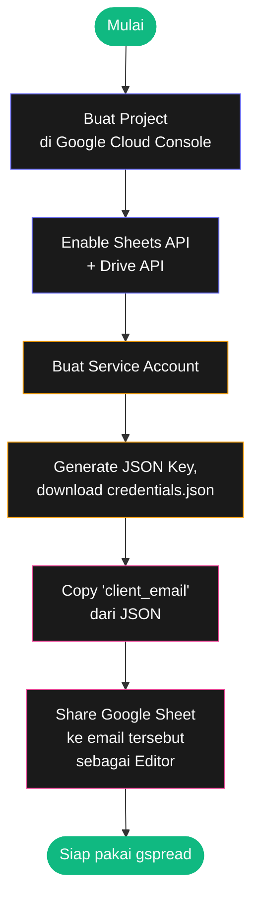

# Bab 14: Google Sheets

> *Excel di cloud. Bisa di-share, real-time collab, dan dipanggil dari Python.*

Google Sheets bagus untuk: data yang perlu di-share, dashboard tim, backend ringan untuk app web kecil. Bab ini ngajarin cara akses Sheets dari Python.

Setelah Bab 14, kamu akan bisa:

- Setup credentials Google API
- Baca/tulis spreadsheet
- Otomatis update dashboard

## 14.1. Setup Awal

Setup-nya yang ribet, tapi sekali jadi tinggal pakai.



<div class="flowchart-caption" markdown>
<span class="label">Cara baca flowchart</span>

Flowchart ini menunjukkan **6 langkah setup** yang perlu dilakukan **sekali** untuk akses Google Sheets dari Python.

**Kenapa serumit ini?** Karena kamu tidak login Google sebagai user. Kamu bikin **identity terpisah** (service account) yang khusus untuk script. Aman karena:

- Tidak perlu simpan password Gmail kamu di kode
- Bisa di-revoke kapan saja kalau bocor
- Akses-nya scoped — cuma sheet yang kamu share, bukan semua data Google

**Step paling sering bikin pemula bingung**:

- **Step 5-6** (Email + Share). Service account adalah "user" terpisah dengan email seperti `nama-script@project-id.iam.gserviceaccount.com`. Sheet kamu **tidak otomatis bisa diakses** olehnya — kamu **harus share manual**, sama seperti share ke kolega.

**Setelah selesai**: file `credentials.json` adalah kunci. **Jangan commit ke Git public** — itu seperti password.

```bash
# Tambahkan ke .gitignore
credentials.json
*.json
```
</div>

### Step 1: Buat Project di Google Cloud Console

1. Buka [console.cloud.google.com](https://console.cloud.google.com)
2. Buat project baru
3. Enable **Google Sheets API** dan **Google Drive API**

### Step 2: Service Account

1. Di "Credentials", klik "Create Credentials" → "Service Account"
2. Beri nama, klik Create
3. Di tab "Keys", klik "Add Key" → JSON
4. Download file JSON, simpan sebagai `credentials.json` di folder project

### Step 3: Share Sheet ke Service Account

Buka `credentials.json`, copy field `client_email`. Buka Google Sheet kamu, klik Share, paste email itu, kasih akses Editor.

### Step 4: Install Library

```bash
pip install gspread google-auth
```

## 14.2. Akses Sheet

```python
import gspread

gc = gspread.service_account(filename="credentials.json")

# Buka by URL
sh = gc.open_by_url("https://docs.google.com/spreadsheets/d/SPREADSHEET_ID/edit")

# Atau by nama (kalau unik)
sh = gc.open("Nama Spreadsheet")

# Pilih worksheet
worksheet = sh.worksheet("Sheet1")
# atau
worksheet = sh.sheet1
```

## 14.3. Baca Data

```python
# Semua data
data = worksheet.get_all_records()
# Return list of dict — header baris 1 jadi keys
# [{'nama': 'Andi', 'umur': 25, 'kota': 'Jakarta'}, ...]

# Cell tertentu
nilai = worksheet.cell(2, 3).value     # baris 2, kolom 3
nilai = worksheet.acell("C2").value    # alternatif

# Range
range_data = worksheet.get("A1:C10")    # list of list

# Kolom tertentu
kolom_a = worksheet.col_values(1)       # list semua nilai kolom A

# Baris tertentu
baris_5 = worksheet.row_values(5)
```

## 14.4. Tulis Data

```python
# Update satu cell
worksheet.update("A1", "Header Baru")
worksheet.update_cell(2, 3, "nilai")

# Update range
worksheet.update("A1:C2", [
    ["nama", "umur", "kota"],
    ["Andi", 25, "Jakarta"],
])

# Append baris
worksheet.append_row(["Sari", 28, "Bandung"])

# Append banyak baris
worksheet.append_rows([
    ["Budi", 30, "Surabaya"],
    ["Citra", 22, "Bali"],
])
```

## 14.5. Operasi Lanjutan

### Buat Worksheet Baru

```python
ws_baru = sh.add_worksheet(title="Laporan", rows=100, cols=10)
```

### Hapus Worksheet

```python
sh.del_worksheet(worksheet)
```

### Format

```python
worksheet.format("A1:C1", {
    "textFormat": {"bold": True, "fontSize": 12},
    "backgroundColor": {"red": 0.31, "green": 0.27, "blue": 0.9},
    "horizontalAlignment": "CENTER",
})
```

### Clear Worksheet

```python
worksheet.clear()
```

## 14.6. Project: Auto-Update Dashboard Penjualan

Skenario: tiap pagi, script ambil data dari API/database, update Google Sheet yang dipakai tim sebagai dashboard.

```python
import gspread
from datetime import datetime
import requests

def update_dashboard():
    gc = gspread.service_account(filename="credentials.json")
    sh = gc.open("Dashboard Penjualan")
    ws = sh.worksheet("Live Data")

    # Ambil data dari API (contoh)
    # response = requests.get("https://api.kantor.com/penjualan/today")
    # data = response.json()
    data = [
        {"cabang": "Jakarta", "total": 25000000},
        {"cabang": "Bandung", "total": 18000000},
        {"cabang": "Surabaya", "total": 32000000},
    ]

    # Clear data lama
    ws.clear()

    # Tulis header
    ws.update("A1", [["Cabang", "Total Penjualan"]])
    ws.format("A1:B1", {"textFormat": {"bold": True}})

    # Tulis data
    rows = [[d["cabang"], d["total"]] for d in data]
    ws.update("A2", rows)

    # Format kolom B sebagai currency
    ws.format("B:B", {"numberFormat": {"type": "CURRENCY", "pattern": "Rp #,##0"}})

    # Update timestamp di pojok
    ws.update("D1", f"Last updated: {datetime.now()}")

    print("✓ Dashboard updated")

update_dashboard()
```

Schedule script ini tiap pagi pakai cron/task scheduler — tim selalu lihat data terkini tanpa effort.

## 14.7. Tips

!!! warning "Rate Limit"
    Google Sheets API punya quota. Best practices:

    - Batch update — pakai `update("A1:Z100", data)` daripada banyak `update_cell()`
    - Gunakan `worksheet.batch_update([...])` untuk multiple operasi
    - Cache data lokal kalau read berkali-kali
    - Tunggu beberapa detik antar batch besar

## 14.8. Ringkasan

- **`gspread`** = library Python untuk Google Sheets
- **Service account** = identity untuk script (tidak perlu password)
- **`get_all_records()`** = list of dict (paling user-friendly)
- **`append_row(list)`** = tambah baris paling efisien
- **`update("A1:Z100", data)`** = batch update lebih efisien dari per-cell

## 14.9. Latihan

### 14.1 — Sheet Reader
Tulis fungsi yang baca seluruh isi Google Sheet, return sebagai list of dict.

### 14.2 — Daily Logger
Tulis script yang setiap dijalankan, append timestamp + custom message ke sheet log.

### 14.3 — Sync Excel ke Sheets
Baca file `.xlsx`, upload semua isi ke Google Sheet baru.

<div class="cheatsheet" markdown>

### Setup
```bash
pip install gspread google-auth
```

```python
import gspread
gc = gspread.service_account(filename="credentials.json")
```

### Buka Spreadsheet
```python
sh = gc.open("Nama Spreadsheet")
sh = gc.open_by_url(url)
sh = gc.open_by_key(spreadsheet_id)

ws = sh.worksheet("Sheet1")
ws = sh.sheet1
```

### Baca
```python
ws.get_all_records()         # list of dict (PALING NYAMAN)
ws.get_all_values()          # list of list
ws.cell(row, col).value
ws.acell("A1").value
ws.row_values(2)             # baris ke-2 sebagai list
ws.col_values(1)             # kolom A sebagai list
ws.get("A1:C10")             # range
```

### Tulis
```python
ws.update("A1", "Hello")
ws.update_cell(2, 3, "data")
ws.update("A1:B2", [["a", "b"], ["c", "d"]])

ws.append_row(["x", "y", "z"])
ws.append_rows([[...], [...]])

ws.clear()
```

### Format
```python
ws.format("A1:C1", {
    "textFormat": {"bold": True, "fontSize": 12},
    "backgroundColor": {"red": 0.31, "green": 0.27, "blue": 0.9},
    "horizontalAlignment": "CENTER",
})
```

### Worksheet Management
```python
sh.add_worksheet(title="New", rows=100, cols=10)
sh.del_worksheet(ws)
sh.worksheets()              # list
```

### Best Practice
- **Batch update** > banyak `update_cell`
- Cache lokal kalau read berkali-kali
- Watch quota (rate limit)

</div>

[← Bab 13](bab-13-excel.md){ .md-button }
[Lanjut Bab 15 →](bab-15-pdf-word.md){ .md-button .md-button--primary }

<div class="atribusi-bab">
Diadaptasi dari Chapter 14: Working with Google Sheets, "Automate the Boring Stuff with Python" karya <a href="https://inventwithpython.com/" target="_blank">Al Sweigart</a>. Dilisensikan CC BY-NC-SA 4.0.
</div>
