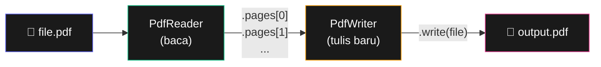

# Bab 15: PDF & Word

> *Format dokumen yang paling banyak dipakai di kantor. Otomasi-nya = produktivitas berlipat.*

Setelah Bab 15, kamu akan bisa:

- Baca teks dari PDF
- Gabung, pisah, rotate halaman PDF
- Watermark dan password protect
- Baca dan tulis file Word `.docx`
- Generate dokumen Word dari template

## 15.1. PDF dengan `PyPDF2`

```bash
pip install PyPDF2
```



<div class="flowchart-caption" markdown>
<span class="label">Cara baca diagram</span>

Diagram ini menunjukkan **2 class utama** PyPDF2 dan alur kerja-nya.

- **`PdfReader`** (hijau) = **read-only**. Untuk baca PDF yang sudah ada — ekstrak teks, lihat metadata, ambil halaman.
- **`PdfWriter`** (amber) = **write-only**. Untuk merangkai PDF baru — kamu tambahkan halaman ke writer, lalu save.

**Pola umum**:

1. Buka PDF source dengan `PdfReader(file)` — dapat list `pages`.
2. Buat `PdfWriter()` kosong.
3. Pilih halaman dari reader, **add ke writer**.
4. Save writer ke file baru.

**Untuk gabung 3 PDF**:

```python
writer = PdfWriter()
for path in ["a.pdf", "b.pdf", "c.pdf"]:
    reader = PdfReader(path)
    for page in reader.pages:
        writer.add_page(page)
writer.write(open("merged.pdf", "wb"))
```

**Untuk pisah 1 PDF jadi banyak**: bikin **1 writer per output**.

**Kunci**: `PdfReader` bukan editor. Kamu tidak bisa langsung modifikasi reader. Untuk apapun yang menghasilkan PDF baru (gabung, pisah, rotate, watermark) — pakai `PdfWriter`.
</div>

### Baca PDF

```python
from PyPDF2 import PdfReader

reader = PdfReader("dokumen.pdf")
print(f"Total halaman: {len(reader.pages)}")

# Ekstrak teks halaman pertama
halaman = reader.pages[0]
print(halaman.extract_text())

# Ekstrak semua halaman
teks_lengkap = ""
for halaman in reader.pages:
    teks_lengkap += halaman.extract_text() + "\n"
```

!!! warning "Tidak semua PDF bisa di-extract"
    PDF yang berbasis **gambar** (scan) tidak bisa di-extract teks-nya tanpa OCR. Untuk OCR, pakai `pytesseract` (lebih advanced).

### Gabung PDF

```python
from PyPDF2 import PdfWriter, PdfReader

writer = PdfWriter()

for file in ["bab1.pdf", "bab2.pdf", "bab3.pdf"]:
    reader = PdfReader(file)
    for halaman in reader.pages:
        writer.add_page(halaman)

with open("gabungan.pdf", "wb") as f:
    writer.write(f)
```

### Pisah PDF

```python
reader = PdfReader("dokumen.pdf")

for i, halaman in enumerate(reader.pages):
    writer = PdfWriter()
    writer.add_page(halaman)
    with open(f"halaman_{i+1}.pdf", "wb") as f:
        writer.write(f)
```

### Rotate Halaman

```python
reader = PdfReader("input.pdf")
writer = PdfWriter()

for halaman in reader.pages:
    halaman.rotate(90)   # 90, 180, 270
    writer.add_page(halaman)

with open("rotated.pdf", "wb") as f:
    writer.write(f)
```

### Password Protect

```python
writer = PdfWriter()
# ... tambah halaman ...
writer.encrypt("password_rahasia")

with open("locked.pdf", "wb") as f:
    writer.write(f)
```

### Baca PDF dengan Password

```python
reader = PdfReader("locked.pdf")
if reader.is_encrypted:
    reader.decrypt("password_rahasia")

print(reader.pages[0].extract_text())
```

## 15.2. Word dengan `python-docx`

```bash
pip install python-docx
```

### Baca Dokumen Word

```python
from docx import Document

doc = Document("laporan.docx")

# Loop paragraf
for p in doc.paragraphs:
    print(p.text)

# Loop tabel
for table in doc.tables:
    for row in table.rows:
        for cell in row.cells:
            print(cell.text)
```

### Tulis Dokumen Word

```python
from docx import Document
from docx.shared import Pt, RGBColor

doc = Document()

# Heading
doc.add_heading("Laporan Penjualan Mei 2026", level=1)

# Paragraf
p = doc.add_paragraph("Berikut ringkasan penjualan bulan Mei: ")
p.add_run("Kenaikan 15% YoY").bold = True
p.add_run(", target tercapai 102%.")

# Heading 2
doc.add_heading("Detail per Cabang", level=2)

# Bullet list
for cabang in ["Jakarta", "Bandung", "Surabaya"]:
    doc.add_paragraph(cabang, style="List Bullet")

# Tabel
data = [
    ("Cabang", "Total"),
    ("Jakarta", "25,000,000"),
    ("Bandung", "18,000,000"),
]

table = doc.add_table(rows=len(data), cols=2)
table.style = "Light Grid Accent 1"
for i, row in enumerate(data):
    for j, value in enumerate(row):
        table.cell(i, j).text = value

# Page break
doc.add_page_break()
doc.add_heading("Lampiran", level=1)
doc.add_paragraph("Lihat data detail di Excel terpisah.")

doc.save("laporan_otomatis.docx")
```

### Format Run

```python
p = doc.add_paragraph()
run = p.add_run("Teks ini bold dan biru")
run.bold = True
run.font.size = Pt(14)
run.font.color.rgb = RGBColor(0, 0, 255)
```

## 15.3. Project: Generator Sertifikat dari Template

Skenario: kamu punya 100 nama peserta workshop, harus generate sertifikat untuk masing-masing.

```python
from docx import Document
from pathlib import Path

def generate_sertifikat(nama_list, template_path, output_folder):
    output_folder = Path(output_folder)
    output_folder.mkdir(exist_ok=True)

    for nama in nama_list:
        doc = Document(template_path)

        # Replace placeholder
        for p in doc.paragraphs:
            if "[NAMA]" in p.text:
                for run in p.runs:
                    run.text = run.text.replace("[NAMA]", nama)

        # Save dengan nama unique
        filename = f"sertifikat_{nama.replace(' ', '_')}.docx"
        doc.save(output_folder / filename)
        print(f"✓ {filename}")

peserta = ["Andi Pratama", "Sari Lestari", "Budi Santoso"]
generate_sertifikat(
    nama_list=peserta,
    template_path="template_sertifikat.docx",
    output_folder="sertifikat_output",
)
```

Tinggal buat template Word dengan teks `[NAMA]`, script ini auto-generate satu file per peserta.

## 15.4. Project: Ekstrak Teks dari Banyak PDF

```python
from PyPDF2 import PdfReader
from pathlib import Path

def ekstrak_pdf_folder(folder):
    folder = Path(folder)
    output = folder / "extracted_text"
    output.mkdir(exist_ok=True)

    for pdf in folder.glob("*.pdf"):
        try:
            reader = PdfReader(pdf)
            teks = ""
            for halaman in reader.pages:
                teks += halaman.extract_text() + "\n"

            output_file = output / f"{pdf.stem}.txt"
            output_file.write_text(teks, encoding="utf-8")
            print(f"✓ {pdf.name} ({len(reader.pages)} halaman)")
        except Exception as e:
            print(f"✗ {pdf.name}: {e}")

ekstrak_pdf_folder("path/ke/folder/pdf")
```

## 15.5. Ringkasan

- **`PyPDF2`** untuk PDF: read, merge, split, rotate, encrypt
- **`python-docx`** untuk Word: read paragraphs, tables, runs
- **Generate Word** dari template dengan placeholder replacement
- **Tidak semua PDF** bisa di-extract (PDF gambar butuh OCR)

## 15.6. Latihan

### 15.1 — PDF Page Counter
Buat script yang scan folder, tampilkan total jumlah halaman dari semua PDF.

### 15.2 — Watermark
Tambahkan watermark "DRAFT" ke semua halaman PDF.

### 15.3 — Word Word Counter
Hitung jumlah kata di dokumen Word.

### 15.4 — Tantangan: Mail Merge
Generate surat resmi dari template Word + data Excel (nama, alamat, tanggal). Output: 1 file Word per recipient.

<div class="cheatsheet" markdown>

### PDF (PyPDF2)
```bash
pip install PyPDF2
```

### Baca PDF
```python
from PyPDF2 import PdfReader

reader = PdfReader("file.pdf")
len(reader.pages)
reader.pages[0].extract_text()

# Encrypted
if reader.is_encrypted:
    reader.decrypt("password")
```

### Tulis PDF
```python
from PyPDF2 import PdfWriter

writer = PdfWriter()
for page in reader.pages:
    writer.add_page(page)

# Encrypt
writer.encrypt("password")

with open("out.pdf", "wb") as f:
    writer.write(f)
```

### Operasi PDF Cepat
```python
# Gabung
writer = PdfWriter()
for f in files:
    for p in PdfReader(f).pages:
        writer.add_page(p)

# Pisah jadi per halaman
for i, p in enumerate(reader.pages):
    w = PdfWriter()
    w.add_page(p)
    w.write(open(f"page_{i+1}.pdf", "wb"))

# Rotate
page.rotate(90)    # 90, 180, 270
```

### Word (python-docx)
```bash
pip install python-docx
```

### Baca Word
```python
from docx import Document

doc = Document("file.docx")

for p in doc.paragraphs:
    print(p.text)

for table in doc.tables:
    for row in table.rows:
        for cell in row.cells:
            print(cell.text)
```

### Tulis Word
```python
doc = Document()

doc.add_heading("Judul", level=1)
doc.add_paragraph("Paragraf biasa.")

p = doc.add_paragraph("Ini ")
p.add_run("bold").bold = True
p.add_run(" italic").italic = True

doc.add_paragraph("Bullet", style="List Bullet")
doc.add_paragraph("Numbered", style="List Number")

table = doc.add_table(rows=2, cols=3)
table.style = "Light Grid"
table.cell(0, 0).text = "Header"

doc.add_page_break()
doc.save("out.docx")
```

### Format Run
```python
from docx.shared import Pt, RGBColor

run.bold = True
run.italic = True
run.underline = True
run.font.size = Pt(14)
run.font.color.rgb = RGBColor(255, 0, 0)
```

</div>

[← Bab 14](bab-14-google-sheets.md){ .md-button }
[Lanjut Bab 16 →](bab-16-csv-json.md){ .md-button .md-button--primary }

<div class="atribusi-bab">
Diadaptasi dari Chapter 15: Working with PDF and Word Documents, "Automate the Boring Stuff with Python" karya <a href="https://inventwithpython.com/" target="_blank">Al Sweigart</a>. Dilisensikan CC BY-NC-SA 4.0.
</div>
