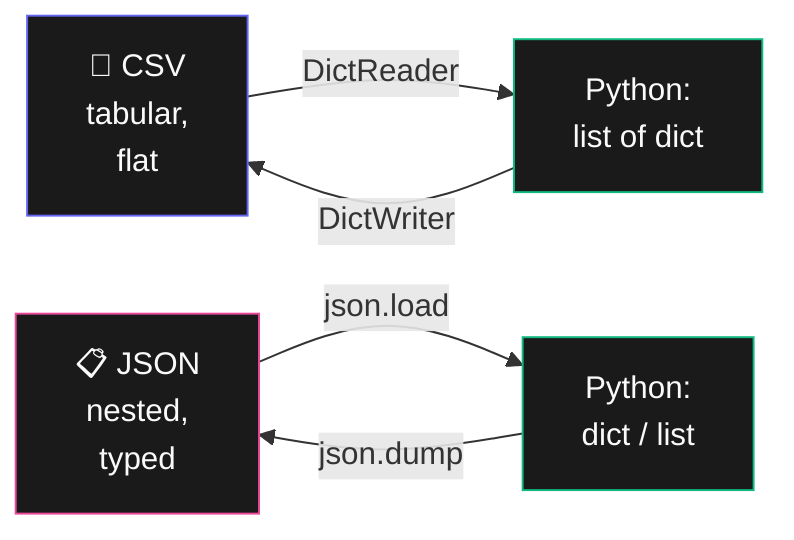

# Bab 16: CSV & JSON

> *Dua format pertukaran data paling populer di dunia. Wajib mahir.*

CSV = format data tabular paling sederhana. JSON = format pertukaran data API & web. Setelah Bab 16, kamu akan bisa proses keduanya dengan lancar.

## 16.1. CSV

CSV (Comma-Separated Values) = teks plain dengan koma sebagai pemisah kolom.

```
nama,umur,kota
Andi,25,Jakarta
Sari,28,Bandung
Budi,30,Surabaya
```



<div class="flowchart-caption" markdown>
<span class="label">Cara baca diagram</span>

Diagram ini membandingkan **CSV vs JSON** dan kapan pakai yang mana.

**CSV (indigo)**:

- Format **tabular** — seperti spreadsheet, baris dan kolom.
- **Flat** — tidak bisa nested. Cocok untuk data simple yang seragam.
- **Tidak punya tipe** — semua nilai dibaca sebagai string.
- Lebih kecil ukurannya, mudah dibuka di Excel.

**JSON (pink)**:

- Format **nested** — bisa berisi list dalam dict, dict dalam list, dst.
- **Typed** — tahu apa itu string, integer, boolean, null, list, dict.
- Standar di API web modern.
- Lebih ekspresif untuk data kompleks.

**Pilihan praktis**:

- Data tabular sederhana (export dari database, log) → **CSV**
- Data dengan struktur (config, API response, profil dengan list/nested) → **JSON**
- Yang akan dibuka manusia di Excel → **CSV**
- Yang akan dikirim antar service → **JSON**

**Konversi keduanya 2 arah** seperti diagram — Python jadi **bahasa perantara**. Pakai `DictReader`/`DictWriter` untuk CSV, `json.load`/`json.dump` untuk JSON.
</div>

### Baca CSV

```python
import csv

with open("data.csv", "r", encoding="utf-8") as f:
    reader = csv.reader(f)
    for baris in reader:
        print(baris)        # ['Andi', '25', 'Jakarta']
```

### Baca dengan Header (Lebih Recommended)

```python
with open("data.csv", "r", encoding="utf-8") as f:
    reader = csv.DictReader(f)
    for baris in reader:
        print(baris)        # {'nama': 'Andi', 'umur': '25', 'kota': 'Jakarta'}
        print(baris["nama"])
```

`DictReader` jauh lebih nyaman — akses by column name, bukan index.

### Tulis CSV

```python
import csv

data = [
    ["nama", "umur", "kota"],
    ["Andi", 25, "Jakarta"],
    ["Sari", 28, "Bandung"],
]

with open("output.csv", "w", encoding="utf-8", newline="") as f:
    writer = csv.writer(f)
    writer.writerows(data)
```

`newline=""` penting di Windows untuk hindari double newline.

### Tulis dengan DictWriter

```python
data = [
    {"nama": "Andi", "umur": 25, "kota": "Jakarta"},
    {"nama": "Sari", "umur": 28, "kota": "Bandung"},
]

with open("output.csv", "w", encoding="utf-8", newline="") as f:
    writer = csv.DictWriter(f, fieldnames=["nama", "umur", "kota"])
    writer.writeheader()
    writer.writerows(data)
```

### Pemisah Lain

CSV kadang pakai semicolon `;` (umum di Eropa) atau tab. Konfigurasi dengan parameter `delimiter`:

```python
reader = csv.reader(f, delimiter=";")
```

### Pandas — Untuk Data Besar

Untuk file CSV besar (>10MB) atau data analysis serius, pakai `pandas`:

```python
import pandas as pd

df = pd.read_csv("data.csv")
print(df.head())
print(df.describe())

# Filter
df_jakarta = df[df["kota"] == "Jakarta"]

# Group
df.groupby("kota")["umur"].mean()

# Save
df.to_csv("output.csv", index=False)
```

## 16.2. JSON

JSON = JavaScript Object Notation. Format paling populer untuk API web & config file.

```json
{
  "nama": "Andi",
  "umur": 25,
  "hobi": ["baca", "musik"],
  "alamat": {
    "kota": "Jakarta",
    "kode_pos": "12345"
  }
}
```

JSON dan Python dictionary mirip banget — perbedaannya kecil.

### Baca JSON

```python
import json

# Dari file
with open("data.json", "r", encoding="utf-8") as f:
    data = json.load(f)

print(data["nama"])
print(data["alamat"]["kota"])

# Dari string
text = '{"nama": "Sari", "umur": 28}'
data = json.loads(text)
```

### Tulis JSON

```python
import json

data = {
    "nama": "Budi",
    "skills": ["Python", "Excel", "SQL"],
    "active": True,
}

# Ke file (dengan indentation untuk readability)
with open("data.json", "w", encoding="utf-8") as f:
    json.dump(data, f, indent=2, ensure_ascii=False)

# Ke string
text = json.dumps(data, indent=2, ensure_ascii=False)
print(text)
```

`ensure_ascii=False` penting biar karakter non-ASCII (Indonesian!) tidak di-escape jadi `\u...`.

### JSON dari API

```python
import requests

response = requests.get("https://api.exchangerate-api.com/v4/latest/IDR")
data = response.json()       # langsung parse JSON
print(data["rates"]["USD"])
```

`response.json()` adalah shortcut untuk `json.loads(response.text)`.

## 16.3. Konversi CSV ↔ JSON

### CSV → JSON

```python
import csv
import json

with open("data.csv", "r", encoding="utf-8") as f:
    reader = csv.DictReader(f)
    data = list(reader)

with open("data.json", "w", encoding="utf-8") as f:
    json.dump(data, f, indent=2, ensure_ascii=False)
```

### JSON → CSV

```python
import csv
import json

with open("data.json", "r", encoding="utf-8") as f:
    data = json.load(f)

with open("data.csv", "w", encoding="utf-8", newline="") as f:
    writer = csv.DictWriter(f, fieldnames=data[0].keys())
    writer.writeheader()
    writer.writerows(data)
```

## 16.4. Project: Konversi & Filter Data

```python
import csv
import json
from pathlib import Path

def csv_to_json_filter(csv_file, output_json, filter_fn=None):
    """Convert CSV ke JSON, dengan opsi filter."""
    with open(csv_file, "r", encoding="utf-8") as f:
        reader = csv.DictReader(f)
        data = list(reader)

    # Konversi tipe (CSV semua string)
    for row in data:
        for key, value in row.items():
            if value.isdigit():
                row[key] = int(value)
            else:
                try:
                    row[key] = float(value)
                except ValueError:
                    pass  # tetap string

    # Filter kalau ada
    if filter_fn:
        data = [row for row in data if filter_fn(row)]

    with open(output_json, "w", encoding="utf-8") as f:
        json.dump(data, f, indent=2, ensure_ascii=False)

    print(f"✓ {len(data)} rows → {output_json}")

# Convert + filter umur >= 25
csv_to_json_filter(
    "siswa.csv",
    "siswa_dewasa.json",
    filter_fn=lambda row: row.get("umur", 0) >= 25,
)
```

## 16.5. Tips

!!! tip "Encoding"
    **Selalu eksplisit `encoding="utf-8"`** saat read/write file teks. Tanpa ini, di Windows bisa baca dengan encoding yang berbeda dan kacau untuk karakter Indonesia/Unicode.

!!! tip "JSON tidak punya tanggal native"
    Format date bukan tipe JSON. Konvensi:

    - Save sebagai string ISO 8601: `"2026-05-15T10:30:00"`
    - Pakai `datetime.fromisoformat(s)` untuk parse

## 16.6. Ringkasan

- **CSV**: pakai `csv.DictReader` dan `csv.DictWriter` (lebih readable dari plain reader/writer)
- **`newline=""`** di Windows
- **JSON**: `json.load()` / `json.dump()` (file), `json.loads()` / `json.dumps()` (string)
- **`indent=2, ensure_ascii=False`** untuk JSON yang readable
- **`response.json()`** untuk API
- **`pandas`** kalau file besar atau analysis kompleks

## 16.7. Latihan

### 16.1 — Stats from CSV
Baca file penjualan.csv (kolom: tanggal, produk, harga). Cetak total per produk.

### 16.2 — JSON Pretty Printer
Tulis script yang baca JSON dari clipboard, format dengan indent, kembalikan ke clipboard.

### 16.3 — API to CSV
Ambil data dari [https://jsonplaceholder.typicode.com/users](https://jsonplaceholder.typicode.com/users), simpan ke CSV.

### 16.4 — Tantangan: Multi-Format Converter
Tulis program yang bisa convert: CSV ↔ JSON ↔ Excel.

<div class="cheatsheet" markdown>

### CSV — Baca
```python
import csv

with open("data.csv", encoding="utf-8") as f:
    reader = csv.reader(f)
    for row in reader: ...

# Lebih baik: DictReader
with open("data.csv", encoding="utf-8") as f:
    reader = csv.DictReader(f)
    for row in reader:
        print(row["nama"])
```

### CSV — Tulis
```python
with open("out.csv", "w", encoding="utf-8", newline="") as f:
    writer = csv.writer(f)
    writer.writerows([
        ["nama", "umur"],
        ["Andi", 25],
    ])

# Dengan dict
with open("out.csv", "w", encoding="utf-8", newline="") as f:
    writer = csv.DictWriter(f, fieldnames=["nama", "umur"])
    writer.writeheader()
    writer.writerows(data)
```

### JSON — Baca
```python
import json

with open("data.json", encoding="utf-8") as f:
    data = json.load(f)         # dari file

data = json.loads(string)        # dari string
```

### JSON — Tulis
```python
with open("data.json", "w", encoding="utf-8") as f:
    json.dump(data, f, indent=2, ensure_ascii=False)

text = json.dumps(data, indent=2, ensure_ascii=False)
```

### JSON dari API
```python
import requests
data = requests.get(url).json()
```

### Aturan Wajib
- Selalu `encoding="utf-8"`
- CSV: `newline=""` di Windows
- JSON: `ensure_ascii=False` untuk Indonesian

### Pandas (Data Besar)
```python
import pandas as pd

df = pd.read_csv("data.csv")
df = pd.read_json("data.json")
df = pd.read_excel("data.xlsx")

df.to_csv("out.csv", index=False)
df.to_json("out.json", orient="records")
```

</div>

[← Bab 15](bab-15-pdf-word.md){ .md-button }
[Lanjut Bab 17 →](bab-17-waktu-jadwal.md){ .md-button .md-button--primary }

<div class="atribusi-bab">
Diadaptasi dari Chapter 16: Working with CSV Files and JSON Data, "Automate the Boring Stuff with Python" karya <a href="https://inventwithpython.com/" target="_blank">Al Sweigart</a>. Dilisensikan CC BY-NC-SA 4.0.
</div>
