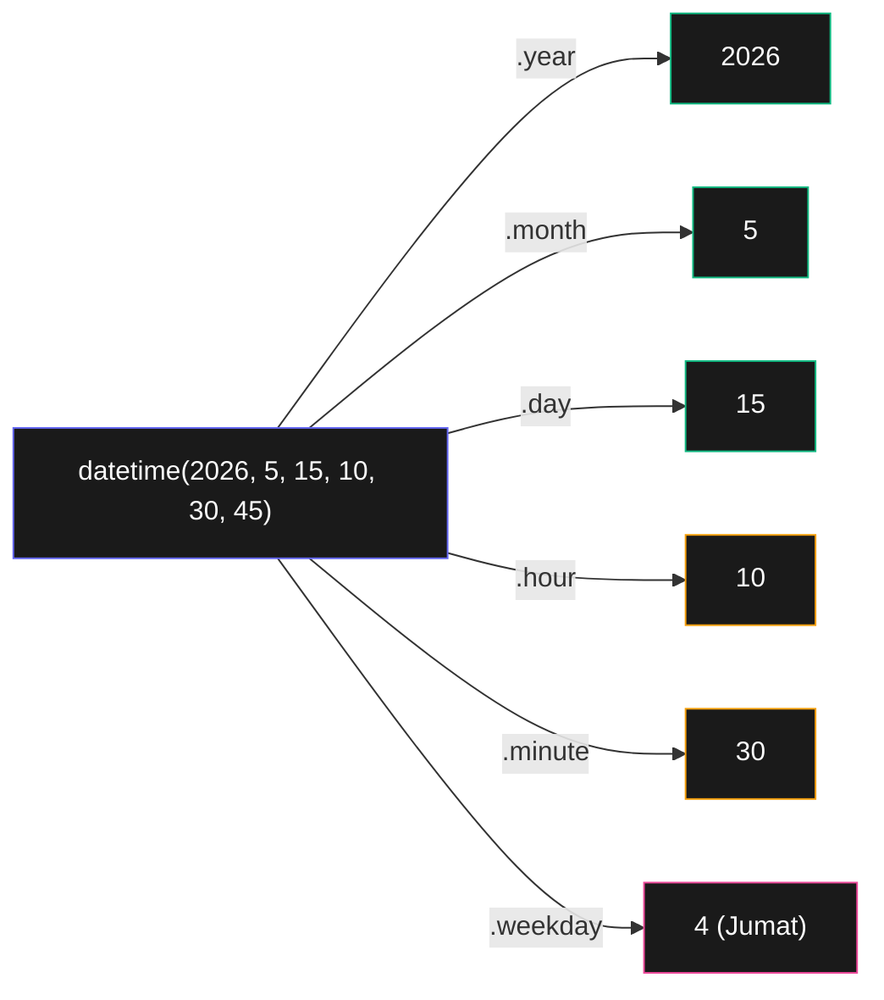

# Bab 17: Waktu & Penjadwalan

> *"Jalankan tiap pagi jam 7" = task scheduler. "Tunggu 5 detik dulu" = sleep. Bab ini ngajarin keduanya.*

Setelah Bab 17, kamu akan bisa:

- Bekerja dengan tanggal dan waktu (`datetime`)
- Hitung selisih waktu, format tanggal
- Pakai `time.sleep()` untuk delay
- Schedule script tiap interval tertentu
- Multi-threading dasar untuk operasi paralel

## 17.1. Modul `time`

```python
import time

# Timestamp Unix (detik sejak 1 Jan 1970)
print(time.time())          # 1747000000.123

# Sleep
print("Mulai")
time.sleep(2)               # tunggu 2 detik
print("Selesai")

# Mengukur durasi
start = time.time()
# ... kode yang diukur ...
durasi = time.time() - start
print(f"Selesai dalam {durasi:.2f} detik")
```

## 17.2. Modul `datetime`

```python
from datetime import datetime, date, time, timedelta

# Sekarang
sekarang = datetime.now()
print(sekarang)             # 2026-05-15 10:30:45.123456

# Bagian-bagian
print(sekarang.year)        # 2026
print(sekarang.month)       # 5
print(sekarang.day)         # 15
print(sekarang.hour)        # 10
print(sekarang.weekday())   # 0=Senin, 6=Minggu

# Buat datetime spesifik
ulang_tahun = datetime(2026, 8, 17, 0, 0, 0)
print(ulang_tahun)
```



<div class="flowchart-caption" markdown>
<span class="label">Cara baca diagram</span>

Diagram ini menunjukkan **anatomi datetime object** dan property-nya.

- **Hijau** = bagian tanggal (`year`, `month`, `day`)
- **Amber** = bagian waktu (`hour`, `minute`, `second`)
- **Pink** = property turunan (`weekday`, `isoweekday`, `timestamp`)

**Yang sering bikin pemula tertipu**:

- **`weekday()` mulai dari 0** — Senin = 0, Minggu = 6
- **`isoweekday()` mulai dari 1** — Senin = 1, Minggu = 7
- **`month` integer** (bukan nama). `5` = Mei, bukan "Mei". Untuk nama bulan, pakai `strftime("%B")`.

**Operasi yang sering**:

- `dt.replace(hour=0, minute=0, second=0)` → dapat awal hari
- `dt.date()` → buang waktu, dapat date saja
- `dt.time()` → buang tanggal, dapat time saja

**Jangan dibingungkan**:

- `datetime` (kelas dari `datetime` module) ≠ `datetime` module
- `from datetime import datetime` — kelasnya
- `import datetime` — module-nya, akses kelas via `datetime.datetime`
</div>

### Format Tanggal

```python
sekarang = datetime.now()
print(sekarang.strftime("%Y-%m-%d"))             # 2026-05-15
print(sekarang.strftime("%d/%m/%Y"))             # 15/05/2026
print(sekarang.strftime("%A, %d %B %Y"))          # Friday, 15 May 2026
print(sekarang.strftime("%I:%M %p"))              # 10:30 AM
```

| Code | Arti |
|------|------|
| `%Y` | Tahun 4 digit |
| `%y` | Tahun 2 digit |
| `%m` | Bulan 2 digit |
| `%B` | Nama bulan lengkap |
| `%b` | Nama bulan singkat |
| `%d` | Hari 2 digit |
| `%A` | Nama hari |
| `%H` | Jam 24 (00-23) |
| `%I` | Jam 12 (01-12) |
| `%M` | Menit |
| `%S` | Detik |
| `%p` | AM/PM |

### Parse String ke Datetime

```python
teks = "15/05/2026 10:30"
dt = datetime.strptime(teks, "%d/%m/%Y %H:%M")
```

### Aritmatika Tanggal

```python
sekarang = datetime.now()

# Tambah/kurang waktu
besok = sekarang + timedelta(days=1)
seminggu_lagi = sekarang + timedelta(weeks=1)
satu_jam_lalu = sekarang - timedelta(hours=1)

# Selisih
selisih = besok - sekarang
print(selisih.days)          # 1
print(selisih.total_seconds())   # 86400
```

## 17.3. Format Lokal Indonesia

```python
import locale

try:
    locale.setlocale(locale.LC_TIME, "id_ID.UTF-8")
except:
    pass  # locale Indonesia tidak selalu tersedia

sekarang = datetime.now()
print(sekarang.strftime("%A, %d %B %Y"))
# Jumat, 15 Mei 2026 (kalau locale ID terinstall)
```

Untuk hasil deterministic tanpa tergantung locale, **buat manual**:

```python
HARI_INDO = ["Senin", "Selasa", "Rabu", "Kamis", "Jumat", "Sabtu", "Minggu"]
BULAN_INDO = ["Januari", "Februari", "Maret", "April", "Mei", "Juni",
              "Juli", "Agustus", "September", "Oktober", "November", "Desember"]

def format_indo(dt):
    hari = HARI_INDO[dt.weekday()]
    bulan = BULAN_INDO[dt.month - 1]
    return f"{hari}, {dt.day} {bulan} {dt.year}"

print(format_indo(datetime.now()))
# Jumat, 15 Mei 2026
```

## 17.4. Schedule Script

### `schedule` Library

```bash
pip install schedule
```

```python
import schedule
import time

def job_pagi():
    print("Jalan tiap pagi jam 7")

def job_jam():
    print("Jalan tiap jam")

schedule.every().day.at("07:00").do(job_pagi)
schedule.every().hour.do(job_jam)
schedule.every().monday.at("09:00").do(lambda: print("Senin pagi!"))
schedule.every(5).minutes.do(lambda: print("Tiap 5 menit"))

while True:
    schedule.run_pending()
    time.sleep(60)
```

### Cron / Task Scheduler (Lebih Robust)

Untuk production, lebih baik pakai OS scheduler — script Python tidak perlu jalan terus:

**Linux/Mac (crontab):**
```bash
# Edit crontab
crontab -e

# Tiap pagi jam 7
0 7 * * * /usr/bin/python3 /path/to/script.py

# Tiap Senin jam 9
0 9 * * 1 /usr/bin/python3 /path/to/script.py
```

**Windows (Task Scheduler):**
GUI di Start → Task Scheduler. Buat task baru, tentukan trigger (waktu) dan action (run python.exe dengan argument script).

## 17.5. Multi-Threading

Untuk operasi paralel yang **I/O-bound** (download, baca file, dll), pakai threading:

```python
import threading
import time

def download(url):
    print(f"Mulai download {url}")
    time.sleep(2)   # simulasi
    print(f"Selesai {url}")

# Tanpa threading — total ~6 detik
for url in ["a.com", "b.com", "c.com"]:
    download(url)

# Dengan threading — total ~2 detik (paralel)
threads = []
for url in ["a.com", "b.com", "c.com"]:
    t = threading.Thread(target=download, args=(url,))
    t.start()
    threads.append(t)

for t in threads:
    t.join()  # tunggu semua selesai

print("Semua selesai")
```

!!! warning "GIL — Threading bukan untuk CPU-bound"
    Python punya Global Interpreter Lock — threading tidak speedup operasi CPU-heavy. Untuk paralel CPU, pakai `multiprocessing`.

    Kapan threading berguna:
    - Download dari banyak URL bersamaan
    - Baca/tulis banyak file
    - Tunggu API response
    - I/O ke database

## 17.6. Project: Reminder Otomatis

```python
import time
from datetime import datetime, timedelta
import schedule

REMINDERS = []

def tambah_reminder(pesan, menit_dari_sekarang):
    waktu_target = datetime.now() + timedelta(minutes=menit_dari_sekarang)
    REMINDERS.append({"pesan": pesan, "waktu": waktu_target, "sent": False})
    print(f"✓ Reminder dijadwalkan: {waktu_target.strftime('%H:%M')}")

def cek_reminder():
    now = datetime.now()
    for r in REMINDERS:
        if not r["sent"] and now >= r["waktu"]:
            print(f"\n🔔 REMINDER: {r['pesan']}\n")
            r["sent"] = True

# Setup
tambah_reminder("Meeting dengan tim", 1)
tambah_reminder("Minum air", 2)

schedule.every(30).seconds.do(cek_reminder)

print("Reminder running. Ctrl+C to stop.")
while True:
    schedule.run_pending()
    time.sleep(5)
```

## 17.7. Ringkasan

- **`time.time()`** untuk timestamp, **`time.sleep(s)`** untuk delay
- **`datetime.now()`** untuk waktu sekarang
- **`strftime(format)`** untuk format string
- **`strptime(s, format)`** untuk parse string
- **`timedelta(days=N)`** untuk aritmatika waktu
- **`schedule`** library untuk recurring task dalam Python
- **cron / Task Scheduler** untuk schedule level OS (lebih robust)
- **`threading`** untuk paralel I/O-bound

## 17.8. Latihan

### 17.1 — Umur Kalkulator
Tulis fungsi `umur_dalam_hari(tanggal_lahir)` yang return jumlah hari dari tanggal lahir ke sekarang.

### 17.2 — Stopwatch
Buat stopwatch CLI: tekan Enter untuk start, Enter lagi untuk stop, tampilkan durasi.

### 17.3 — Daily Report
Schedule script jalan tiap jam 17:00 weekday, generate laporan hari itu.

### 17.4 — Tantangan: Multi-Threaded Downloader
Download 10 file paralel dengan threading. Bandingkan waktu vs sequential.

<div class="cheatsheet" markdown>

### `time`
```python
import time

time.time()           # timestamp Unix
time.sleep(2)         # delay 2 detik
time.perf_counter()   # high-precision untuk benchmark
```

### `datetime`
```python
from datetime import datetime, timedelta

now = datetime.now()
now.year   now.month   now.day
now.hour   now.minute  now.weekday()  # 0=Senin

datetime(2026, 5, 15, 10, 30)   # buat manual
```

### Format & Parse
```python
now.strftime("%Y-%m-%d %H:%M")   # datetime → string
datetime.strptime("15/05/2026", "%d/%m/%Y")  # string → datetime
```

### Format Code Penting
| Code | Hasil |
|------|-------|
| `%Y` | 2026 |
| `%m` | 05 |
| `%d` | 15 |
| `%B` | May |
| `%A` | Friday |
| `%H` | 14 (24-hr) |
| `%I` | 02 (12-hr) |
| `%M` | 30 |
| `%p` | AM/PM |

### Aritmatika
```python
now + timedelta(days=7)         # seminggu lagi
now - timedelta(hours=2)        # 2 jam lalu
selisih = a - b                 # timedelta object
selisih.days  selisih.total_seconds()
```

### Schedule
```python
import schedule

schedule.every().day.at("07:00").do(job)
schedule.every().hour.do(job)
schedule.every().monday.at("09:00").do(job)
schedule.every(5).minutes.do(job)

while True:
    schedule.run_pending()
    time.sleep(60)
```

### Threading
```python
import threading

t = threading.Thread(target=fn, args=(arg,))
t.start()
t.join()        # tunggu selesai
```

</div>

[← Bab 16](bab-16-csv-json.md){ .md-button }
[Lanjut Bab 18 →](bab-18-email-sms.md){ .md-button .md-button--primary }

<div class="atribusi-bab">
Diadaptasi dari Chapter 17: Keeping Time, Scheduling Tasks, and Launching Programs, "Automate the Boring Stuff with Python" karya <a href="https://inventwithpython.com/" target="_blank">Al Sweigart</a>. Dilisensikan CC BY-NC-SA 4.0.
</div>
