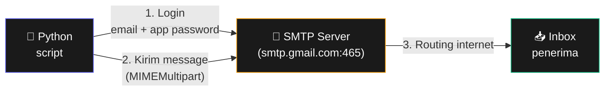

# Bab 18: Email & SMS

> *Notifikasi otomatis = produktivitas tanpa harus jadi babysitter aplikasi.*

Setelah Bab 18, kamu akan bisa:

- Kirim email otomatis dengan SMTP
- Baca email dari inbox dengan IMAP
- Kirim SMS dengan Twilio
- Project: notifikasi error otomatis

## 18.1. Kirim Email dengan SMTP



<div class="flowchart-caption" markdown>
<span class="label">Cara baca diagram</span>

Diagram ini menunjukkan **3 pihak** yang terlibat saat kirim email dari Python.

- **Script (indigo)** = kode Python kamu. Tidak punya kemampuan kirim email langsung — dia delegasikan ke SMTP server.
- **SMTP server (amber)** = "kantor pos" digital. Untuk Gmail, alamatnya `smtp.gmail.com` di port 465 (SSL).
- **Inbox penerima (hijau)** = tujuan akhir. Bisa Gmail, Yahoo, kantor, dll.

**Alur kirim email**:

1. **Login** — script connect ke SMTP server, autentikasi dengan email + **App Password** (bukan password Google biasa).
2. **Kirim message** — script siapkan email object (`MIMEMultipart`), submit ke server.
3. **Routing** — server forward ke alamat penerima via internet.

**Kenapa butuh App Password (bukan password biasa)?** Google block "less secure apps" sejak 2022. App Password adalah token khusus untuk app yang tidak support OAuth — generate dari [myaccount.google.com/apppasswords](https://myaccount.google.com/apppasswords).

**Untuk service lain**:
- Outlook: `smtp-mail.outlook.com` port 587 (TLS)
- Yahoo: `smtp.mail.yahoo.com` port 465 (SSL)
- Kantor (Office 365): `smtp.office365.com` port 587

Selalu cek dokumentasi provider email kamu untuk port & encryption yang tepat.
</div>

### Setup Gmail

Untuk Gmail, kamu perlu **App Password** (bukan password Google biasa):

1. Aktifkan 2FA di akun Google
2. Pergi ke [myaccount.google.com/apppasswords](https://myaccount.google.com/apppasswords)
3. Generate password 16 karakter, copy
4. Pakai password itu di script (bukan password login biasa)

### Kirim Email Sederhana

```python
import smtplib
from email.mime.text import MIMEText
from email.mime.multipart import MIMEMultipart

def kirim_email(to, subject, body, from_email, from_password):
    msg = MIMEMultipart()
    msg["From"] = from_email
    msg["To"] = to
    msg["Subject"] = subject

    msg.attach(MIMEText(body, "plain"))

    # Connect ke Gmail SMTP
    with smtplib.SMTP_SSL("smtp.gmail.com", 465) as smtp:
        smtp.login(from_email, from_password)
        smtp.send_message(msg)

    print(f"✓ Email terkirim ke {to}")

kirim_email(
    to="penerima@example.com",
    subject="Test Email dari Python",
    body="Halo, ini email otomatis dari script Python!",
    from_email="kamu@gmail.com",
    from_password="abcd_efgh_ijkl_mnop",  # App Password
)
```

### Email dengan HTML & Attachment

```python
from email.mime.text import MIMEText
from email.mime.multipart import MIMEMultipart
from email.mime.base import MIMEBase
from email import encoders
from pathlib import Path

def kirim_email_lengkap(to, subject, html_body, attachments=None):
    msg = MIMEMultipart()
    msg["From"] = FROM_EMAIL
    msg["To"] = to
    msg["Subject"] = subject

    msg.attach(MIMEText(html_body, "html"))

    if attachments:
        for path in attachments:
            path = Path(path)
            with open(path, "rb") as f:
                part = MIMEBase("application", "octet-stream")
                part.set_payload(f.read())
            encoders.encode_base64(part)
            part.add_header(
                "Content-Disposition",
                f'attachment; filename="{path.name}"',
            )
            msg.attach(part)

    with smtplib.SMTP_SSL("smtp.gmail.com", 465) as smtp:
        smtp.login(FROM_EMAIL, FROM_PASSWORD)
        smtp.send_message(msg)

html = """
<html>
  <body>
    <h1 style="color: #4f46e5;">Laporan Mingguan</h1>
    <p>Berikut <strong>laporan</strong> minggu ini.</p>
    <ul>
      <li>Pendapatan: Rp 50jt</li>
      <li>Pengeluaran: Rp 30jt</li>
    </ul>
  </body>
</html>
"""

kirim_email_lengkap(
    to="bos@kantor.com",
    subject="Laporan Mingguan",
    html_body=html,
    attachments=["laporan.pdf", "data.xlsx"],
)
```

## 18.2. Baca Email dengan IMAP

```python
import imaplib
import email

def baca_email_terbaru(email_user, password, jumlah=5):
    with imaplib.IMAP4_SSL("imap.gmail.com") as mail:
        mail.login(email_user, password)
        mail.select("inbox")

        # Cari semua email
        status, msg_ids = mail.search(None, "ALL")
        ids = msg_ids[0].split()

        # Ambil N terakhir
        for msg_id in ids[-jumlah:]:
            status, data = mail.fetch(msg_id, "(RFC822)")
            msg = email.message_from_bytes(data[0][1])

            print(f"From: {msg['From']}")
            print(f"Subject: {msg['Subject']}")
            print(f"Date: {msg['Date']}")
            print("-" * 50)

baca_email_terbaru("kamu@gmail.com", "app_password")
```

## 18.3. SMS dengan Twilio

Twilio = service kirim SMS via API. Daftar gratis dengan trial credit.

```bash
pip install twilio
```

```python
from twilio.rest import Client

ACCOUNT_SID = "ACxxxxxxxxxxxxxxxx"
AUTH_TOKEN = "yyyyyyyyyyyyyyyyyy"
TWILIO_NUMBER = "+15555551234"  # nomor Twilio kamu

def kirim_sms(to_number, pesan):
    client = Client(ACCOUNT_SID, AUTH_TOKEN)
    message = client.messages.create(
        body=pesan,
        from_=TWILIO_NUMBER,
        to=to_number,
    )
    print(f"✓ SMS terkirim. SID: {message.sid}")

kirim_sms("+6281234567890", "Halo dari Python!")
```

## 18.4. Project: Email Notification Saat Error

```python
import smtplib
import traceback
from email.mime.text import MIMEText
from email.mime.multipart import MIMEMultipart

ADMIN_EMAIL = "admin@kantor.com"

def kirim_error_email(error_msg, traceback_text):
    msg = MIMEMultipart()
    msg["From"] = "alert@kantor.com"
    msg["To"] = ADMIN_EMAIL
    msg["Subject"] = "🚨 ERROR di script"

    body = f"""
    Script error pada {datetime.now()}:

    Error: {error_msg}

    Traceback:
    {traceback_text}
    """

    msg.attach(MIMEText(body, "plain"))

    with smtplib.SMTP_SSL("smtp.gmail.com", 465) as smtp:
        smtp.login(FROM_EMAIL, FROM_PASSWORD)
        smtp.send_message(msg)

def kerjaan_kritis():
    """Function yang harus jalan tiap hari."""
    # ... kode kerja kritis ...
    raise ValueError("Database connection failed")

try:
    kerjaan_kritis()
except Exception as e:
    kirim_error_email(str(e), traceback.format_exc())
```

Setiap kali script crash, kamu langsung dapat email dengan detail error.

## 18.5. Tips

!!! warning "Jangan hardcode credential"
    Jangan tulis password langsung di kode. Pakai environment variable atau file `.env`:

    ```python
    import os
    FROM_EMAIL = os.getenv("EMAIL_USER")
    FROM_PASSWORD = os.getenv("EMAIL_PASSWORD")
    ```

    Atau pakai library `python-dotenv`:

    ```bash
    pip install python-dotenv
    ```

    ```python
    from dotenv import load_dotenv
    load_dotenv()  # baca .env file
    ```

!!! danger "Anti-Spam"
    Jangan kirim email massal tanpa consent. Banyak negara punya anti-spam law (SPAM Act, GDPR, dll). Pakai service email marketing resmi (SendGrid, Mailchimp) untuk legal compliance.

## 18.6. Ringkasan

- **`smtplib`** untuk kirim email (gunakan SSL port 465)
- **App Password** untuk Gmail (bukan password biasa)
- **`MIMEMultipart`** untuk email kompleks (HTML + attachment)
- **`imaplib`** untuk baca email
- **Twilio** untuk SMS (atau alternatif: Vonage, MessageBird)
- **Jangan hardcode credential** — pakai env variable

## 18.7. Latihan

### 18.1 — Birthday Reminder
Baca CSV berisi nama + tanggal lahir. Kirim email ke yang ulang tahun hari ini.

### 18.2 — Auto-Responder
Cek inbox, balas otomatis ke email dengan subject mengandung "out of office".

### 18.3 — Tantangan: Newsletter
Kirim email newsletter ke list subscriber, isi diambil dari file template Markdown.

<div class="cheatsheet" markdown>

### SMTP Server
| Provider | Host | Port |
|----------|------|------|
| Gmail | smtp.gmail.com | 465 (SSL) |
| Outlook | smtp-mail.outlook.com | 587 (TLS) |
| Yahoo | smtp.mail.yahoo.com | 465 (SSL) |
| Office 365 | smtp.office365.com | 587 (TLS) |

### Gmail App Password
1. Aktifkan 2FA
2. [myaccount.google.com/apppasswords](https://myaccount.google.com/apppasswords)
3. Pakai 16-char password (bukan password Google)

### Kirim Email
```python
import smtplib
from email.mime.text import MIMEText
from email.mime.multipart import MIMEMultipart

msg = MIMEMultipart()
msg["From"] = "from@gmail.com"
msg["To"] = "to@gmail.com"
msg["Subject"] = "Subject"

msg.attach(MIMEText(body, "plain"))   # atau "html"

with smtplib.SMTP_SSL("smtp.gmail.com", 465) as smtp:
    smtp.login(email, app_password)
    smtp.send_message(msg)
```

### Attachment
```python
from email.mime.base import MIMEBase
from email import encoders

with open(file_path, "rb") as f:
    part = MIMEBase("application", "octet-stream")
    part.set_payload(f.read())
encoders.encode_base64(part)
part.add_header(
    "Content-Disposition",
    f'attachment; filename="{filename}"',
)
msg.attach(part)
```

### Baca Email (IMAP)
```python
import imaplib
import email

with imaplib.IMAP4_SSL("imap.gmail.com") as mail:
    mail.login(user, password)
    mail.select("inbox")

    status, ids = mail.search(None, "ALL")
    for msg_id in ids[0].split()[-5:]:
        status, data = mail.fetch(msg_id, "(RFC822)")
        msg = email.message_from_bytes(data[0][1])
        print(msg["From"], msg["Subject"])
```

### Twilio SMS
```bash
pip install twilio
```

```python
from twilio.rest import Client

client = Client(account_sid, auth_token)
client.messages.create(
    body="pesan",
    from_=twilio_number,
    to="+62...",
)
```

### Aman: Pakai Env Variable
```python
import os
EMAIL = os.getenv("EMAIL_USER")
PASSWORD = os.getenv("EMAIL_PASSWORD")
```

```bash
# .env (jangan commit ke Git!)
EMAIL_USER=...
EMAIL_PASSWORD=...
```

</div>

[← Bab 17](bab-17-waktu-jadwal.md){ .md-button }
[Lanjut Bab 19 →](bab-19-gambar.md){ .md-button .md-button--primary }

<div class="atribusi-bab">
Diadaptasi dari Chapter 18: Sending Email and Text Messages, "Automate the Boring Stuff with Python" karya <a href="https://inventwithpython.com/" target="_blank">Al Sweigart</a>. Dilisensikan CC BY-NC-SA 4.0.
</div>
