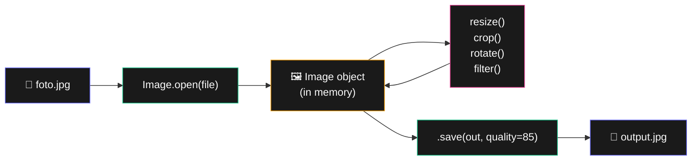

# Bab 19: Manipulasi Gambar

> *Photoshop untuk 1 gambar = klik-klik. Photoshop untuk 10,000 gambar = mustahil. Python = bisa.*

Bab ini ngajarin batch processing gambar — resize, crop, watermark, convert format — semua otomatis.

Setelah Bab 19, kamu akan bisa:

- Buka, edit, save gambar dengan Pillow
- Resize, crop, rotate, flip
- Tambah teks dan watermark
- Batch process ratusan gambar

## 19.1. Install Pillow

```bash
pip install Pillow
```

`Pillow` adalah fork modern dari `PIL` (Python Imaging Library). Standar industri.

## 19.2. Buka & Save

```python
from PIL import Image

# Buka
img = Image.open("foto.jpg")

# Info
print(img.size)        # (lebar, tinggi)
print(img.mode)        # 'RGB', 'RGBA', 'L' (grayscale), dll
print(img.format)      # 'JPEG', 'PNG', dll

# Save
img.save("output.png")  # auto-detect format dari extension
img.save("output.jpg", quality=85)  # untuk JPEG, kontrol kualitas
```



<div class="flowchart-caption" markdown>
<span class="label">Cara baca diagram</span>

Diagram ini menunjukkan **lifecycle gambar** di Pillow — dari file ke memory ke file lagi.

**Tahap-tahapnya**:

1. **File source** — gambar di disk (JPG, PNG, etc).
2. **`Image.open()`** — load file ke memory sebagai `Image` object.
3. **Image object di memory** (amber) — tempat semua manipulasi terjadi.
4. **Method-method edit** (pink) — `resize`, `crop`, `rotate`, `filter`. Banyak method **return Image baru** (tidak modify in-place); banyak juga yang in-place.
5. **`.save()`** — tulis ke disk dalam format apapun.

**Kunci**: `Image.open()` **tidak benar-benar load semua pixel** — Pillow lazy-load. Pixel baru di-decode saat kamu akses (misalnya saat `.size` atau `.crop()`). Jadi `Image.open()` cepat bahkan untuk file besar.

**Pattern yang sering**:

- **In-place** (`thumbnail`, `paste`): modifikasi langsung, tidak return.
- **Pure** (`resize`, `crop`, `rotate`, `filter`): return Image baru, tidak modify aslinya.

**Untuk save format berbeda**: kadang harus convert dulu. PNG punya alpha channel (transparency); JPG tidak. Jadi `img.convert("RGB").save("out.jpg")` untuk PNG → JPG.
</div>

### Convert Format

```python
img = Image.open("foto.png")
img.convert("RGB").save("foto.jpg")   # PNG → JPG (perlu RGB)
```

## 19.3. Resize & Thumbnail

```python
img = Image.open("foto.jpg")

# Resize ke ukuran spesifik
small = img.resize((800, 600))
small.save("small.jpg")

# Resize proporsional (thumbnail) — modifikasi in-place
img.thumbnail((800, 800))   # max 800x800, jaga aspect ratio
img.save("thumbnail.jpg")
```

### Crop

```python
img = Image.open("foto.jpg")

# Box: (kiri, atas, kanan, bawah)
cropped = img.crop((100, 100, 500, 400))
cropped.save("cropped.jpg")
```

### Rotate & Flip

```python
img.rotate(90).save("rotate90.jpg")        # 90 derajat
img.rotate(180).save("rotate180.jpg")
img.transpose(Image.FLIP_LEFT_RIGHT).save("mirror.jpg")
img.transpose(Image.FLIP_TOP_BOTTOM).save("upside.jpg")
```

## 19.4. Tambah Teks & Watermark

```python
from PIL import Image, ImageDraw, ImageFont

img = Image.open("foto.jpg")
draw = ImageDraw.Draw(img)

# Pakai font system
try:
    font = ImageFont.truetype("arial.ttf", 40)
except OSError:
    font = ImageFont.load_default()

# Tulis teks
draw.text(
    (50, 50),                   # posisi
    "© 2026 Toko Pak Budi",     # teks
    font=font,
    fill=(255, 255, 255, 200),  # putih dengan transparency
)

img.save("watermarked.jpg")
```

### Watermark Diagonal

```python
from PIL import Image, ImageDraw, ImageFont

def watermark(input_path, output_path, teks="DRAFT"):
    img = Image.open(input_path).convert("RGBA")

    # Bikin layer transparent untuk watermark
    layer = Image.new("RGBA", img.size, (255, 255, 255, 0))
    draw = ImageDraw.Draw(layer)

    font = ImageFont.truetype("arial.ttf", img.size[0] // 8)
    draw.text((50, 50), teks, font=font, fill=(255, 0, 0, 100))

    # Combine
    combined = Image.alpha_composite(img, layer)
    combined.convert("RGB").save(output_path, "JPEG", quality=90)

watermark("foto.jpg", "draft.jpg", "DRAFT")
```

## 19.5. Filter & Adjustment

```python
from PIL import Image, ImageFilter, ImageEnhance

img = Image.open("foto.jpg")

# Filter built-in
img.filter(ImageFilter.BLUR).save("blur.jpg")
img.filter(ImageFilter.SHARPEN).save("sharp.jpg")
img.filter(ImageFilter.GaussianBlur(radius=5)).save("gaussian.jpg")
img.filter(ImageFilter.EDGE_ENHANCE).save("edge.jpg")

# Convert ke grayscale
img.convert("L").save("bw.jpg")

# Adjust brightness, contrast, saturation
ImageEnhance.Brightness(img).enhance(1.5).save("brighter.jpg")
ImageEnhance.Contrast(img).enhance(1.3).save("contrast.jpg")
ImageEnhance.Color(img).enhance(0.5).save("desaturated.jpg")
ImageEnhance.Sharpness(img).enhance(2.0).save("sharper.jpg")
```

## 19.6. Project: Batch Resize untuk Web

Skenario: kamu punya 500 foto product hi-res, butuh versi web (max 1200px) dan thumbnail (300px).

```python
from PIL import Image
from pathlib import Path

def batch_resize(folder_input, folder_output, max_size=1200, thumb_size=300):
    folder_input = Path(folder_input)
    web = Path(folder_output) / "web"
    thumb = Path(folder_output) / "thumbnail"
    web.mkdir(parents=True, exist_ok=True)
    thumb.mkdir(parents=True, exist_ok=True)

    extensions = (".jpg", ".jpeg", ".png", ".webp")

    for file in folder_input.rglob("*"):
        if not file.is_file():
            continue
        if file.suffix.lower() not in extensions:
            continue

        try:
            img = Image.open(file).convert("RGB")

            # Web version
            web_img = img.copy()
            web_img.thumbnail((max_size, max_size))
            web_img.save(web / f"{file.stem}.jpg", quality=85, optimize=True)

            # Thumbnail
            thumb_img = img.copy()
            thumb_img.thumbnail((thumb_size, thumb_size))
            thumb_img.save(thumb / f"{file.stem}.jpg", quality=80, optimize=True)

            print(f"✓ {file.name}")
        except Exception as e:
            print(f"✗ {file.name}: {e}")

batch_resize(
    folder_input="raw_photos",
    folder_output="processed",
)
```

## 19.7. Project: Composite Image (Logo Overlay)

```python
from PIL import Image

def tambah_logo(foto_path, logo_path, output_path, posisi="kanan_bawah"):
    foto = Image.open(foto_path).convert("RGBA")
    logo = Image.open(logo_path).convert("RGBA")

    # Resize logo ke 15% dari lebar foto
    new_logo_w = foto.width // 7
    ratio = new_logo_w / logo.width
    new_logo_h = int(logo.height * ratio)
    logo = logo.resize((new_logo_w, new_logo_h))

    # Hitung posisi
    margin = 30
    if posisi == "kanan_bawah":
        pos = (foto.width - logo.width - margin, foto.height - logo.height - margin)
    elif posisi == "kiri_atas":
        pos = (margin, margin)
    elif posisi == "tengah":
        pos = ((foto.width - logo.width) // 2, (foto.height - logo.height) // 2)

    # Paste dengan transparency
    foto.paste(logo, pos, logo)
    foto.convert("RGB").save(output_path, quality=90)

tambah_logo("foto.jpg", "logo.png", "branded.jpg", "kanan_bawah")
```

## 19.8. Ringkasan

- **`Pillow` (`from PIL import Image`)** untuk semua operasi gambar
- **`.resize()`** ukuran spesifik, **`.thumbnail()`** dengan aspect ratio
- **`.crop((kiri, atas, kanan, bawah))`** untuk potong
- **`ImageDraw.Draw(img).text(...)`** untuk tulis teks
- **`ImageFilter`, `ImageEnhance`** untuk filter & adjustment
- **`quality=85, optimize=True`** untuk JPG dengan size minimal
- **Convert ke RGB** sebelum save JPG (PNG punya alpha channel)

## 19.9. Latihan

### 19.1 — Bulk Watermark
Tambah watermark "© Studio XYZ 2026" ke semua foto di folder.

### 19.2 — Photo Collage
Gabung 4 foto jadi 1 grid 2x2.

### 19.3 — Auto-crop Square
Crop semua foto jadi square (1:1) — center crop.

### 19.4 — Tantangan: Photo Sorter
Sort foto ke folder berdasarkan orientasi (landscape, portrait, square) dan ukuran (small, medium, large).

<div class="cheatsheet" markdown>

### Install
```bash
pip install Pillow
```

### Buka & Save
```python
from PIL import Image

img = Image.open("foto.jpg")
img.size       # (w, h)
img.mode       # 'RGB', 'RGBA', 'L'
img.format     # 'JPEG'

img.save("out.png")
img.save("out.jpg", quality=85, optimize=True)
```

### Convert Format
```python
img.convert("RGB").save("out.jpg")    # PNG → JPG
img.convert("L").save("bw.jpg")       # ke grayscale
```

### Resize
```python
img.resize((800, 600))            # ukuran spesifik
img.thumbnail((800, 800))         # max, jaga aspect (in-place)
```

### Crop
```python
img.crop((kiri, atas, kanan, bawah))
```

### Rotate & Flip
```python
img.rotate(90)
img.transpose(Image.FLIP_LEFT_RIGHT)
img.transpose(Image.FLIP_TOP_BOTTOM)
```

### Filter & Adjustment
```python
from PIL import ImageFilter, ImageEnhance

img.filter(ImageFilter.BLUR)
img.filter(ImageFilter.SHARPEN)
img.filter(ImageFilter.GaussianBlur(radius=5))

ImageEnhance.Brightness(img).enhance(1.5)   # +50% brightness
ImageEnhance.Contrast(img).enhance(1.3)
ImageEnhance.Color(img).enhance(0.5)        # desaturated
ImageEnhance.Sharpness(img).enhance(2.0)
```

### Tambah Teks
```python
from PIL import ImageDraw, ImageFont

draw = ImageDraw.Draw(img)
font = ImageFont.truetype("arial.ttf", 40)
draw.text((x, y), "teks", font=font, fill=(255, 255, 255))
```

### Composite (Logo Overlay)
```python
img = Image.open("foto.jpg").convert("RGBA")
logo = Image.open("logo.png").convert("RGBA")
img.paste(logo, (x, y), logo)         # arg ke-3 = mask
img.convert("RGB").save("out.jpg")
```

### Pattern: Batch Process
```python
for file in folder.glob("*.jpg"):
    img = Image.open(file).convert("RGB")
    img.thumbnail((1200, 1200))
    img.save(out_folder / file.name, quality=85, optimize=True)
```

</div>

[← Bab 18](bab-18-email-sms.md){ .md-button }
[Lanjut Bab 20 →](bab-20-gui-automation.md){ .md-button .md-button--primary }

<div class="atribusi-bab">
Diadaptasi dari Chapter 19: Manipulating Images, "Automate the Boring Stuff with Python" karya <a href="https://inventwithpython.com/" target="_blank">Al Sweigart</a>. Dilisensikan CC BY-NC-SA 4.0.
</div>
