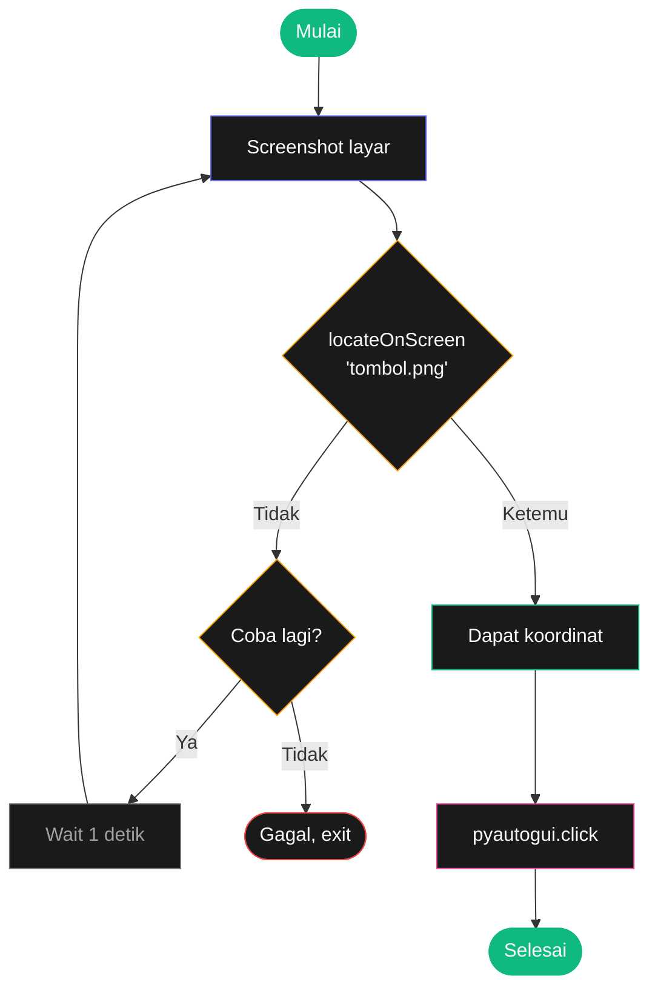

# Bab 20: GUI Automation

> *Bab terakhir, dan yang paling magis. Python yang **menggerakkan mouse dan keyboard** seperti manusia.*

GUI automation = Python yang klik, drag, ketik di aplikasi GUI mana pun. Pakai untuk: data entry repetitif, otomasi software lama yang tidak punya API, end-to-end testing.

Setelah Bab 20, kamu akan bisa:

- Menggerakkan mouse, klik, drag
- Ketik dan hotkey otomatis
- Screenshot dan deteksi gambar
- Project: filler form otomatis

## 20.1. Install PyAutoGUI

```bash
pip install pyautogui pillow opencv-python
```

## 20.2. Mouse Control

```python
import pyautogui

# Posisi mouse sekarang
x, y = pyautogui.position()
print(f"Mouse di ({x}, {y})")

# Ukuran layar
w, h = pyautogui.size()
print(f"Layar: {w}x{h}")

# Pindahkan mouse
pyautogui.moveTo(500, 300, duration=0.5)    # smooth ke posisi
pyautogui.moveRel(100, 0, duration=0.3)     # relatif

# Klik
pyautogui.click()                            # klik di posisi sekarang
pyautogui.click(x=500, y=300)                # klik di posisi spesifik
pyautogui.doubleClick()
pyautogui.rightClick()
pyautogui.middleClick()

# Drag
pyautogui.dragTo(700, 400, duration=1, button="left")
pyautogui.dragRel(100, 0, duration=0.5)

# Scroll
pyautogui.scroll(10)        # scroll up 10 "klik"
pyautogui.scroll(-10)       # scroll down
```

!!! danger "Failsafe — Selalu Aktifkan!"
    PyAutoGUI bisa "lari liar" kalau script bug. Failsafe: gerakkan mouse ke pojok kiri-atas (0, 0) untuk **paksa stop** script.

    ```python
    pyautogui.FAILSAFE = True   # default True, jangan disable!
    pyautogui.PAUSE = 0.1        # delay antar action 0.1 detik
    ```

## 20.3. Keyboard Control

```python
import pyautogui
import time

# Type teks
pyautogui.write("Halo dunia!", interval=0.05)  # interval antar karakter

# Press key spesifik
pyautogui.press("enter")
pyautogui.press("tab")
pyautogui.press("escape")
pyautogui.press(["a", "b", "c"])  # press berturut-turut

# Hold key (down + up terpisah)
pyautogui.keyDown("shift")
pyautogui.press("h")
pyautogui.keyUp("shift")

# Hotkey (kombinasi)
pyautogui.hotkey("ctrl", "c")           # Ctrl+C
pyautogui.hotkey("ctrl", "shift", "n")   # Ctrl+Shift+N
pyautogui.hotkey("alt", "tab")           # Alt+Tab
pyautogui.hotkey("win", "r")             # Win+R (Windows)
```

### Daftar Key Special

```python
pyautogui.KEY_NAMES
# ['enter', 'tab', 'space', 'esc', 'backspace', 'delete',
#  'up', 'down', 'left', 'right', 'home', 'end', ...
#  'f1', 'f2', ...
#  'ctrl', 'alt', 'shift', 'win', ...]
```

## 20.4. Screenshot

```python
# Full screen
img = pyautogui.screenshot()
img.save("screenshot.png")

# Region tertentu (kiri, atas, lebar, tinggi)
region = pyautogui.screenshot(region=(0, 0, 300, 400))
region.save("region.png")
```

## 20.5. Image Recognition — Cari Lokasi Tombol

Salah satu fitur paling powerful — **cari lokasi gambar di layar**:

```python
# Cari posisi tombol_login.png di layar
posisi = pyautogui.locateOnScreen("tombol_login.png", confidence=0.9)
if posisi:
    print(f"Ditemukan di {posisi}")
    pyautogui.click(posisi)   # klik tepat di tengah
else:
    print("Tombol tidak ditemukan")
```

`confidence=0.9` = match 90% (untuk handle perbedaan kecil rendering).



<div class="flowchart-caption" markdown>
<span class="label">Cara baca flowchart</span>

Flowchart ini menunjukkan **pattern retry** untuk image recognition.

**Kenapa pakai retry?** Aplikasi sering load lambat. Tombol mungkin belum muncul saat script jalan, jadi `locateOnScreen` return `None`.

**Alur**:

1. **Screenshot** layar saat ini
2. **`locateOnScreen('tombol.png')`** — cari gambar di screenshot
3. Kalau **ketemu**: dapat koordinat → klik → selesai
4. Kalau **tidak ketemu**: tunggu 1 detik → ulangi (max N kali)

**Pattern code-nya**:

```python
def klik_tombol(image_path, max_retry=5):
    for i in range(max_retry):
        pos = pyautogui.locateOnScreen(image_path, confidence=0.9)
        if pos:
            pyautogui.click(pos)
            return True
        time.sleep(1)
    return False
```

**Kunci**: GUI automation rapuh — jangan asumsikan UI selalu instan. Selalu retry untuk produktif.
</div>

## 20.6. Project: Auto-Filler Form

Skenario: kamu harus isi 100 form web yang sama dengan data berbeda dari Excel.

```python
import pyautogui
import openpyxl
import time

def isi_form(nama, email, telepon, alamat):
    """Asumsi: form sudah dibuka di browser, fokus di field pertama."""

    pyautogui.write(nama, interval=0.05)
    pyautogui.press("tab")
    pyautogui.write(email, interval=0.05)
    pyautogui.press("tab")
    pyautogui.write(telepon, interval=0.05)
    pyautogui.press("tab")
    pyautogui.write(alamat, interval=0.05)
    pyautogui.press("tab")

    # Klik tombol submit (asumsi pakai image)
    pos = pyautogui.locateOnScreen("submit_btn.png", confidence=0.9)
    if pos:
        pyautogui.click(pos)
    else:
        print("⚠ Tombol submit tidak ditemukan")
        return False

    # Tunggu konfirmasi load
    time.sleep(3)
    return True

def main():
    wb = openpyxl.load_workbook("data_kontak.xlsx")
    sheet = wb.active

    print("Script akan mulai dalam 5 detik. Buka form dan klik field pertama!")
    time.sleep(5)

    sukses = 0
    for row in sheet.iter_rows(min_row=2, values_only=True):
        nama, email, telepon, alamat = row
        print(f"Input: {nama}")
        if isi_form(nama, email, telepon, alamat):
            sukses += 1
        else:
            break

    print(f"\n✓ Selesai. {sukses} form terisi.")

main()
```

5 menit nulis script ini, jam-jam manual data entry teratasi.

## 20.7. Project: Auto-Click Game

Mini-game contoh — klik kotak hijau yang muncul random:

```python
import pyautogui
import time

def auto_click_hijau():
    while True:
        try:
            # Cari kotak hijau
            pos = pyautogui.locateOnScreen("kotak_hijau.png", confidence=0.85)
            if pos:
                pyautogui.click(pos)
                print(f"✓ Click {pos}")
            time.sleep(0.1)
        except KeyboardInterrupt:
            print("Stopped")
            break

auto_click_hijau()
```

Aplikasinya: idle game grinding, daily login bonus, etc.

## 20.8. Tips & Best Practice

!!! tip "Aturan emas GUI automation"

    1. **Selalu pakai `time.sleep`** sebelum action — kasih app waktu render
    2. **Tambahkan delay/`PAUSE`** antar action untuk meniru perilaku manusia
    3. **Image recognition > koordinat absolut** — koordinat pecah kalau resolusi berubah
    4. **Test di environment yang sama** — DPI, theme, resolusi berbeda = behavior berbeda
    5. **Jangan disable FAILSAFE** — itu safety net kamu kalau script bug
    6. **Hindari untuk task kritis** — GUI automation rapuh; untuk production, prefer API/CLI

!!! danger "Etika & Legal"
    GUI automation untuk **bypass paywall**, **scraping prohibited**, **bot game online**, atau **akses akun orang lain** = pelanggaran ToS dan kadang ilegal. Pakai untuk task **kerjaan kamu sendiri** atau yang punya consent.

## 20.9. Ringkasan

- **`pyautogui.moveTo`, `.click`, `.dragTo`** untuk mouse
- **`.write`, `.press`, `.hotkey`** untuk keyboard
- **`.screenshot()`** dan **`.locateOnScreen()`** untuk image recognition
- **Selalu retry** dengan `time.sleep` antar attempt
- **Failsafe**: gerakkan mouse ke pojok kiri-atas untuk paksa stop
- **`pyautogui.PAUSE = 0.1`** = delay antar action

## 20.10. Latihan

### 20.1 — Auto-Type Boilerplate
Hotkey custom (Ctrl+Alt+S) → ketik signature email otomatis.

### 20.2 — Bulk Screenshot
Buka 10 URL berbeda, ambil screenshot full page masing-masing.

### 20.3 — Anti-Idle
Detect kalau mouse tidak bergerak 5 menit, gerakkan sedikit (1px) untuk hindari sleep mode.

### 20.4 — Tantangan: Excel Data Entry
Baca data dari CSV, otomatis input ke aplikasi desktop (Excel, atau apps lain) baris per baris.

<div class="cheatsheet" markdown>

### Setup
```python
import pyautogui
pyautogui.FAILSAFE = True       # JANGAN disable!
pyautogui.PAUSE = 0.1
```

### Failsafe Emergency
Gerakkan mouse ke **(0, 0)** untuk paksa stop.

### Mouse
```python
pyautogui.position()             # (x, y)
pyautogui.size()                 # (w, h) layar

pyautogui.moveTo(x, y, duration=0.5)
pyautogui.click(x, y)
pyautogui.doubleClick()
pyautogui.rightClick()
pyautogui.dragTo(x, y)
pyautogui.scroll(10)             # +up, -down
```

### Keyboard
```python
pyautogui.write("teks", interval=0.05)
pyautogui.press("enter")
pyautogui.hotkey("ctrl", "c")
```

### Image Recognition
```python
pos = pyautogui.locateOnScreen("button.png", confidence=0.9)
if pos:
    pyautogui.click(pos)
```

### Pattern Retry
```python
def klik_btn(img, max_retry=5):
    for i in range(max_retry):
        pos = pyautogui.locateOnScreen(img, confidence=0.9)
        if pos:
            pyautogui.click(pos)
            return True
        time.sleep(1)
    return False
```

### Aturan Emas
1. `time.sleep` sebelum tiap action
2. Image recognition > koordinat absolut
3. Test di env yang sama (DPI, resolusi)
4. JANGAN disable FAILSAFE

</div>

---

## 🎉 Selamat — Bagian 2 & Buku Selesai!

Kamu baru menyelesaikan **20 bab penuh**. Ini bukan hal kecil. Sebagian besar orang yang mulai belajar Python tidak sampai di sini.

### Yang sekarang kamu bisa

- ✅ Tulis program Python dari nol untuk hampir semua kebutuhan
- ✅ Otomasi Excel, PDF, Word, gambar
- ✅ Web scraping, email, SMS, scheduling
- ✅ GUI automation — kontrol komputer dengan kode
- ✅ Debug seperti programmer profesional
- ✅ Build pipeline data: CSV → JSON → Database → Email

### Apa selanjutnya

Buku ini fokus ke **otomasi kerjaan**. Tapi Python jauh lebih luas. Setelah ini, kamu bisa eksplorasi:

- **Web Development**: Flask, Django, FastAPI
- **Data Science**: pandas, numpy, matplotlib, seaborn
- **Machine Learning**: scikit-learn, PyTorch, TensorFlow
- **Game Dev**: Pygame
- **AI / LLM**: LangChain, OpenAI API, RAG systems
- **DevOps**: Ansible, infrastructure as code

Apapun arahnya, fondasi yang kamu dapat dari buku ini akan **terus berguna**. Variable, function, list, dictionary, loop, file I/O — semua itu universal.

### Kontribusi Balik

Kalau kamu merasa buku ini berguna:

1. **Beli buku resmi Al Sweigart** di [No Starch Press](https://nostarch.com/automatestuff2) untuk mendukung penulis aslinya
2. **Bagikan** ke teman yang mungkin terbantu
3. **Berkontribusi** ke project terjemahan ini — perbaiki typo, tambahkan contoh, atau translate bab yang kamu kuasai

### Pesan Penutup

> *"Programmer hebat malas. Mereka tidak suka mengulang pekerjaan yang sama. Itulah kenapa mereka menulis kode."*

Sekarang, **kamu sudah punya kekuatan itu**. Pekerjaan repetitif yang dulu menyebalkan = sekarang tinggal 30 baris script.

Pakai dengan bijak. Selamat ngoding.

[← Bab 19](bab-19-gambar.md){ .md-button }
[🏠 Beranda](../index.md){ .md-button .md-button--primary }

<div class="atribusi-bab">
Diadaptasi dari Chapter 20: Controlling the Keyboard and Mouse with GUI Automation, "Automate the Boring Stuff with Python" karya <a href="https://inventwithpython.com/" target="_blank">Al Sweigart</a>. Dilisensikan CC BY-NC-SA 4.0.
</div>
